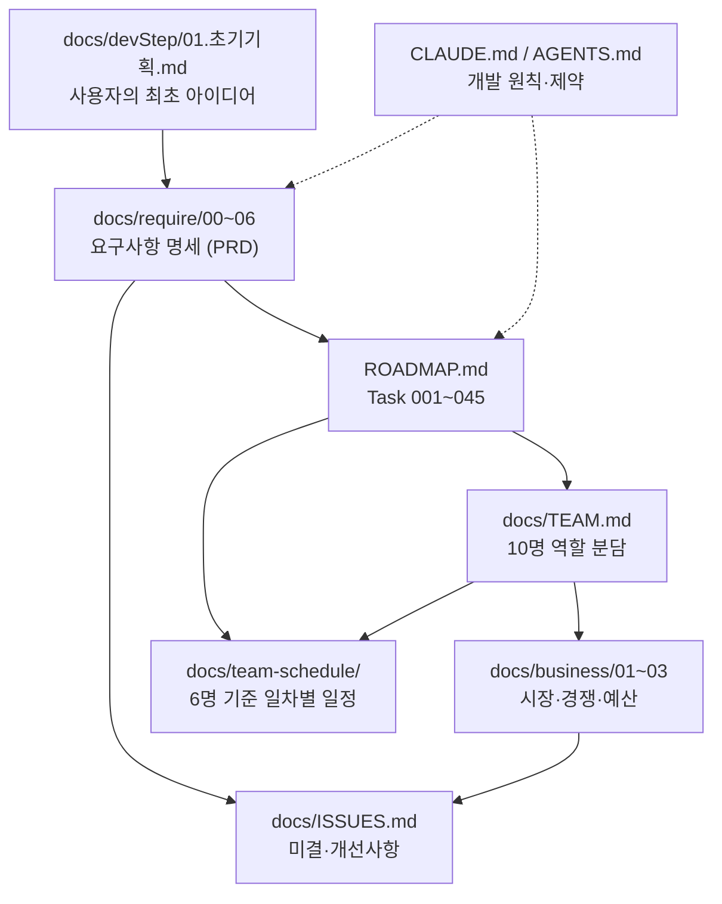

# football4 — 가상 축구 리그 시뮬레이션 & 배팅 플랫폼

> **"플레이하지 않고, 지켜보고 예측한다."**
> 컴퓨터가 24/7 자동으로 진행하는 3티어(24/20/16팀) 가상 축구 리그 세계를 구축한다.
> 사용자는 팀을 조작하지 않고 **관전**하며(1차 릴리스), 이후 **배팅**한다(2차 릴리스).

기술 스택: Next.js 16 (App Router) / React 19 / TypeScript / TailwindCSS v4 / Supabase
현재 상태: **구현 착수 — 44일차 진행 완료 (2026-09-18 기준)**. 8일차에 도메인 타입 47종이 **동결(H-01)** 됐고, 지금은 그 위에서 6팀이 병렬로 계약·엔진·상수·물리 스키마를 쌓는 단계입니다. **34일차부터 화면이 실제로 보입니다** — `/[lang]` 홈에 3리그 라이브 경기 카드가, `/[lang]/sample`에 컴포넌트 22종이 렌더됩니다(그 전까지는 `params`를 JSON으로 찍는 자리표시자였습니다). 36일차에 비주얼 디렉션 **"Floodlit"**이 확립됐고, 37일차에 **차단성 검증 V-01·V-02가 전건 해소**되어 남은 실측 게이트가 없습니다. DB에는 39테이블 + 인덱스 20개 + RLS 39/39가 실제로 적용돼 있습니다. 15일차에 **머지 게이트(`npm run gate`)** 가 가동돼 `tsc → lint → test:coverage`가 병합 전 강제되고, **20일차에 이 게이트가 GitHub Actions CI(`.github/workflows/ci.yml`)에도 연결**됐습니다. **24일차에 `next typegen`이 앞단에 추가돼 4단이 됐습니다** — 로컬에만 남아 있던 Next 생성 타입 때문에 로컬은 통과하고 CI만 실패하던 위양성을 없앤 것입니다(I-138).

```bash
npm run dev            # 개발 서버 (http://localhost:3000) — webpack 고정
npm run lint           # ESLint
npm run test           # Vitest 1회 실행
npm run test:watch     # Vitest watch 모드          ← 13일차 신규
npm run test:coverage  # 커버리지 리포트            ← 13일차 신규
npm run gate           # 4단 머지 게이트            ← 15일차 신규 / 24일차 확장
                       # next typegen → tsc --noEmit → lint → test:coverage, fail-fast
                       # WSL에서 next build가 EPERM으로 죽으므로(I-62) 빌드는 미포함
npm run typecheck      # 타입체크 (35일차 신규 — raw `npx tsc --noEmit` 대신 이걸 쓰세요, I-181)
```

> ⚠️ **WSL 마운트 경로(`/mnt/...`) 환경 주의 (I-62)** — Turbopack은 파일 쓰기 실패로 구동되지 않습니다. **`npm run dev`는 `WATCHPACK_POLLING=true next dev --webpack`으로 고정돼 있으니 그대로 쓰면 됩니다**(번들러 고정은 12일차, 폴링은 36일차 I-185 — 같은 마운트에서 inotify도 신뢰할 수 없어 **소스를 고쳐도 서버가 재컴파일하지 않고, 오류 없이 옛 화면이 그대로 떠서 코드 문제로 오진하기 쉽습니다**). `npx next dev`(플래그 없음)로 직접 띄우지 마세요 — EPERM으로 죽고 루트에 Windows 리터럴 경로 디렉터리(`E:\...`)를 만듭니다(I-87). 14일차에 기존 디렉터리는 삭제됐고 ESLint `globalIgnores`도 걸려 있지만, 플래그 없이 띄우면 다시 생깁니다.
>
> **`npm run build`는 번들러와 무관하게 실패**합니다(webpack 경로도 최종 `copyfile` 단계에서 EPERM). **빌드 성공을 검증 수단으로 쓰지 말고** `npm run typecheck`(35일차부터 — raw `npx tsc --noEmit`은 I-181로 대체) / `npm run lint` / `npm run test`로 판정하세요. 근본 해소책은 리포지토리를 WSL 네이티브 파일시스템으로 옮기는 것이며, 아직 결정되지 않았습니다.

---

## 진행 현황 (44일차 · 2026-09-18)

**팀장이 틀렸고, 팀원이 편집 전에 막아 세웠습니다.** 2팀이 "슬롯 삽입은 `season/` 소관"이라는 41일차 주석과 44일차 배정(`schedule/`)이 어긋난다고 제보했습니다. 팀장은 `season/` 디렉터리가 없다는 근거로 **"팀 일정이 옳고 주석이 stale"**이라 판정하고 정정을 지시했는데, **판정 자체가 틀렸습니다** — 팀장이 `ls src/lib/sim/season/`을 실행해 놓고 출력 라벨을 `schedule/`로 잘못 달아, 반환된 `phase.ts`를 다른 디렉터리 내용으로 착각한 것입니다. **자기가 만든 라벨을 근거로 정반대 결론을 냈습니다.** 2팀은 지시대로 고치지 않고 근거를 들어 확인을 요청했고, 그 덕분에 **실재하는 `phase.ts`를 없는 것처럼 지우는 주석이 남는 것을 막았습니다.** 실제로 두 계층은 경쟁이 아니라 역할 분담이었습니다 — `season/phase.ts`는 "언제 넘어가는가"(이산 전이), `schedule/cup-slot.ts`는 "몇 시부터 몇 시까지인가"(연속 시각).

**그 과정에서 진짜 구멍이 드러났습니다.** 두 모듈은 서로를 전혀 참조하지 않습니다 — 슬롯 창의 시작·종료 시각이 `ENTER_CUP_SLOT`/`EXIT_CUP_SLOT` 발화와 연결돼 있지 않습니다. 지금은 `cup-slot.ts` 소비처가 0건이라 관측되지 않을 뿐이고, 배선하는 순간 어긋난 시각에 페이즈가 전환됩니다. 이건 두 엔진 계층의 결함이 아니라 **"월드클록이 언제 무엇을 발화할지" 결정하는 오케스트레이션 계층이 아직 없다**는 뜻이라, 2팀 소관이 아니며 담당·일차 모두 미배정입니다(**I-225**).

**같은 형태의 누락이 세 번째로 반복됐습니다.** 5팀이 이벤트 23종 중계 문구 카탈로그를 완비했는데(`satisfies`로 전량 매핑을 타입이 강제) **소비처가 0건**입니다 — 타임라인은 여전히 4팀 소유의 단어 라벨만 씁니다. 42일차 I-206, 43일차 I-221과 **원인이 똑같습니다: 만드는 팀과 소비처를 가진 팀이 다릅니다.** 매번 아무도 규칙을 어기지 않았는데 인계물이 떴습니다(**I-226**). 개별 건을 메우는 방식으로는 네 번째가 옵니다.

**2팀은 충돌을 런타임에 검사하는 대신 불가능하게 만들었습니다.** 컵 슬롯 삽입을 `shift(t) = t + duration × (t 이전 마커 수)` 한 공식으로 정의해 **리그 킥오프가 슬롯 창에 들어갈 수 없음을 수학적으로 보장**하고 증명을 헤더에 적었습니다(보정 로직 불필요). **6팀은 크론 재시도·catch-up**을 실 DB에서 증명했습니다 — 40건 백로그가 2회 틱으로 완주하고, `is_catch_up`이 상수 false에서 실측값으로 바뀌었습니다. **크론은 오늘도 켜지 않았습니다(I-214).** **4팀은 플레이오프 브래킷**을 신규 컴포넌트 0종으로 완성했습니다(기존 `BracketTree` 위임) — 다만 리그1의 와일드카드 라운드는 mock이 10팀을 8로 절삭해 생성되지 않습니다. 이건 오늘의 실수가 아니라 이미 문서화된 스코프 축소이고, I-50이 풀려야 닫힙니다(**I-227**).

전체 게이트는 **테스트 1609건 전건 통과 · typecheck 0 · lint 0**입니다. 재작업 1건(2팀, 팀장 오판 정정 후), 신규 이슈 3건(I-225·I-226·I-227).

---

## 진행 현황 (43일차 · 2026-09-17)

**어제 배운 교훈이 오늘 그대로 재연됐습니다.** 42일차의 I-206은 "소유가 갈린 문제는 한 팀에게 물으면 영원히 안 풀린다"였는데, 오늘 팀장 검증에서 **5팀이 새로 만든 `MatchScoreboard`가 `/sample`에 등록되지 않은 것**이 잡혔습니다. 원인은 같습니다 — **컴포넌트를 만드는 팀(5팀)과 `/sample`을 소유한 팀(4팀)이 다르고, 누구의 완료 정의에도 "등록"이 없었습니다.** 아무도 규칙을 어기지 않았는데 결과물이 빠졌습니다. 전수 대조하자 같은 이유로 빠진 것이 3종 더 있었습니다(I-221). 오늘 것은 4팀에 지시해 당일 닫았지만, **누적분은 개별로 메우는 대신 "등록 책임을 어느 팀 DoD에 넣을지" 규약 판정 대상으로 남겼습니다.**

**경기 상세 화면이 실제로 보이기 시작했습니다.** 5팀이 `/[lang]/matches/[matchId]`를 실렌더했습니다 — LIVE 배지와 페이즈(전반/하프타임/후반/연장/승부차기), 경과분·추가시간, 승부차기 분리 표기, 시간역순 이벤트 타임라인입니다. **실렌더 중 스스로 버그를 잡았습니다**: Mock에 종료 경기의 이벤트 로그가 없어 이벤트를 접어 만드는 스코어가 항상 0-0으로 나왔습니다. 종료 경기는 가릴 미래가 없으므로 `Fixture`의 스코어를 직접 쓰도록 우회했고, **임시 조치임을 명시**해 승인했습니다(I-212).

**폴백값이 DB와 갈라진 채 양쪽 다 테스트를 통과하고 있었습니다.** 6팀이 크론 1회 처리 상한을 50 → 30경기로 낮추자(Edge Function CPU 한도 대응) 1팀 소유의 코드 폴백은 50에 남았습니다. 어느 쪽 테스트도 실패하지 않습니다 — **경계를 넘는 값은 소비 지점에서만 관측되기 때문입니다.** 39일차부터 이월 중인 **I-192**의 다섯 번째 근거이고, 지금까지 중 가장 직접적입니다. 상한 자체는 실측으로 증명했습니다(35건 → 30 처리 + `PARTIAL` → 다음 틱 5건 소진). **다만 크론은 여전히 켜지 않았습니다(I-214).**

**2팀은 중복을 지우면서 규칙을 닫았습니다.** 컵 홈 결정 규칙이 `cup.ts`의 지역 함수로 있던 것을 `seeding.ts`로 이관하고, 결승 중립지의 홈 계수 1.0을 **불변식으로 값 증명**했습니다. 이 과정에서 "규칙 구현은 `ability/` 소관"이라던 다른 파일의 주석이 **오늘의 분기를 모른 채 쓰인 stale**임이 드러나 당일 정정했습니다(I-219). **4팀은 페이지네이션 규약을 통일**했습니다 — 무한 스크롤이 아니라 `?limit=` 증가 GET 링크입니다(`DataSource`가 `limit`만 지원하고 SSR 전용 패턴을 지키기 위해).

전체 게이트는 **테스트 1583건 전건 통과 · typecheck 0 · lint 0**입니다. 이슈 **1건 당일 해소**(I-219), 신규 2건(I-220·I-221), 기존 2건 보강(I-192·I-212).

---

## 진행 현황 (42일차 · 2026-09-16)

**6일간 아무도 잘못하지 않았는데 안 풀리던 문제가 하루에 닫혔습니다.** 36일차부터 이월된 I-206 — "공통코드를 DB에 적재했는데 앱이 안 읽는다" — 은 41일차에 원인까지 규명됐는데도 남아 있었습니다. 등록 배선은 1팀, mock 소스는 3팀, supabase 소스는 6팀 소유라 **어느 팀도 혼자서는 닫을 수 없었고**, 물을 때마다 "우리 소유가 아니다"라는 정확한 답이 돌아왔기 때문입니다. 오늘 조각을 셋으로 나눠 동시에 배정하자 끝났습니다. 실측으로 **`config/fallback` 경고 45건 → 0건**, `POLL_INTERVAL_MS`가 안전망 30000이 아닌 **시드값 5000**을 반환합니다 — 폴링 5초가 이제 실제로 동작합니다.

**이를 위해 1팀을 예외 소환했습니다.** 1팀은 24~68일차가 「상시 리뷰 게이트 구간」이라 다음 개발 배정이 71일차인데, 1팀 소유 파일이 있어야 풀리는 판정이 3건 쌓여 있었습니다. 그대로 두면 29일 방치될 사안이었고, 소환하자 셋 다 당일 처리됐습니다(I-206 배선 / I-207 컵 재추첨 해석 / I-213 `getManager?` 추가). 특히 I-213은 **선택 메서드로 넣어 다른 두 팀의 구현체를 깨뜨리지 않은 것**이 규약대로였습니다.

**판정 기준을 도중에 갈아치운 것이 결정적이었습니다.** 처음에는 "로그 경고가 줄어드는가"로 보려 했는데, 3팀이 같은 일차에 폴백 WARN을 그룹별 1회로 억제하면서 **건수가 배선과 무관하게 떨어져 근거가 무력화**됐습니다. "조회값이 시드값을 반환하는가"로 바꾸자 1팀이 자기 배선이 아직 no-op임을 **스스로 값으로 증명**해 냈고, 그 다음에야 진짜 해소를 판정할 수 있었습니다.

**5팀은 자기 판단을 뒤집었습니다.** 41일차에 경기 목록을 `<ul>`로 마크업했던 것(I-210)을 와이어프레임 원문 대조 후 `<table>`로 전환했습니다. 다만 늘인 링크가 첫 셀의 접근명을 삼켜 **「경기 상태」 열이 행 전체를 읽어 주는** 문제가 접근성 트리 검증에서 잡혀 당일 수정했습니다. **4팀은 시즌 아카이브**를 완료 시즌 0건 상태로 만들면서, 그게 버그가 아니라 `UC-011` 선행조건이 예견한 케이스임을 원문에서 찾아왔습니다 — 다만 그러면 요약 3섹션이 한 번도 실행되지 않는 죽은 코드가 되므로, 픽스처를 주입한 렌더 테스트로 실행시켰습니다. **2팀은 컵 시딩**을 새로 짜는 대신 기존 `cup.ts`에서 분리했고, **6팀은 크론 멱등성**을 동시 curl 10건으로 실증한 뒤 **"지금 크론을 켜면 안 된다"**고 보고했습니다(스코어가 STUB이라 매분 가짜 점수로 경기가 확정됩니다 — **I-214**).

전체 게이트는 **테스트 1564건 전건 통과 · typecheck 0 · lint 0**입니다. 이슈 **4건 해소**(I-206·207·210·213), 신규 5건.

## 진행 현황 (41일차 · 2026-09-15)

**게이트 3종이 1차부터 전부 초록이었는데, 실제로 화면을 띄우고 로그를 읽자 결함이 5건 나왔습니다.** 40일차와 같은 교훈이 반복됐습니다.

**가장 무거운 건 로그에서 나왔습니다.** 6팀이 공통코드 38그룹·155코드를 DB에 적재하고 `UI_PARAM.POLL_INTERVAL_MS=5000`까지 눈으로 확인한 뒤 "36일차부터 이월된 폴링 5초 문제가 풀렸다"고 보고했습니다. 그런데 적재 후 새로 띄운 dev 서버 로그에는 `[config/fallback]` 경고가 **여전히 45건** 찍혔습니다. 추적해 보니 값을 읽어 갈 `ConstantSource` 구현체가 없고, 유일한 등록 함수 `setGlobalDefaultSource()`를 **호출하는 프로덕션 코드가 0건**이었습니다. **적재는 필요조건일 뿐이었고, 보고 자체는 한 글자도 틀리지 않았는데 앱 관점에서는 거짓**이었습니다(**I-206**). 6팀은 등록 지점이 1팀 소유임을 확인하고 **구현하지 않은 채 소유 경계만 회신**했는데, 이게 옳은 판단이었습니다.

**나머지 넷은 화면에서 나왔습니다.** 4팀이 `/[lang]/awards` 수상·명예의 전당을 완성했지만 mock이 빈 배열 스텁이라 세 섹션이 전부 empty로 떴습니다. 대기 중이던 3팀에 같은 일차 안에서 데이터를 채우게 하자 그제서야 표가 보였고, 보이자마자 **범위 열에 `LEAGUE`라는 enum 리터럴이 그대로 노출**되고, **베스트11 두 세트가 11명 전원 동일**하고, 같은 수상명이 리그 구분 없이 3행씩 반복되고, 감독 랭킹이 「감독 정보 없음」 3행으로 뜬다는 게 드러났습니다. 넷 다 당일에 고쳐졌습니다. **3팀이 "값을 지어내지 않겠다"고 회신한 3건**(다중 시즌·팀 부문 랭킹·감독 역조회)은 그대로 두는 쪽이 맞았습니다.

**5팀은 일정/결과 화면(Task 016)을 끝내고 40일차 잔여를 전량 정리했습니다.** 미결로 남았던 B4 타이브레이커 안내 스코프는 **존 경계 인접 블록만 노출**로 결론 내 7줄이 2줄로 줄었고, 라운드 이동·탭·시즌 선택기를 Playwright로 실제 클릭해 확인했습니다. **2팀은 컵대회 60팀 브래킷**(bye 4 · 6라운드 **59경기** · 우승 1팀)을 값으로 실증했고, **3팀은 시즌 밸런스 리포트**에 KPI-8 4지표 밴드 판정까지 넣었습니다. 다만 `cup`·`playoff`·`balance-report`·`metrics` **4개 모듈이 "만들어졌지만 아무도 호출하지 않는" 상태로 쌓였습니다**(**I-208**) — 소비처가 팀을 가로질러 자력 해소가 구조적으로 불가능합니다.

전체 게이트는 **테스트 1508건 전건 통과 · typecheck 0 · lint 0**입니다. 신규 이슈 8건(I-206~213), 그중 **1팀 판정 대기가 3건**입니다.

## 진행 현황 (40일차 · 2026-09-14)

**단위 테스트를 전건 통과한 기능이 실화면에서는 아무것도 그리지 않고 있었습니다.** 5팀이 순위표에 "2·3위는 골득실로 순위가 갈렸습니다" 같은 타이브레이커 안내(B4)를 구현했고 테스트는 전부 초록이었는데, 팀장이 실제로 렌더해 보니 **문구가 0건**이었습니다. 원인은 5팀 코드가 아니라 3팀 소유의 mock 데이터였습니다 — `schedule.ts`가 `tiebreakApplied`를 채우지 않고 `null`만 박고 있었고, 덤으로 순위 정렬도 FR-LG-005 7단계 규칙을 mock 안에서 3단계로 축소 복제하고 있었습니다. 3팀이 2팀의 `resolveStandings()`에 위임하도록 고치자 B4가 처음으로 화면에 나왔습니다. **「본인 범위만 테스트」 규칙의 사각지대**이고, 화면 산출물은 실렌더 확인이 팀장 검증에 반드시 포함돼야 한다는 근거가 하나 더 쌓였습니다.

**그리고 그렇게 렌더되기 시작하자마자 두 번째 결함이 드러났습니다.** 문구 11줄 중 4줄이 "5위는 골득실로 순위가 갈렸습니다" — 갈리려면 상대가 있어야 하니 말이 안 되는 문장이었고, 5팀 자신이 주석에 적어 둔 "2개 이상" 계약도 어기고 있었습니다. 같은 승점 블록이 여러 단계로 갈릴 때 잔여가 1개만 남는 구조였습니다. 승점 블록을 먼저 묶고 그 안에서 단계별로 나누는 2단 구조로 재작성해 **단독 문장이 구조적으로 불가능**해졌고, 11줄이 7줄로 줄었습니다.

**나머지 두 팀은 계약을 고정했습니다.** 2팀이 플레이오프 브래킷(`playoff.ts`)을 라운드별 순수 함수로 만들어 리그1 9경기·리그2 3경기·리그3 1경기를 테스트로 실증했고, 3팀이 관측성 6종 메트릭(`metrics.ts`)의 데이터 계약을 확정했습니다. 둘 다 **소비처 배선은 아직 없습니다** — 브래킷을 부를 페이즈 전환도, 메트릭을 계측할 호출부도 팀·일차가 미배정입니다.

**4팀은 `/[lang]/transfers` 이적/뉴스 피드를 채웠습니다.** 신규 컴포넌트 0종 — 기존 `NewsItem`을 재사용했고 이적 문구 하드코딩도 0건입니다. 다만 `/en`에서 헤드라인이 한국어로 나옵니다. 화면 잘못이 아니라 `NewsFeedItem.headline`이 **데이터 계층에서 이미 조립된 표시 문자열**이라는 계약 자체의 문제라, 실데이터 전환과 묶어 판단하기로 했습니다(**I-205**).

전체 게이트는 **테스트 1469건 전건 통과 · typecheck 0 · lint 0**입니다.

## 진행 현황 (39일차 · 2026-09-11)

**자리표시자였던 화면 두 개가 실제 화면이 됐습니다.** 5팀이 `/[lang]/leagues/[leagueId]` 순위표를, 4팀이 `/[lang]/stats` 통계 랭킹을 채웠습니다. 3리그 × ko/en 6경로가 전부 200이고 순위표는 24행이 실렌더됩니다. 전체 게이트는 **테스트 1434건 전건 통과 · typecheck 0 · lint 0**입니다.

**5팀은 순위를 다시 계산하지 않았습니다.** 순위·승점·득실은 2팀 `getStandings()` 산출물을 그대로 표시만 합니다 — 순위 규칙이 두 곳에 생기면 두 판정이 어긋날 수 있기 때문입니다. 대신 `Standing`에 필드가 없는 승격/플레이오프/강등 **존**은 rank + 리그 슬롯에서 파생하는 함수 하나(`standings-zone.ts`)를 두고 테이블과 범례가 **둘 다 그 한 곳만** 참조하게 했습니다. 표기는 색 + 아이콘(▲◆▼) + 라벨 3중이라 색상 단독 금지(NFR-A11Y-002)를 만족합니다.

**3팀은 수락 기준을 문서가 아니라 타입으로 강제했습니다.** "전 로그가 상관 ID 보유"를 지키게 하는 대신, 무맥락 `log()` 함수를 아예 노출하지 않아 **컨텍스트 없이 로그를 낼 경로 자체를 타입에서 없앴습니다.** 빈 컨텍스트는 로그를 내는 시점이 아니라 로거를 만드는 시점에 던집니다 — 원인 추적이 쉬운 쪽을 고른 것입니다. 다만 기존 `fallback.ts`의 `console.warn` 호출부는 아직 배선 전이라, 저장소 전체 기준으로는 미충족입니다(**I-202**).

**2팀은 새 기능 대신 "재시도해도 안전한가"를 증명했습니다.** 40일차에 6팀 크론이 이 엔진을 호출하기 시작하는데, 크론은 실패 시 같은 입력으로 다시 부릅니다. 타이브레이커·순위 누적·스탯 재계산 각각에 **재호출 시 동일 결과 + 입력 불변** 단언을 넣고, 반환 계약을 `RETURN_CONTRACT.md` 한 장으로 정리해 크론(6팀)과 정산(3팀)에 인계했습니다.

**팀장 검증에서 구조적 사안 하나가 드러났습니다(I-201).** 5팀 페이지가 이 프로젝트에서 `notFound()`를 쓰는 첫 페이지였는데, **화면은 404 콘텐츠를 정상 렌더하지만 HTTP 상태는 200**이었습니다. 라우트마다 `loading.tsx`가 있어 셸이 먼저 스트리밍되고 그 시점에 200이 커밋되기 때문으로, 4상태 60파일 구조의 귀결이지 5팀 결함이 아닙니다. Task 016~021이 상세 화면을 채우며 사용처가 급증하므로 방침 결정이 필요하지만, **프로덕션 빌드가 안 되는 이 환경에서는 dev 전용 아티팩트인지부터 가릴 수 없습니다** — I-200과 같은 병목입니다.

## 진행 현황 (38일차 · 2026-09-10)

**네 팀이 각자 맡은 Task의 마지막 미체크 항목을 닫았습니다.** 2팀은 이벤트 로그 기반 재계산 함수(FR-ST-005)로 Task 026의 잔여 1건을, 3팀은 발효 정책과 스냅샷 예산으로 031a의 잔여 2건을, 4팀은 커버리지 체크리스트 자동 표기로 Task 014의 잔여 1건을 끝냈습니다. 전체 게이트는 **테스트 1407건 전건 통과 · typecheck 0 · lint 0**으로 팀 간 회귀가 없었습니다.

2팀과 3팀은 공통적으로 **기존 레이어를 재사용하고 얇은 층만 얹는** 방식을 택했습니다. 2팀은 `match/stats.ts`의 누적 함수와 `standing/aggregate.ts`의 누적↔재계산 분리 패턴을 그대로 써서 로직 재구현이 0이고, "재계산 = 누적"을 같은 입력으로 두 경로를 돌려 비교하는 것에 더해 **경기 순서를 뒤집어도 같은 값이 나오는지(교환법칙)**까지 단언했습니다. 3팀은 예산 초과를 예외로 던지지 않고 `BUDGET_EXCEEDED` **판정 값으로 반환**했는데, 실제 DB 쓰기 정책이 6팀 소관이라 결정을 자기 층에서 내리지 않은 것입니다.

**4팀은 코드 리뷰로는 잡히지 않는 결함을 실측으로 잡았습니다.** 커버리지 카운터가 `"use client"` 모듈의 배열을 Server Component에서 import하자 **RSC 경계에서 빈 값으로 치환돼 "0/16"이 떴습니다.** 타입도 맞고 테스트도 통과하는데 화면에서만 틀리는 유형이라, 런타임 카운트를 클라이언트 모듈 의존 없이 분리하고 **실제 레지스트리와의 일치를 Node 환경 테스트가 매 실행 대조**하도록 재설계했습니다. 37일차 I-192("각자 초록불인 채 경계에서 갈라진다")와 같은 계열이 다른 축에서 반복된 셈입니다.

**5팀은 Task 015를 코드 변경 없이 검증만 했고, 수락 기준 하나가 미달로 남았습니다.** 320px 가로 스크롤 0, LCP 최대 268ms(기준 2.5s), 탭 비활성 시 폴링 중단은 전부 통과했지만 **`ko` 로케일 320px에서만 CLS 0.1735**로 기준(0.1)을 넘었습니다. 원인이 자기 소유 밖(루트 레이아웃 폰트 선언)이라 고치지 않고 판단만 회신했고, 팀장이 ko 0.1735 / en 0으로 직접 재현했습니다.

**이 건은 "고쳤다"가 아니라 "고칠 수 없음을 확인했다"로 닫았습니다.** 4팀이 세 가지 폰트 옵션을 시도했으나 각각 오차 수준·악화·무효였고, SSR 원문을 확인해 보니 **dev 서버는 폰트 CSS를 인라인하지 않고 첫 페인트 이후 합류시켜** `font-display`로 통제할 수 없는 구조였습니다. 프로덕션은 인라인 방식이 다르지만 이 환경은 `npm run build`가 WSL EPERM으로 실패해 검증 자체가 불가능합니다. 유일하게 측정 가능한 환경에서 이득이 없는데 "첫 방문 시 한글이 폴백 글꼴로 남는" 확실한 대가를 미검증 가설과 맞바꿀 수는 없어 **시도를 되돌리고, 무효였던 경로 3건을 수치와 함께 주석에 남겨** 다음 사람이 같은 길을 다시 파지 않게 했습니다(**I-200**, Task 015의 CLS 항목은 통과로 기록하지 않음).

## 진행 현황 (37일차 · 2026-09-09)

**25일차부터 12일간 미완이던 차단성 검증 V-01이 통과했습니다.** Supabase Edge Function의 CPU 2초/호출 한도는 어떤 요금제로도 풀 수 없고, `NFR-PF-003`(30경기 1.5초)이 이미 75%를 소모하는 구조라 실패하면 크론 아키텍처(`D-04`)가 통째로 재설계 대상이었습니다. 6팀이 2팀 엔진을 Deno로 이식해 실제 Edge 런타임에 올려 재 결과 **30경기 처리 9.5~13.2ms** — 한도 대비 마진 99.3%로, 300경기(10배)를 넣어도 42ms였습니다. **Task 033(8.5인일) 재설계는 불필요합니다.**

주목할 점은 6팀이 먼저 한 일이 측정이 아니라 **사실 확인**이었다는 것입니다. 19~36일차 로그를 훑어 "그동안 실측이 있었는가"를 확인했고, 전무했다는 것과 함께 35일차 로그의 "self-consistency 추정치"가 사실 KPI-4(3팀 Brier) 건이라 V-01과 무관한데 나란히 적혀 혼동을 부르고 있다는 것도 분리해 기록했습니다. 측정 후에는 **순수 CPU만 쟀고 DB I/O와 계수 체인이 빠졌다**는 한계를 스스로 명시했습니다(I-196).

**팀장 검증에서 결함 3건이 나왔고, 세 건 모두 "각자 테스트는 통과했는데 경계에서 새는" 유형이었습니다.**

가장 컸던 것은 `RATING_WEIGHT` 접점입니다. 2팀 파서는 스탯 키를, 3팀 공통코드는 이벤트 타입 키를 쓰고 있었는데 **양 팀 모두 본인 범위 테스트가 초록불**이었습니다. 실제로는 파서가 `null`을 반환해 엔진이 공통코드를 못 읽고 하드코딩 값으로 **조용히 폴백**하고 있었습니다 — 즉 I-187을 해소하려던 목적(NFR-CFG-001 준수)이 무산됐는데 아무 증상도 없는 상태였습니다. 폴백이 정상처럼 보이는 게 핵심 위험이라, 값만 맞추지 않고 **접점을 검증하는 테스트를 넣어 고정**했습니다(I-192).

이 과정에서 **팀장의 1차 지시가 틀렸고 3팀이 착수 전에 막았습니다.** 지시한 저장 형태가 공통코드 모델("그룹 → 코드 → JSON object")상 애초에 저장 불가였는데, 3팀이 구현 전에 `TS2322`로 재현하고 대안 3안과 함께 되물어 왔습니다. 그대로 밀어붙였으면 캐스팅으로 타입 안전성을 뚫는 쪽으로 갔을 겁니다.

4팀 어댑터 토글에서는 **"로컬 전용이니 괜찮다"는 전제가 주석에만 있고 코드로 강제되지 않은** 문제가 나왔습니다. `"use server"` 액션은 액션 ID로 외부에서 직접 POST할 수 있고 `/sample`은 프로덕션 빌드에 포함되는 일반 라우트라, 배포되면 **인증 없이 서버 전역의 데이터 소스를 뒤집을 수 있는 엔드포인트**가 됩니다. 4팀은 이를 "동시 접속 시 재검토" 수준으로 제보했는데, 실제 위협은 한 단계 위였습니다.

**5팀은 36일차부터 남아 있던 관찰 하나를 코드로 확정했습니다.** "다음 킥오프가 5건 전부 오전 12:00"이던 건이 변환 로직(DC-07) 문제가 아니라 **mock 생성기가 킥오프를 1440분(1일) 배수로만 오프셋해서** time-of-day가 불변이었기 때문이었습니다(I-195). 3팀 소유 파일이라 고치지 않고 판단만 회신했고, 팀장이 직접 재현해 확정했습니다.

## 진행 현황 (36일차 · 2026-09-08)

**화면의 인상이 바뀐 일차입니다.** 34~35일차에 화면이 처음 렌더되자 전부 무채색으로 보였는데, 원인은 디자인이 아니라 **아직 정해지지 않은 축**이었습니다 — 24~26일차 Task 012가 확정한 것은 시맨틱 5색·브레이크포인트·타이포뿐이었고, 중립색은 create-next-app 기본값(채도 0의 순수 회색)이, 차트 5종은 명도만 다른 회색이 그대로 남아 있었습니다. 팀장이 **비주얼 디렉션 "Floodlit(야간 조명)"**을 확립해 이 축을 닫았습니다.

판단의 중심은 **브랜드색으로 초록을 쓰지 않는다**는 것입니다. `--promotion`(승격)이 이미 초록이라 브랜드 초록과 겹치면 시맨틱 색의 구분력이 희석되기 때문에, 브랜드 브라이트를 **조명 호박색**으로 잡고 중립을 야간 잔디 잉크로 기울였습니다. 색상 값은 **코드를 쓰기 전에** `contrast.test.ts`와 같은 수식으로 전수 실측해 확정했고, ΔE 여유가 0.56뿐인 시맨틱 5색은 일절 건드리지 않았습니다.

**"깨짐 0"을 스크린샷이 아니라 자동 판정으로 재면서 결함 2건이 잡혔습니다.** 27일차에 "소비처 0곳 + Playwright 미설치"로 미검증 종료됐던 Task 012 수락 기준(I-153)을 처음 실제로 측정했는데 — 뷰포트 6 × 테마 2 × 경로 7 = **84조합** — 320px 사이드바 오버플로(536→320, I-183)와 자리표시자 18개의 `<pre>` 미줄바꿈(355→320)이 나왔습니다. 후자는 스크린샷에서 전혀 보이지 않던 35px 초과였습니다. 같은 흐름에서 `/en/*` 로딩이 항상 한국어로 뜨던 결함(I-170 수정이 20곳 중 1곳에만 적용돼 있었습니다)도 드러났고, 4상태 파일 60개를 공용 껍데기 3종으로 모아 **그 종류의 표류가 구조적으로 불가능해졌습니다.**

이어서 팀 스프린트를 진행했습니다(2·3·4·5팀). **5팀이 I-182를 닫았습니다** — 홈 폴링이 Route Handler를 우회해 클라이언트에서 어댑터를 직접 구성하던 문제로, 신설 `src/app/api/live/matches`를 경유하도록 바꾸자 클라이언트 번들에서 `bootstrap`·`factory`·`mock`·`supabase` 모듈이 **전부 사라졌습니다**. 이 검증에는 함정이 있었는데, 문자열 검색만 하면 JSDoc 예제 산문 때문에 심볼이 남은 것처럼 보입니다 — 5팀이 이를 먼저 짚고 모듈 등록 문자열로 재검증한 것이 정확했고, 팀장도 같은 오탐을 밟았다가 정정했습니다.

**세 팀이 각자 "모르는 것을 채우지 않는" 쪽을 택했습니다.** 3팀은 05문서에 값이 없는 4그룹을 억측으로 채우지 않고 그룹 메타만 등록했고, 2팀은 요구사항에 없는 다자 경계 동률 대진을 임의 규칙 대신 **명시적 오류**로 막았으며, 4팀은 D-18 위반이 의심되던 문자열을 타입 정의부터 확인해 **자진 철회**했습니다. 다만 3팀의 판단은 새 문제를 드러냈습니다(**I-187**) — `fallback.ts`가 그 4그룹을 "36일차 소관"이라 미뤄 뒀는데 오늘 스코프에도 값이 없어 **이월 사슬이 갈 곳 없이 끝났고**, 그중 `RATING_WEIGHT`는 2팀의 37일차 작업이 곧바로 필요로 합니다.

한편 **공유 작업 트리에서 `git stash`가 쓰였습니다**(I-188). 4팀이 스코프 확인용으로 썼고 즉시 복구·자진 보고해 실제 피해는 0이었지만, 병렬 스프린트에서 stash는 그 순간 **모든 팀의 미커밋 작업을 통째로 치웁니다.** 트리 상태를 바꾸는 git 명령을 팀원에게 금지하는 규칙으로 올렸습니다.

## 진행 현황 (34일차 · 2026-09-04)

**화면이 처음으로 실제로 보이기 시작한 일차입니다.** 10일차 이후 줄곧 `params`를 JSON으로 출력만 하던 `/[lang]`과 `/[lang]/sample`이 실데이터·실컴포넌트로 렌더됩니다. 4팀(2·3·4·5)이 병렬로 진행했고, 4팀이 `/sample` 쇼케이스에 **21종을 전량 등록**(도메인 8 + 복합 7 + 상태 6, 5개 카테고리 앵커 내비), 5팀이 홈에 **3리그 라이브 카드 그리드**를 냈습니다. 5팀이 만든 `MatchCard`로 **013B 컴포넌트 22종이 전량 종결**됐습니다 — 27일차 SP-2에서 승격된 이후 마지막까지 남아 있던 1종입니다.

**오늘 두드러진 것은 두 팀이 가드레일 앞에서 멈춘 방식입니다.** 5팀은 경기 카드에 경과분을 표시하려다 `now`의 출처가 없다는 것을 발견했습니다 — `DataSource`에 시각 메서드가 없고, Mock의 `MOCK_NOW` 직접 import는 `@/lib/mock/**` 금지 규칙(21일차 결함 A 재발 방지) 위반이며, `Date.now()`는 Mock 세계 시각(2026-08월 고정)과 어긋나 **음수 경과분**이 됩니다. 5팀은 가드레일을 뚫는 대신 **경과분 표시를 생략**하고 순수 함수와 테스트만 완비해 뒀습니다(I-169). 4팀도 어댑터가 아직 빈 배열만 주는 4종에 대해 같은 규칙을 우회하지 않고 쇼케이스 전용 표본으로 처리했습니다. 기능을 줄여서라도 금지선을 지킨 판단을 둘 다 지지했습니다.

**팀장 검증에서 결함 3건이 나왔고 전부 당일 해소됐습니다.** 3팀 배당 표시 모듈이 `toFixed(2)`로 표시 문자열을 자체 생성하고 있었는데, 4팀 인계물 `src/i18n/format.ts`에 이미 `formatOdds(odds, locale)`가 있고 같은 파일이 "단일 경유지 원칙"을 명시하고 있었습니다. **ko/en 모두 소수점이 `.`이라 자체 테스트 9건이 전부 통과했고 육안으로도 잡히지 않던 건**입니다. 2팀 후처리 멱등 키는 `fixtureId` 단독이라, Tier B 재시뮬레이션이 같은 fixture를 다른 시드로 재계산할 때 **정당한 재계산 결과가 "이미 처리됨"으로 버려질** 수 있었습니다(I-171, 경고 주석으로 방어). 4팀 레이아웃은 metadata description에 한글이 하드코딩돼 `/en` 응답에 그대로 나가고 있었고 `generateMetadata` 전환으로 고쳤습니다.

**검증 과정에서 이 환경의 사실 두 가지가 새로 확인됐습니다.** ① **dev 서버 응답은 재기동 없이는 검증 근거가 될 수 없습니다** — WSL 마운트 watch 미반영으로 수정 후에도 구버전 캐시가 200으로 응답합니다(팀장이 `layout.tsx` 수정 후 `/en`이 계속 한글 meta를 반환하는 것으로 재현). ② **Next.js 16은 같은 디렉터리에서 두 번째 dev 서버를 거부합니다** — 포트만 바꿔 격리 기동하던 기존 방식이 이 버전에서는 통하지 않습니다.

2팀은 후처리 파이프라인에 재시도·롤백·멱등을 얹었고, 실패 분기가 산출물 필드를 **구조적으로 담을 수 없는 유니온 타입**이라 "전체 롤백"이 타입으로 강제됩니다. 3팀은 `bettingEnabled`를 리터럴 `false`로 고정하고 override 파라미터 자체를 두지 않아 FR-BT-014(베팅 API 비노출)를 모듈 경계에서 막았습니다.

## 진행 현황 (33일차 · 2026-09-03)

33일차에도 4팀(2·3·4·5)이 병렬로 진행했고, **Task 013의 마지막 두 규약 항목이 닫히며 013A·013B가 종결**됐습니다. 다만 닫힌 방식이 눈여겨볼 만합니다 — `useMemo`/`useCallback` 미사용은 위반을 고쳐서가 아니라 **전수 grep 결과 처음부터 사용처가 0건**임을 양 팀이 독립 실측해 확인한 것이고, `overflow-x: auto`도 21종 중 실제 대상이 `BracketTree` 하나뿐(이미 적용됨)이라 **불필요한 wrapper를 일괄 삽입하지 않는 판단**으로 끝났습니다. 리팩터 일차에 코드 변경이 거의 없는 것이 정상적인 결과였습니다.

2팀은 **후처리 7종 단일 트랜잭션 골격**(`sim/postmatch/pipeline.ts`)을 냈습니다. 순서 고정을 주석이나 코드 배치가 아니라 `POST_MATCH_STAGE_ORDER` 튜플 하나로 두고, 테스트가 `executedStages` **런타임 트레이스로 순서를 증명**합니다. 7종 중 하위 모듈이 있는 4종만 실배선하고 나머지 3종(순위 갱신·컨디션 피로·부상 판정)은 **동작하는 척하는 스텁 대신 `implemented:false` 마커**로 뒀습니다 — 11일차 `tier-b-resim-contract.ts`가 세운 선례 그대로입니다.

3팀은 배당 **워커·큐 분리**(`odds/worker.ts`)를 내며 8분할 처리를 붙였는데, 핵심은 **분할이 결정론을 깨지 않는다는 실증**입니다. 파티션마다 `runIndexOffset`을 누적해 시드 구간을 겹치지 않게 하고, 테스트가 *"8분할 결과와 단일 호출 결과의 확률이 완전히 같다"*를 단언합니다. 큐 전환 지점도 `executeJob` 주입 하나로 좁혔습니다(NFR-SC-004).

**32일차에 등재된 이슈 3건이 하루 만에 전부 닫혔습니다.** I-167(리드타임 30의 소재 부재)은 3팀이 `ODDS_PARAM`에 등록해 리터럴 하드코딩 위험을 없앴고, I-159(clamp 중복)는 4팀이 공유 유틸로 추출했습니다. **I-166은 3팀 카탈로그 신설 → 5팀 소비 전환 → 4팀 사장 키 제거까지 같은 일차에 완결**됐습니다 — 통상 다음 일차로 이월되는 연쇄인데, 5팀이 4팀 소유 파일을 직접 지우지 않고 **판단만 회신하는 절차**를 지킨 덕에 경계 침범 없이 당일 종결됐습니다. 오래 매달려 있던 **I-123(출전 이력 필드)도 026 착수와 함께 기각**됐습니다 — 로테이션 소비처와 후처리 갱신처가 같은 스칼라를 한쪽은 읽고 한쪽은 쓰는 대칭 구조라, 이력 배열 없이도 "최근 상태"가 표현된다는 것이 실구현으로 드러났습니다. 동결 타입에 필드를 추가하지 않고 끝난 셈입니다.

팀장 검증에서 **코드 결함은 0건**이었지만 두 가지가 걸렸습니다. 하나는 4팀이 상태·유틸 6종을 "4상태 비대상"으로 판정한 건인데, 31일차 표 원문을 역추적한 결과 **면제 자체는 타당**했고 문제는 **수락 문구가 "14종 전부"라고만 적어 근거를 담지 못한 것**이었습니다(I-168). `EmptyState`·`ErrorState`·`SkeletonBlock`은 4상태를 *구현하는* 프리미티브라 자기 자신에게 4상태를 요구하는 것이 성립하지 않습니다. 다른 하나는 2팀이 인계받은 "I-123 · D-23"을 **한 건으로 읽고 D-23만 회신**한 것으로, 재지시해 당일 회수했습니다.

## 진행 현황 (32일차 · 2026-09-02)

32일차에도 4팀(2·3·4·5)이 병렬로 진행했고, **컴포넌트 카탈로그가 21/22종까지 올라왔습니다.** 5팀이 `TrophyCase`를 내면서 **013B 복합 7종이 종결**됐습니다 — `Trophy`(필수)와 `Award`(선택)를 함께 받는 설계라 클럽 상세와 선수 상세 두 소비처를 분기 없이 커버합니다. 잔여는 `MatchCard` 1종뿐입니다. 3팀은 배당 **스케줄링 정책**(`src/lib/odds/schedule.ts`)을 냈습니다. "킥오프 후 재산출 0건"이라는 수락 기준의 근거가 **`hasKickoffPassed(now >= kickoffAt)` 한 지점으로 모여 있는 것**이 이 파일의 설계입니다 — 최초 산출이든 라인업 확정·부상 발생에 의한 재산출이든 전 경로가 이 함수를 지나므로, 차단을 빠뜨릴 경로가 구조적으로 없습니다.

**양 팀이 함께 돌린 전 컴포넌트 규약 감사에서 위반이 0건**이었습니다(013A 25종 + 013B 7종). 페칭 0건, `@/types` 서브경로 import 0건, 하드코딩 표시 문자열 0건 — 팀장이 grep으로 전부 재현했습니다. 감사가 "통과"로 끝난 것은 규약이 28일차부터 매 컴포넌트에 일관되게 적용돼 왔다는 뜻이고, 실제로 리팩터가 필요 없었습니다. 2팀은 Tier B 테스트 4항목 중 3개가 31일차 산출물에 이미 있음을 확인하고 **비어 있던 구조 마커 회귀 3케이스만** 채웠습니다 — 그중 하나는 "정위치가 아닌 동일 타입 이벤트를 마커로 오인하지 않는가"로, I-65가 재발할 수 있는 지점을 정확히 겨눈 오탐 방지 테스트입니다.

**5팀이 I-165(부상 상태 표시명 이중화)를 닫았지만, 같은 구조의 문제가 곧바로 재발했습니다**(I-166). `TrophyType` 4종의 정본 표시명 카탈로그가 `enums.ts`에 없어 또 로컬 키로 우회한 것입니다 — 같은 패턴 2회째라 **"신규 enum 표시명이 필요하면 로컬 키 우회 대신 3팀에 카탈로그를 먼저 요청한다"를 관례로 등재**했습니다. 3팀이 자진 보고한 판단 지점 하나도 이슈로 승격됐습니다(I-167): 리드타임을 인자로 주입받게 한 설계 자체는 타당하나, 그 결과 **정책값 30이 코드베이스 어디에도 없어** 33일차 `worker.ts` 작성자가 리터럴을 박을 위험이 생겼습니다. 팀장 검증에서 재수정 지시는 0건, 중복 기동도 2일 연속 0건입니다.

## 진행 현황 (31일차 · 2026-09-01)

31일차에도 4팀(2·3·4·5)이 병렬로 진행했고, **오래 미뤄져 있던 판정 하나가 실구현 근거로 닫혔습니다.** 5팀이 `GrowthChart`·`InjuryTimeline`을 **자체 SVG로 완성**하면서 **I-152(차트 라이브러리)를 "recharts 도입 불필요"로 확정**했습니다 — 두 컴포넌트 모두 단일 시리즈/구간 막대라 폴리라인과 rect 좌표 계산만으로 끝나고, 줌·범례·다중시리즈처럼 라이브러리가 필요한 요구가 없었습니다. 27일차에 세운 "1차 자체 SVG, 부족하면 31일차에 폴백" 방침에서 **폴백이 발동하지 않았고 런타임 의존성은 8개 그대로**입니다. 4팀은 상태·유틸 3종(`CountdownTimer`·`PhaseIndicator`·`OddsButton`)을 내 **013A 상태·유틸이 6/6으로 종결**됐고, 컴포넌트 카탈로그는 **19/22종**이 섰습니다.

`OddsButton`의 처리가 눈여겨볼 만합니다. "1차 비활성"(FR-BT-014)을 `disabled` 고정으로만 두지 않고 **`onClick`/`onSelect` prop 자체를 타입에서 없앴습니다** — 소비처가 실수로도 핸들러를 연결할 수 없으니, 규칙이 관례가 아니라 타입으로 강제됩니다. 2팀은 Tier B 26필드 재시뮬레이션과 이벤트 구조 마커 삽입(I-65)을 냈고, 3팀은 토너먼트 브래킷 마켓에 더해 **`MANAGER_STYLE_XG` 공통코드 그룹을 신설해 I-160을 닫았습니다** — 30일차에 반려됐던 2팀 xG 배율 모듈이 이제 실값 출처를 갖게 됐습니다(다만 6종 중 5종은 잠정치로 031b 튜닝 대상입니다).

**산출물 직접 대조가 4일 연속으로 결함을 잡았습니다.** 이번 건은 "테스트는 통과하는데 수락 기준은 미충족"인 유형입니다(I-164) — 2팀이 만든 구조 마커 보정 함수와 Tier B 산출 함수가 **소비처 0건**이어서, 실제 파이프라인(`snapshot-pipeline.ts`)이 뱉는 이벤트 배열에는 여전히 마커가 없습니다. 게다가 이 함수는 sequence를 재부여하므로 **`linkPenaltyOutcomes`보다 앞에서** 불러야 하고 뒤에 두면 참조가 조용히 깨지는데, 그 제약이 JSDoc 주석에만 있어 배선하는 쪽이 틀려도 타입·테스트가 잡지 못합니다. 2팀이 스스로 "오늘 스코프 아님"이라 밝힌 부분이라 은폐는 아니지만, **단위 테스트 통과를 파이프라인 산출물의 속성으로 인용하면 안 되는** 경우입니다.

한편 **30일차에 4개 팀 전원에서 터졌던 중복 기동이 31일차엔 0건**입니다. 개정한 절차(빈 `git status`를 종료 근거로 쓰지 않고, 불확실하면 재소환 대신 초경량 질의)가 실제로 작동했습니다 — 3팀이 idle 통보를 두 차례 보냈지만 둘 다 **통보와 팀장 지시가 교차한 것**이었지 유휴가 아니었고, 질의로 확인해 재소환 없이 넘어갔습니다.

## 진행 현황 (30일차 · 2026-08-31)

30일차에도 4팀(2·3·4·5)이 병렬로 진행했습니다. **2팀 Task 025가 종료**됐습니다 — 마지막 조각이던 **월드시간↔실시간 환산 계약(H-24)**을 `worldclock.ts`로 내고 5팀에 인계했습니다(35일차 Task 015에서 소비). 이 모듈은 `Date.now()`를 한 번도 호출하지 않습니다 — "지금"을 전부 호출자가 주입하는 순수 함수라, 재현 실행에서 시계가 결과를 흔들지 않습니다. 구독 메커니즘(React 훅·폴링)은 `react` import가 금지된 계층이라 의도적으로 빠져 있고 5팀이 자기 계층에서 감쌉니다. **수락 기준은 여유가 아니라 정확히 0분으로 충족**됐습니다 — 최종 라운드 킥오프이 세 리그 전부 같은 타임스탬프이고, 신규 4리그 확장 검증에서도 드리프트가 0분입니다(기준 ≤ 30분).

3팀은 **시즌 마켓 확률 산출**을 냈습니다. 핵심은 정규화 방식을 마켓 성격에 따라 나눈 것입니다 — 우승·득점왕은 반복당 승자가 1명뿐이라 합=1로 정규화하지만, **승격·강등은 한 반복에 여러 팀이 동시에 해당되는 독립 이진 마켓이라 합이 1이 아닌 것이 정상**입니다(승격 2자리면 합은 2에 수렴). 이를 합=1로 강제했다면 실제로는 두 팀이 오르는데 한 팀만 오른다는 왜곡된 분포가 나왔을 것입니다. 컴포넌트 카탈로그는 4팀 상태 3종(`SkeletonBlock`·`EmptyState`·`ErrorState`)과 5팀 `BracketTree`로 **15/22종**이 섰습니다.

**산출물 직접 대조가 3일 연속으로 게이트가 못 잡는 결함을 잡았습니다.** 이번엔 2팀 xG 배율 모듈의 **I-83 위반**입니다 — 밸런싱 테이블을 sim 모듈 안에 기본값으로 두고 미주입 시 그것으로 폴백하는 구조였는데, 이는 14일차에 사용자 승인으로 확정된 "sim 순수 함수는 상수를 주입받는다"는 결정에 어긋납니다. 같은 디렉터리 `gk-fallback.ts` 헤더에 동일한 시도가 *"오판이었다"*로 이미 기록돼 있었습니다. 반려 시점에 **tsc·lint·test 3종이 전부 통과 상태**였다는 점이 이 유형의 성격을 보여줍니다 — 실패 경로는 "주입을 빠뜨리면 조용히 중립값으로 시뮬레이션이 돌고 아무도 모른다"이고, 그 값이 들어갈 공통코드 그룹이 아직 없어서(I-160) 실제로 일어날 수 있는 상태였습니다. 지금은 필수 주입 + fail-fast로 시정됐습니다.

부수적으로 **이 문서 계열의 드리프트도 하나 잡혔습니다**(I-162) — `CLAUDE.md`가 23일차에 도입된 shadcn/ui·`cn()`을 30일차까지 "미설치"로, 의존성 8개를 "3개뿐"으로 적고 있었습니다. 매 세션 주입되는 문서라 이를 믿은 에이전트가 이미 있는 `cn()`을 다시 만들 수 있었습니다. 한편 **팀원 중복 기동이 4개 팀 전원에서 재발**했고 이번에 원인이 특정됐습니다(I-147) — 종료 통보 직후의 빈 `git status`를 "작업 없음"으로 읽은 것이 오판이었습니다. 착수 직후에는 아직 파일을 쓰기 전이라 트리가 비어 있는 것이 정상이어서, 두 신호가 동시에 거짓 음성이 될 수 있습니다.

## 진행 현황 (29일차 · 2026-08-28)

29일차에도 4팀(2·3·4·5)이 병렬로 진행했고, **재수정 지시가 0건**이었습니다 — 28일차에 두 갈래로 갈렸던 4상태 계약과 서버 컴포넌트 규약이 이번에는 양 팀 1차 산출물부터 지켜졌습니다. 컴포넌트 카탈로그는 4팀이 013A 도메인 표현 4종(`FitnessBar`·`FormStrip`·`PositionMap`·`StatBar`)을 내 **도메인 8종이 종결**됐고, 5팀이 `PitchLineup`을 내 **11/22종**이 섰습니다.

**`PitchLineup`은 7종 포메이션(4-4-2 / 4-3-3 / 4-2-3-1 / 3-5-2 / 3-4-3 / 4-5-1 / 5-3-2)을 렌더합니다.** `Formation` 타입이 아직 값 목록 미확정인 `string`이라 도메인 타입을 재선언하는 대신 로컬 UI 상수로 좌표표를 두고, 목록 밖 문자열은 방어 상태로 렌더합니다. 렌더 테스트가 불가능한 상황(I-151)이라 양 팀 모두 **순수 함수를 `.ts`로 분리해 커버리지를 확보**했습니다 — 5팀 `resolvePitchSlots`(7종 각각 GK 포함 11슬롯·좌표·Position 검증), 4팀 `form.ts`·`pitch.ts`.

엔진 쪽에서는 2팀이 **배속 재계산**을 냈습니다 — 배속 변경은 비례(곱셈), 정지/재개는 오프셋(덧셈)으로 분리하고, 여러 리그에 동일 파라미터를 일괄 적용하는 진입점을 둬 **리그 간 동시 종료 정렬(AS-16)이 재계산 후에도 구조적으로 보존**되게 했습니다. 3팀은 배당률 변환을 완성해 **경기 마켓의 확률 산출~배당 변환 경로가 종결**됐습니다(오버라운드 1.06, 1.01~500.00 클램프). 상수는 새로 선언하지 않고 27일차 공통코드를 재사용했고, 셀렉션 키→확률 레코드를 받는 범용 시그니처라 시즌 마켓도 그대로 씁니다.

**팀 간 산출물 직접 대조가 2일 연속으로 게이트가 못 잡는 결함을 잡았습니다** — 이번엔 **피치 좌표계 발산**(I-157)입니다. 4팀 `pitch.ts`는 세로 피치(자기 골문이 아래), 5팀 `FORMATION_LAYOUTS`는 가로 피치(자기 골라인이 왼쪽)로 잡아 같은 제품 안에서 피치가 전치된 방향으로 그려지고, `LW`의 의미도 전방 윙 대 측면 미드필더로 갈렸습니다. 두 테이블은 데이터 형태가 달라(1포지션 1점 대 11슬롯) 그대로 통합할 수 없으므로, 통합 대상은 테이블이 아니라 **방향·종횡비 규약**으로 정리해 I-156과 같은 시점(015, 34일차)에 함께 판정합니다. 나머지 신규 이슈는 **I-158**(`Position` 11종에 측면MF·윙백 코드가 없어 `LW`/`LB`가 이중 의미로 재사용 중 — 1팀 판정), **I-159**(fitness clamp 1줄 중복, 경미)입니다.

## 진행 현황 (28일차 · 2026-08-27)

28일차에도 4팀(2·3·4·5)이 병렬로 진행했고, **컴포넌트 카탈로그(SP-2 22종)의 실구현이 시작**됐습니다 — 4팀이 013A 도메인 표현 4종(`TeamBadge`·`PlayerAvatar`·`AbilityRadar`·`ConditionGauge`), 5팀이 013B 복합 2종(`EventTimelineItem`·`NewsItem`)을 내 **6/22종**이 섰습니다. shadcn 프리미티브는 `Avatar`·`Progress`가 더해져 **10종**이 됐습니다.

**두 팀이 같은 카탈로그를 나눠 만든 첫 일차라 규약이 두 갈래로 갈렸고, 팀장 검증에서 잡아 정렬했습니다.** ⓐ 4상태 계약이 4팀 `state` 단일 prop + `"ready"` 대 5팀 펼친 props + `"success"`로 나뉜 것을 전자로 통일했고(지금은 2파일, 잔여 16종이 나온 뒤면 20종 수정이었습니다) ⓑ 인터랙션이 0건인 5팀 컴포넌트에 붙어 있던 `"use client"`를 걷어내 011 규약대로 서버 컴포넌트 + `t(locale, …)` 직접 호출로 바꿨습니다(방치하면 소비처가 자동으로 클라이언트 경계에 들어가 메시지 카탈로그가 번들에 실립니다). **둘 다 `tsc`·`lint`·`test`가 전부 그린인 상태에서 나온 결함**이라, 팀 병렬 일차에는 게이트가 아니라 산출물 직접 대조가 필요하다는 것이 확인됐습니다.

엔진 쪽에서는 2팀이 **시즌 페이즈 상태머신**(`REGULAR ⇄ CUP_SLOT → PLAYOFF → (TIEBREAK?) → SETTLEMENT → PRESEASON → REGULAR`)을 냈습니다 — 멱등 전이는 "이미 목표 페이즈면 no-op"으로 구현했고, 동률 판정은 인자 주입이 아니라 **호출자의 이벤트 선택**(`ENTER_TIEBREAK` 대 `COMPLETE_PLAYOFF`)으로 분리해 Task 026이 나와도 이 모듈이 바뀌지 않게 했습니다. 3팀은 Task 035의 **결과 분포 → 확률 산출**을 완성했고, 수락 기준 "확률 합 = 1"이 근사가 아니라 **항상 정확히** 성립합니다(`normalizeWeights`의 6자리 정수 잔차 흡수). 배당률 변환(오버라운드·클램프)은 잔여입니다.

신규 이슈는 3건입니다 — **I-154**(뉴스 i18n 네임스페이스 부재로 `news` 그룹이 `match.ts`에 임시 거주), **I-155**(선수용 시드 아바타 생성기 부재, `emblem.ts`와 비대칭), **I-156**(4상태 계약 동형 중복 — H-12 인계 전 결합을 피하려는 의도적 중복이라 015에서 합류 판정). 렌더 테스트는 여전히 0건입니다(I-151, 33일차 전 도입).

## 진행 현황 (27일차 · 2026-08-26)

27일차에는 4팀(2·3·4·5)이 배정돼 진행했고 **Task 012(shadcn/ui·디자인 토큰)가 종료**됐습니다. 26일차 V-02 통과 덕분에 **Task 035(배당 엔진)가 계획대로 착수**돼, 3팀이 `src/lib/odds/runner.ts`에 프리시뮬 러너를 냈습니다 — 경량 근사 모델 없이 **2팀 풀 엔진을 그대로 호출**하며, 프리시뮬 시드는 `ODDS_PRESIM` 네임스페이스(0b01)로 본경기 `MAIN`(0b00)과 **값 집합이 서로소**임을 런타임 단언과 테스트 4축으로 보장합니다(NFR-DT-006). 함께 **I-08이 해소**돼 `MC_N_SEASON`이 300 → **1,500**, 재산출 주기가 매라운드 → **5라운드**가 됐습니다(월 CPU 총량 동일, 정확도 2.2배). 2팀은 킥오프 시각 산출을 내면서 **최종 라운드 T+3,450분이 자연 계산으로는 어긋난다**는 것(46R × 75분 = 3,375분)을 확인하고 라운드 간격 선형 스케일링으로 강제 정렬했으며, I-12 라운드 오프셋도 리그 수 하드코딩 없이 적용했습니다.

**4팀·5팀이 SP-2 컴포넌트 분할을 확정**했습니다. 두 팀 목록이 완전히 일치했는데, 배분 근거가 소유 경로(`domain/`·`state/`=4팀 / `composite/`=5팀)로 이미 고정돼 있어 **재협상이 아니라 대조 확인**이었기 때문입니다. 홈·클럽상세·일정결과 3곳에서 재사용되는 `MatchCard`를 `density:"card"|"row"` 단일 prop으로 통합해 013B에 승격(21 → **22종**, +0.6~0.7인일 증분)했고, 클럽상세 1곳 전용인 W-31 차트는 카탈로그에 넣지 않고 화면 로컬로 남겼습니다. **H-11(프리미티브 8종·토큰·`cn()`)이 5팀에 인계**돼 28일차 013B 착수 조건이 충족됐습니다.

**팀장 검증에서 결함 2건**: ⓐ 2팀이 I-146을 "대상 함수가 아직 없다"며 보류했으나, 이슈 대상은 컵 함수가 아니라 **이미 존재하는 `detectVenueStreaks`** 였습니다(반려 후 JSDoc 명시로 해소). ⓑ 4팀 `badge.tsx`의 `truncate`가 `inline-flex` 컨테이너에 걸려 **말줄임(…)이 실제로는 렌더되지 않고 하드 클립**됩니다 — 기능 회귀는 아니지만 주석이 "말줄임"이라 단언해 013A/013B가 잘못된 전제를 갖게 되므로 주석과 인계 문서를 정정했습니다.

**Task 012의 수락 기준("두 테마 × 두 로케일 레이아웃 깨짐 0")은 미검증으로 남겼습니다**(I-153). 세 컴포넌트의 소비처가 아직 0곳이라 렌더할 화면이 없고, Playwright(I-128)에 더해 **jsdom·`@testing-library/react`도 미설치**(I-151)라 실측 경로가 이중으로 막혀 있습니다. 4팀이 이를 통과로 올리지 않고 **"미확인(코드 검토만)"으로 자진 보고**했고 그대로 수용했습니다 — 26일차 V-02 실측치 오기와 같은 유형을 예방한 처리입니다.

## 진행 현황 (26일차 · 2026-08-25)

26일차에는 3팀(2·3·4)이 배정돼 진행했고 **Task 029(포인트 경제·스폰서·재정)가 종료**됐습니다. 가장 큰 결과는 **차단성 검증 V-02 통과**입니다 — 배당 시뮬 1회가 **평균 0.497ms(기준 3.3ms 대비 약 6.6배 여유)** 로 측정돼, "풀 엔진이 느려 경량 근사 모델을 따로 만들어야 한다"던 전제가 실측으로 뒤집혔습니다. V-02가 근거로 삼은 "풀 엔진 50ms"는 16일차에 정한 **수락 상한이었지 실측치가 아니었고**, 실제는 그보다 약 100배 빨랐습니다. (측정 대상은 SHA-256 다이제스트 2회를 포함해 실제 배당 산출기보다 무거운 경로라 **보수적 상한**입니다.) **경량 모델 없이 풀 엔진을 그대로 재사용**하며 Task 035는 계획대로 착수합니다.

2팀은 3연속 동일 장소 탐지(`detectVenueStreaks`)를 내면서 실전 규모(16/20/24팀) 위반 0건을 전수 검증했고, **`teamCount = 4`는 3연속 회피가 수학적으로 불가능**함을 64가지 전수탐색으로 확인했습니다(팀장이 독립 재현). 4팀은 텍스트 대비 4.5:1을 24조합 실측하다 **create-next-app 기본값 `--muted-foreground`가 4.339:1로 WCAG 미달**임을 찾아 교정했습니다 — 프로젝트가 정한 값이 아니라 스타터 기본값에서 나온 미달이라 나머지 기본 토큰 전수 재점검이 필요합니다(I-148).

**팀장 검증에서 결함 1건(I-149)**: 3팀의 KPI-8 부도율이 밴드(≤15%)에 비해 지나치게 낮은 **2.22%** 로 나온 점을 의심해 대조를 지시했더니, 동일한 60팀/45스폰서 조건에서 **계약 밀도 가정만 바꿔도 13.33%로 6배가 갈렸습니다.** "팀당 계약 1건" 가정에서는 잔고와 지출이 같은 배수로 움직여 **부도가 구조적으로 발생할 수 없어**, 밴드를 통과해도 사실상 아무것도 검증하지 않는 상태였습니다(3팀 자체 진단: "통과했지만 아무것도 검증 안 한 상태"). 두 구성을 병합해 다중계약 33.3% 조건에서 **6.67%** 로 고정하고 부도율과 함께 계약 밀도를 로그로 출력하게 했으나, 이 밀도 자체가 실제 배정 로직이 아닌 임시 가정이라 **통과는 조건부**입니다(Task 030 이후 재측정).

**⚠️ 운영 사고(I-147)**: 외부 세션의 일괄 종료 후 재소환 과정에서 **종료 통보된 팀원 인스턴스가 실제로는 살아 있어** 팀마다 중복 기동이 발생했고, 3팀에서는 동일 테스트가 두 이름으로 만들어졌다가 **양쪽 모두 삭제되는 산출물 유실**로 이어졌습니다(untracked라 git 복구 불가). 단독 쓰기 주체를 지정하고 **검증 직후 `git add`로 고정**하는 조치 후 재유실은 없었습니다. 19·25일차에 이은 3회차라 구조적 문제로 기록했습니다.

## 진행 현황 (25일차 · 2026-08-24)

25일차에는 4팀(2·3·4·6)이 배정돼 진행했습니다. 2팀은 **Berger 원형 로테이션 더블 라운드로빈**을 냈고(24/20/16팀 → 552/380/240경기·46/38/30라운드, **리터럴 24/20/16 0건**으로 NFR-SC-003 준수), 팀장 지시로 홈/원정 균형 단언을 보강해 3개 티어 모두 팀당 홈=원정=N−1을 고정했습니다. 3팀은 **재정 위기 판정**을 내면서 스폰서 부도가 영구 상태인 것과 달리 **재정 위기는 매 프리시즌 재판정·즉시 회복**으로 갈랐고(FR-EC-012 "프리시즌에 진입하면"), 실제 강제 매각은 스쿼드를 아는 Task 030에 위임했습니다.

**오늘의 핵심은 "검증이 검증되지 않고 있었다"는 것이 두 곳에서 동시에 드러난 것입니다.** 6팀은 034a의 "컴포넌트 Supabase 직접 import 0건"을 **위반 코드를 실제로 주입해 보는 방식**으로 검증했고, 그 결과 **가드레일이 죽어 있는 것을 발견**했습니다 — ESLint flat config는 같은 파일에 매칭되는 여러 블록이 **같은 규칙 키를 설정하면 병합하지 않고 뒤 블록으로 전체 교체**하는데, 22일차에 추가된 Task 044 블록이 **H-06 컴포넌트 가드레일**과 **NFR-DT-001 sim 도메인 가드레일**을 통째로 덮어써 22일차부터 둘 다 무력화돼 있었습니다(sim 건은 팀장 지시 전수확인에서 추가 발견). **규칙 추가 1회가 가드레일 2개를 동시에 죽인 구조적 사고**이며, 위반 5종 실주입으로 전건 발동을 확인해 해소했습니다(I-140). 같은 성격으로 4팀 컬러 토큰은 **색맹 상호 구분(ΔE)만 검증하고 배경 대비 축이 통째로 빠져 있었습니다** — 팀장 실측 결과 라이트 `--warning`이 **1.34:1**로 비텍스트 3:1 기준도 못 넘었고, **5개 중 4개 토큰이 sRGB 색역 밖**이라 브라우저 클램프로 실제 렌더 색이 달라져 **원 ΔE 검증 자체가 무효**였습니다. 색역 안으로 채도를 낮추고 `--warning`을 배지 채움 전용으로 확정한 뒤 짝이 되는 `--warning-foreground`를 신설해 해소했습니다. 두 건 모두 **재현 가능한 회귀 테스트가 없었던 것이 진짜 원인**이라, 컬러는 `globals.css`를 파싱하는 102케이스 테스트로 고정했고 ESLint 가드레일 쪽은 **I-142로 1팀에 배정**했습니다(6팀이 `ESLint#lintText`로 실현성 프로토타입까지 검증해 넘김).

**팀장 검증에서 결함 1건은 팀장 귀책입니다** — 4팀을 두 번 소환해 검증 테스트가 두 파일로 중복 생성됐습니다(23일차 중복 기동과 같은 계열). 커버 축이 상호 보완적이라 어느 쪽도 버리지 않고 한 벌로 통합했습니다(4축 전부 보존, 102케이스). 6팀의 **API p95는 측정 불가로 46일차 이월** — 선행 조건 `/api/health`가 46일차 인계물이라 `src/app/api/**`가 아직 없으며, **허위 수치 대신 사유를 보고한 올바른 처리**입니다. 그 밖에 오래 미배정이던 **I-119(→2팀)·I-111(→3팀·6팀)·I-134(→6팀)·I-139(해소)** 를 전부 결론냈습니다. 최종 게이트 4단 전부 통과(937 tests, 커버리지 96.3%).

## 진행 현황 (24일차 · 2026-08-21)

24일차에는 4팀(2·3·4·6)이 배정돼 진행했고 **Task 024(능력치 보정 체인)가 종료**됐습니다. 2팀은 23일차 자기 테스트가 weather/manager에 **테스트 전용 리터럴 테이블을 주입해 실제 공통코드 로더 경로를 타지 않았다**는 것을 스스로 진단하고 실 로더 경로 통합 검증을 추가했으며, `ability/README.md`로 9개 계수의 반환 타입과 **H-14(경기 결과·이벤트 타입)를 3팀에 인계**했습니다. 3팀은 스폰서 부도 판정을 내면서 `EXPIRED`/이미 `VOIDED`인 계약을 **대상에서 제외**했습니다(만료 계약까지 덮어쓰면 이력이 왜곡되므로) — 같은 파일의 급여 이중 지급이 예외를 던지는 것과 달리 **중복 부도 조회는 정상 흐름이라 `null` 반환**으로 갈랐습니다. 4팀은 브레이크포인트 6종을 `@theme inline`에 넣고 **I-135를 해소**했으며(리터럴 66→70), 시맨틱 컬러는 와이어프레임 문서가 "28일차 전 미정"이라 명시한 근거로 25일차에 이월했습니다. 6팀은 배정된 034a 작업이 **22~23일차에 이미 완료돼 있음을 조사로 확인하고 코드 변경 0건으로 보고**했습니다 — 팀장이 전 항목을 직접 재현해 타당함을 확인했습니다(I-139, 일정 문서 중복 배정).

**팀장 검증에서 차단급 결함 1건(I-138)**: 23일차 인계에 따라 CI를 실측했더니 **"CI 복구" 판정이 오판이었고 CI는 4일 연속 레드**였습니다. 원인은 `PageProps`/`LayoutProps`가 Next.js **생성물**(`.next/types` + `next-env.d.ts`, 둘 다 gitignore 대상)이라는 것으로, **로컬은 이전 `next dev` 산출물이 남아 tsc가 우연히 통과했지만 CI는 체크아웃 직후라 타입 오류 10건으로 6초 만에 실패**하고 있었습니다. 즉 **로컬 게이트 통과가 CI 통과를 보장하지 못하는 위양성**이었습니다. 진단 과정에서 **로그 다운로드는 403이지만 check-run annotations는 공개 조회가 가능**하다는 것을 찾아 실패 10건의 파일·행·메시지를 전부 확보했고(이후 CI 실패 진단의 기본 수단), 1팀을 추가 소환해 `scripts/gate.sh` 앞단에 `npx next typegen`을 넣어 해소했습니다. `.next`·`next-env.d.ts`를 완전히 제거한 CI 동일 상태에서 **1팀과 팀장이 각각 독립 재현**해 4단 게이트 exit 0을 확인했고, **push 후 러너에서 24일차 커밋 CI가 실제로 success임까지 확인**했습니다(5일 만의 실질 복구 — 23일차와 달리 로컬이 아니라 러너 결과로 판정했습니다). **⚠️ 브랜치 보호가 없어 4일치 레드가 그대로 master에 누적됐습니다(I-131, 사용자 판단 대기).**

## 진행 현황 (23일차 · 2026-08-20)

23일차에도 5팀(1·2·3·4·6)이 병렬로 진행했고 **Task 044(CI 게이트·배포 파이프라인)가 종료**됐습니다. 오늘의 핵심은 **3일간 미확인이던 CI 첫 실행 결과가 확인됐고, 그 결과 CI가 3일 내내 레드였다는 사실이 드러난 것**입니다 — 1팀이 `gh` CLI 없이도 **repo가 public이라 `curl`로 Actions 실행 상태를 조회할 수 있음**을 찾아내 블로커를 풀었고, 확인해 보니 3회 연속 실패였습니다. 원인은 6팀의 22일차 산출물(`client.ts`/`index.ts`)이 테스트 없이 들어와 **커버리지 perFile 임계를 위반**한 것이었습니다. 즉 **게이트는 정상 동작했지만 아무도 그 결과를 보지 않고 있었습니다.** 6팀이 테스트를 붙여 해소했고, 그 과정에서 `client.ts`의 **이중 URL 인코딩 실버그**(공백이 `%2520`으로 나가 팀명 등 공백·한글이 든 PostgREST 필터가 **항상 불일치**)까지 잡았습니다 — 커버리지를 숫자 채우기로 처리했다면 놓쳤을 건입니다. 1팀은 `docs/deploy-runbook.md`를 냈는데, 실측이 두 전제를 뒤집었습니다: **스테이징(Supabase 브랜칭)이 미구성**이고(I-133), **로컬 마이그레이션 2파일 vs 원격 19건 적용**이라 **git으로 스키마 재현이 불가**합니다(I-132, 자격증명 필요). 4팀은 shadcn을 도입하며 init 기본값 2건이 프로젝트 규약과 충돌하는 것을 직접 교정했고(`.dark` 클래스 → `prefers-color-scheme`, WSL EPERM 우회), 3팀은 스폰서 계약과 **enums ko/en 실값 66리터럴**을, 2팀은 ability 계수 **커버리지 100%**를 달성했습니다. **최종 `npm run gate` 전체 통과 — CI 레드가 복구됐습니다.**

**팀장 검증에서 결함 3건**: ⓐ **팀 인스턴스 중복 기동(팀장 귀책)** — 3·4·6팀이 소환 직후 종료 통보를 보냈으나 실제로는 살아 있었고, 팀장이 `git status`(당시 clean)만 보고 재소환해 경합이 발생했습니다. 작업 시작 직후엔 산출물이 없어 clean이 정상이므로 **clean은 "종료됨"의 근거가 못 됩니다**. 4팀 재소환분이 경합을 감지해 즉시 멈추고 보고했고, 3팀은 우연히 작업이 갈려 유실이 없었습니다. ⓑ **`lucide-react` import 0건** — 수락 기준 "의존성 최소(NFR-MT-008)"를 **"마감 시점 `src/` 내 import 0건인 런타임 의존성은 남기지 않는다"**로 구체화해 제거했습니다. ⓒ **034a 라벨 오류** — 오늘 6팀 일정 행이 `match_event` 필터를 "034a"로 표기했으나 034a는 Supabase 어댑터(22일차 종료)이고, 이 항목은 라벨 없는 별도 항목이었습니다(**034-E**로 라벨 부여, I-130). 덕분에 이 항목의 수락 기준 ①이 아직 미충족(`is_event_elapsed()`가 의도된 스텁, 30일차 확정)임이 확인돼 조기 체크를 막았습니다. 신규 이슈 8건(**I-130~I-137**), **I-127 종결**. **⚠️ 브랜치 보호가 없어 CI 실패가 머지를 막지 못합니다(I-131, 사용자 판단 대기).**

## 진행 현황 (22일차 · 2026-08-19)

22일차에도 5팀(1·2·3·4·6)이 병렬로 진행했고 **Task 011(i18n)과 034a가 함께 종료**됐습니다 — 4팀이 로케일 스위처(`src/components/` 첫 파일)·쿠키 영속화·Provider 실배선을 내면서 **D-18 경고 111건을 0건으로 해소**해 19일차부터 조건부였던 1팀 lint 수락 기준까지 함께 닫았고, 6팀은 `DataSource` **전 55메서드 구현 + `factory.ts` 등록**으로 034a를 끝냈습니다(`@supabase-js` 미설치는 PostgREST fetch 브리지로 우회 — 설치 후 1줄 교체). 2팀은 카드·퇴장 정지를 **리그/컵 축으로 완전 분리**했고, 3팀은 급여 이중 차감을 **원장 스캔으로 구조 차단**했으며(플래그를 만들면 원장과 이중 소스가 되므로), 1팀은 gitleaks 시크릿 스캔 워크플로우와 **프로덕션의 `@/lib/mock` import를 막는 ESLint 룰**(21일차 결함 A 재발 방지)을 냈습니다.

**팀장 검증에서 결함 3건 — 모두 하나의 배선에서 연쇄로 드러났습니다.** ⓐ 11일차에 확정하고 12일차에 승인한 **`await bootstrapApp()` 루트 레이아웃 배선이 9일간 실행되지 않았습니다**(호출처 grep 0건) — 공통코드 폴백 등록과 어댑터 등록이 둘 다 죽어 있었습니다. 이를 붙이자 ⓑ **I-75가 실결함으로 확정**됐습니다: `bootstrap.ts`의 변수 경유 동적 import를 webpack이 해석하지 못해 1차 `/ko`가 500(`Cannot find module './mock'`)이었고, 11일차에 "정적 분석으로 두 갈래를 모두 포함할 가능성이 높다"고 본 낙관이 틀렸습니다(등재해 둔 대안인 리터럴 분기로 해소). 그 과정에서 4팀이 ⓒ **부트스트랩 완료 플래그가 `await` 이전에 세팅돼 실패를 은폐하는 구조**를 발견했습니다 — 첫 요청만 500이고 **두 번째부터는 전 라우트가 200으로 조용히 통과하지만 등록은 끝내 실행되지 않습니다**. ⓑ보다 위험하다고 판정해(향후 어떤 부트스트랩 실패든 한 번만 깨지고 정상처럼 보임) in-flight Promise 캐시로 전환하고 회귀 9건을 고정했습니다(**I-127**). 세 건 모두 팀장이 격리 포트로 직접 재현·재검증했습니다(수정 후 1차 `/ko`·`/en` 200, webpack 경고 0건). 신규 이슈 3건 — **I-128**(Playwright Chromium 미설치로 Task 011의 클릭 전환 실측이 미수행, 28일차 이후 UI 검증마다 반복될 사안), **I-129**(`loading`/`not-found`가 Next 16에서 `params` 접근 불가로 DEFAULT_LOCALE 고정). **⚠️ CI 첫 실행 결과는 `gh` CLI 부재로 3일째 미확인이며, 오늘 `secret-scan.yml`이 추가돼 확인 대상이 2개가 됐습니다.**

**같은 계열 결함이 네 번째입니다**(I-67 · I-72 · I-117 · 오늘 ⓐ) — "등록 함수를 만들었는데 아무도 호출하지 않는다"를 잡아낼 수단이 lint·tsc·test 어디에도 없어, 게이트화 여부를 23일차에 검토합니다.

## 진행 현황 (21일차 · 2026-08-18)

전체 일정은 **94영업일(~2026-11-27)**, 1차 MVP는 74일차(2026-10-30)입니다. **8일차에 SP-1 타입 동결(H-01)이 완료**됐고, 이후 `src/types/**` 변경은 이슈 배치(C-7) 반영만 가능합니다 — 13일차에 그 절차가 처음 발동해 공통코드 범위 3필드가 E-41→E-42로 이동했습니다(I-93).

21일차에도 5팀(1·2·3·4·6)이 병렬로 진행했습니다 — 2팀이 **라인업 자동 선정**(부상·정지 선발 0건 테스트 고정), 3팀이 **몸값 공식**(하한 100pt를 배율 로직과 분리된 마지막 줄로 구조 보장), 4팀이 **번역 경계 문서**(`src/i18n/README.md` — 애매 사례 3종 + 자동/사람 검출 구분표), 6팀이 **034a 2/3**(4메서드), 1팀이 **스냅샷 갱신 차단 + 번역 키 검사 CI 편입**을 냈습니다. 1팀은 번역 키 검사를 **중복 구현하지 않았습니다** — `keys.ts`의 재귀 타입 덕에 `tsc`가 이미 잡는다는 것을 TS2741/TS2353 실측으로 입증하고 기존 게이트 강화(`UPDATE_SNAPSHOT: none` 명시)로 갈음했습니다. **팀장 검증에서 결함 1건**: 6팀의 프로덕션 `SupabaseDataSource`가 `toPublicProfile`을 쓰려고 `@/lib/mock/fixtures/screens`를 import했는데 그 파일이 Mock 월드 생성기 전체를 정적 import해 **프로덕션 어댑터 그래프에 Mock 스택이 딸려 들어왔습니다** — Task 034의 존재 이유와 충돌해 `src/lib/data/player-profile.ts`로 추출했고(재export 없음), **의존 방향이 `data → mock`에서 `mock → data`로 뒤집힌 것**을 grep 0건으로 실증했습니다. 6팀은 스스로 이 차이를 감지해 판단을 물어왔고 절차상 정확했습니다. 신규 이슈 7건 — 그중 **I-121**은 "소비 측이 공통코드 키 이름을 시드보다 먼저 확정"하는 패턴이 이틀 연속 2개 팀에서 반복돼 I-118을 구조적 문제로 승격한 것이고, **I-123**은 `PlayerState`에 출전 이력 필드가 없어 이력 기반 로테이션이 불가함을 기록한 것입니다(Task 024 로테이션은 **부분 충족**으로 판정). **⚠️ CI 첫 실행 결과는 `gh` CLI 부재로 2일째 미확인입니다.**

20일차에는 5팀(1·2·3·4·6)이 병렬로 진행했고 **Task 044의 CI 게이트가 가동**됐습니다 — 1팀이 `.github/workflows/ci.yml`을 올려 push·PR(master)에서 **`npm run gate` 단일 호출**로 3단 게이트를 돌리게 했습니다(로컬과 CI가 갈라지지 않도록 스텝을 개별 나열하지 않았습니다). 2팀은 날씨·감독 계수를 내며 **`tactics.ts` 분리를 확정**했는데, 19일차 포지션 판단을 승계하지 않고 "`fallback.ts`에 안전 기본값 자체가 없어 로더를 반드시 거쳐야 한다"는 **별도 축으로 재판단**한 것입니다. 3팀은 포인트 원장을 **잔고를 직접 바꾸는 함수를 아예 만들지 않는 API 표면**으로 설계해 "원장 없는 잔고 변동 0건"을 구조적으로 강제했고, 4팀은 날짜·숫자 포맷터를 단일 소스로 세웠으며(`src/**`에서 `Intl.*` 직접 호출 0건 실증), 6팀은 `@supabase/*` 미설치 제약을 **클라이언트 주입 인터페이스(duck-typing)** 로 우회해 034a 1/3을 냈습니다. **팀장 검증에서 결함 1건**: 2팀 수락 기준이 "숫자 리터럴 0건 **(CI 검증)**"인데 `check:literals`가 게이트·CI 어디에도 없어 **19일차에 막 해소한 I-117과 같은 계열**이었습니다 — 다만 후보 55건이 전부 기존 파일이고 스크립트 자신이 휴리스틱이라 명시하므로 blocking이 아니라 **비차단 advisory 스텝**으로 연결했습니다(I-115 갱신). 신규 이슈 2건(**I-118** 시드 키 이름 정렬, **I-119** xG 배율 Task 행 누락 — `ROADMAP.md`에 "xG" 문자열 0건). **⚠️ CI는 아직 러너에서 실행된 적이 없어 첫 실행 결과 확인이 21일차 몫입니다.**

19일차에는 5팀(1·2·3·4·6)이 병렬로 진행해 **결함 0건**으로 마감했고, **Task 007(Mock 팩토리)과 Task 010(코드 규약·정적 가드레일)이 함께 종료**됐습니다 — 1팀이 `bootstrap.test.ts`를 "배럴 존재 여부 런타임 검사" 방식으로 재작성해 **I-113의 순서 고정 자체를 없앤 뒤**, 3팀이 `mock/index.ts` 배럴 + `registerDataSource` 배선(**H-07**)을 올려 4·5·6팀의 20일차 Mock 소비가 열렸습니다. 2팀은 포지션 계수를 인접 그래프 BFS로 구현하며 `position.ts` **분리를 확정**했고, 4팀은 열거형 표시명 카탈로그 골격(66키, enum 전 멤버를 tsc가 강제)을 냈으며, 3팀은 Mock 기준 시각 3종의 최대 3일 편차를 단일 앵커로 통일했습니다(**I-114**). **팀장 판정 1건**: 1팀 수락 기준 "`npm run lint` 경고 0"은 잔존 111건이 전부 4·5팀 소유 `src/app/**`의 D-18 항목이고 Task 011(22일차)에 종속돼 **조건부 충족으로 판정하고 22일차 재판정**으로 넘겼습니다(**I-116**). 또 마감 검증에서 **실결함 1건(I-117)** 이 드러났습니다 — 15일차에 만든 `npm run gate`가 일차 마감 판정에 연결되지 않아(계속 `npm run test`로만 판정했고 여기엔 `--coverage`가 없습니다) **16~18일차 동안 perFile 커버리지 임계 위반 6건이 누적·미검출**됐습니다. 18일차 커밋을 별도 worktree에 체크아웃해 이월 건임을 재현 확인한 뒤 1·3·6팀이 분담 해소했고(**신규 테스트 54건**, 570→624), **마감 검증을 `npm run gate`로 고정**했습니다.

18일차에는 5팀(1·2·3·4·6)이 병렬로 진행했고 **Task 032(DB 마이그레이션)가 종료**됐습니다 — 6팀이 이월돼 있던 성능 advisor **211건(`auth_rls_initplan` 41 + `multiple_permissive_policies` 170)을 전량 0으로** 떨어뜨렸고(원인은 SELECT 권한이 두 정책에 중첩된 구조), 3팀이 `MockDataSource`로 `DataSource` **56개 메서드를 전량 구현**해 **I-106을 완전 해소**했으며, 4팀이 서버·클라이언트 겸용 번역 함수 `t()`와 로케일 Provider를, 2팀이 컨디션·피로·캐미 **실공식 3종**을, 1팀이 **D-18 하드코딩 문자열 검출 룰**을 냈습니다. **팀장 검증에서 결함 1건**(6팀이 수락 기준의 "보안" 경고를 스코프 밖으로 남김)을 반려해 보안 advisor를 5→1건으로 마감했고, **팀 보고 2건은 직접 재현·이력 조회로 오탐 기각**했습니다.

17일차에도 5팀(1·2·3·4·6)이 병렬로 진행해 **결함 0건**으로 마감했습니다 — 1팀이 sim·컴포넌트 import 가드를 채웠고, 2팀이 능력치 계수 9종 골격과 클램프를, 3팀이 4상태 픽스처 11화면분을, 4팀이 번역 키 타입 안전 접근을, 6팀이 DB 타입 39테이블 + 38엔티티 매퍼를 냈습니다. 팀 제보 1건은 팀장이 **DB 원본을 직접 조회해 실결함으로 확정**했습니다(**I-110** — `team_season_stat`의 동반 null 불변식을 강제하는 CHECK 제약이 실제로 없습니다).

16일차에는 5팀(1·2·3·4·6)이 병렬로 진행해 **결함 0건**으로 마감했습니다 — 2팀 성능 벤치가 수락 기준(p95 ≤ 50ms)을 250배 여유로 통과했고, 6팀이 `unindexed_foreign_keys` 65건을 전량 해소했습니다. 팀 제보 1건은 원본 대조 결과 **사실과 달라 기각**했습니다(I-108 — 리스크 번호의 단일 소스는 `docs/require/06-prioritization-and-risks.md`입니다).

14일차에는 사용자 판정 3건이 확정됐습니다 — **I-83**(엔진은 공통코드를 `SimConstantSnapshot`에서 **파라미터로 주입**받고 `loadConstants()` 직접 호출은 엔진 밖 오케스트레이션 계층 소관), **I-88**(국적 비중을 공통코드 그룹으로 신규 추가 → **36그룹 → 37그룹**, D-17 원문 준수), **I-87**(스트레이 빌드 캐시 디렉터리 삭제).

| Task | 담당 | 상태 |
|---|---|---|
| **001** 확정 결정(D-15~D-26) 설계 전제화 | 1팀 | ✅ 완료 (2일차) |
| **006** 시드 PRNG·결정론 유틸 | 2팀 | ✅ 완료 (6일차) — 118케이스 + 100만 회 바이트 동일성 벤치 |
| **002** 도메인 타입 47종 | 1팀 | ✅ **동결** (8일차, H-01) — E-01~E-47 전량 |
| **004** `DataSource` 인터페이스 | 1팀 | ✅ 완료 (11일차) — 9군 시그니처·팩토리·4상태 래퍼·폴링 계약(H-02) |
| **003** 공통코드 카탈로그 | 3팀 | ✅ **완료** (12일차) — 로더·폴백·발효정책·스냅샷 해시. **H-05 인계**. 14일차 I-88로 36→**37그룹**(`NATIONALITY_WEIGHT`) |
| **009** DB 스키마 설계 | 6팀 | ✅ **완료** (12일차) — 47엔티티·관계·인덱스·RLS 초안·타입 대응표(불일치 0). **H-08 인계** |
| **005** 라우트 골격 | 4팀 | ✅ **완료** (13일차) — 20라우트 × `{loading,error,not-found}` 60파일. ⚠️ Playwright 콘솔 스모크만 15일차 이월 |
| **008** 테스트 하네스 | 1팀 | ✅ **완료** (15일차) — **3단 머지 게이트 `npm run gate`** + perFile 커버리지(I-94 해소). aggregate lines 98.05%/branches 90.7% |
| **023** 매치 틱 엔진 | 2팀 | 🔄 순회·이벤트 23종·스탯 폴드·교체·승부차기·GK 폴백 + 시드 스냅샷 100경기 diff 0 + **성능 벤치 p95 0.203ms / p99 0.430ms**(16일차, 한도 50/120ms) — **수락 기준 충족** |
| **007** Mock 월드 팩토리 | 3팀 | ✅ **완료** (19일차) — 월드 팩토리·진행 상태·4상태 픽스처·`MockDataSource` 전 메서드 + **배럴 `registerDataSource` 배선(H-07)**. I-106·I-113·I-114 해소, 4·5·6팀 20일차부터 소비 개시 |
| **032** DB 마이그레이션 | 6팀 | ✅ **완료** (18일차) — 39테이블 + RLS 39/39 + 인덱스·제약 + 매퍼 38엔티티. **advisors 성능 211건 → 0, 보안 5건 → 1건**(잔존 1건은 예외 승인 I-112). `unused_index` 73건은 Task 042 이관 |
| **012** 디자인 시스템 | 4팀 | 🔄 **shadcn 도입**(23일차) — `components.json` + `cn()` + 프리미티브 8종(button·badge·card·table·tabs·separator·skeleton·tooltip). init 기본값 2건을 규약에 맞게 교정(`.dark` → `prefers-color-scheme`, WSL EPERM 우회). 잔여: 토큰 확장·시맨틱 컬러·대비 검증(24~27일차) |
| **011** i18n 기반 | 4팀 | ✅ **완료** (22일차) — 로케일 라우팅 + 카탈로그 8네임스페이스 + 키 타입 파생 + 서버·클라 겸용 `t()` / `TranslationProvider` + **열거형 카탈로그 골격 66키**(19일차) + **날짜·숫자 포맷터 단일 소스**(20일차) + **번역 경계 문서 `src/i18n/README.md`**(21일차, 애매 사례 3종 + 자동/사람 검출 구분표) — **22일차 종료**: 로케일 스위처(`src/components/` 첫 파일)·쿠키 영속화·Provider 실배선 + **D-18 경고 111건 → 0건**(1팀 lint 수락 기준도 함께 해소). Playwright Chromium 미설치로 클릭 전환 실측은 미수행(I-128) |
| **010** 코드 규약·정적 가드레일 | 1팀 | ✅ **완료** (19일차) — sim 결정론·import 가드 + D-18 룰 + 리터럴 검사 스크립트 + **PR 체크리스트·ISSUES 갱신 규약**. lint 경고 0은 D-18 잔존 111건(Task 011 종속)으로 **조건부 충족, 22일차 재판정**(I-116). H-06은 5팀 인계 |
| **024** 능력치 보정 체인 | 2팀 | 🔄 **핵심 9개 함수 커버리지 100% 달성**(23일차, NFR-QA-002) — 계수 9종 + 실공식(컨디션·피로·캐미·포지션 BFS·날씨·감독 6×6) + **라인업 자동 선정**(21일차, 부상·정지 선발 0건 고정). 로테이션은 `PlayerState` 출전이력 필드 부재로 **부분 충족**(I-123). 계수 값은 36일차 시드 이후. + **카드 누적·퇴장 정지 리그/컵 분리 및 I-03 해소**(22일차). 계수 값은 36일차 시드 이후 |
| **029** 포인트 경제 | 3팀 | 🔄 **포인트 원장**(20일차, 잔고 직접 변경 함수 부재로 수락 기준 구조적 강제) + **몸값 공식**(21일차, 하한 100pt를 배율과 분리된 마지막 줄로 보장). + **급여·성과 분배·스폰서 수입**(22일차, 이중 차감을 원장 스캔으로 구조 차단). + **스폰서 계약**(23일차, 팀당 3슬롯을 예외로 강제) + **enums ko/en 실값 66리터럴**. 잔여: 부도 판정·재정 위기(26일차까지) |
| **034a** Supabase 어댑터 | 6팀 | ✅ **완료** (22일차) — **1/3 순위·일정**(20일차) + **2/3 경기상세·선수·클럽·통계**(21일차) = 6메서드. `@supabase/*` 미설치를 클라이언트 주입(duck-typing)으로 해소. 21일차 결함 A 조치로 **프로덕션 어댑터의 Mock 의존 제거**(`player-profile.ts` 추출). **3/3(22일차)로 전 55메서드 구현 + `implements DataSource` 전환 + `factory.ts` 등록 완료.** `@supabase-js` 설치 시 1줄 교체로 실클라이언트 전환 |
| **044** CI 게이트 | 1팀 | ✅ **완료** (23일차) — 3단 게이트 CI(20일차) + 스냅샷 갱신 차단·번역 키 검사(21일차) + gitleaks 시크릿 스캔(22일차) + **`docs/deploy-runbook.md`**(23일차: 환경 분리·마이그레이션 순서·Edge Fn 배포/롤백·요금제). **수락 기준 실측 충족** — `curl`로 CI 결과 확인 수단을 뚫어(public repo) 3회 연속 실패를 확인, 게이트가 실제 회귀(커버리지 0%)를 잡아냄을 입증. ⚠️ 브랜치 보호 부재로 **머지 차단은 미충족**(I-131) |

**현재 코드**

```
src/types/        11파일 — E-01~E-47 전량 정의 후 8일차 동결(H-01)
                  34속성(기술10·정신10·신체8·GK6), enum 34종·177리터럴 확정
src/lib/sim/rng/  5파일 — prng(xoshiro128**) / derive(시드 계층) / precision(6자리 정수 비교)
                          sort(tiebreak 키 타입 강제) / hash(외부 의존 0 SHA-256)
src/lib/sim/match/ tick.ts — 90(+30)틱 순회, 추가시간(전반 0~5 / 후반 1~8)  ← 9일차
                   events.ts — 이벤트 23종 생성·시간순 정렬, 밸런싱 리터럴 0건 ← 10일차
                   stats.ts — Tier A 16필드 이벤트 폴드                    ← 11일차
                   substitution.ts — 교체 5명·3창, 부상 즉시 교체          ← 12일차
                   penalty.ts — 승부차기 5+서든데스, PK골 통산 미포함(D-19) ← 13일차
                   gk-fallback.ts — GK 퇴장 시 필드플레이어 배치(D-22)      ← 14일차 신규
                                    배율은 리터럴이 아니라 스냅샷 주입(I-83)
                   snapshot-pipeline.ts — 100경기 틱→이벤트→PK→스탯 단일소스 ← 15일차 신규
                   __snapshots__/ — 다이제스트 스냅샷(경기당 SHA-256 hex 2개)
                                    원본 배열은 수만 줄이라 리뷰 불가 → 축약
src/lib/naming/    generate.ts — 국적 기반 결정론 이름 생성(D-17)          ← 13일차
                   namePools.ts(20개국·표기순서) / blacklist.ts(실명 회피)
                   emblem.ts — 절차적 엠블럼 SVG(외부 의존 0, D-16)        ← 14일차 신규
                               도형5·배색6·문양5·색상을 crestSeed로 결정
src/__suites__/    검증 스위트 골격 6종 — 단위/스냅샷/분포/회계/구조/성능   ← 13일차 신규
                   (D-03은 전역 게이트라 sim 하위가 아닌 프로젝트 레벨)
src/lib/data/      DataSource.ts — 화면별 조회 메서드 9군                 ← 9일차
                   result.ts — 4상태 판별 유니온 / factory.ts — 어댑터 선택  ← 10일차
                   polling.ts / fetch-result.ts / bootstrap.ts            ← 11일차
                   *.test.ts 4종 — 0% 방치분 해소(polling만 제외, I-99)   ← 15일차
                   database.types.ts — 생성 DB 타입 39테이블 3,184줄       ← 17일차 신규
                   supabase/mapper.ts — DB Row→도메인 단방향 매퍼 38엔티티  ← 17일차 신규
                                        (컴포넌트는 DB 타입 직접 참조 안 함)
                   mock/MockDataSource.ts — DataSource 56메서드 전량 구현  ← 18일차 신규
                                        getStandings는 schedule.ts 역산값
                                        (I-106 해소). 배럴 등록은 19일차
src/lib/mock/      world.ts — 시드 1개로 3리그 60팀·1,577명·감독60·스폰서41 ← 15일차 신규
                              결정론 생성(Math.random·Date.now 0건)
                   world.test.ts — 스쿼드 불변식·등번호 무중복·OVR 리그차
                   progress.ts — 라이브/타임라인/순위표/스탯/뉴스/브래킷    ← 16일차
                   fixtures/ — schedule.ts(더블 라운드로빈 풀 일정·순위표    ← 17일차 신규
                               역산, I-106) / states.ts(4상태 빌더) /
                               screens.ts(11화면 × 4상태 픽스처)
src/lib/sim/ability/ modifiers.ts — 계수 9종 + 클램프 [0.35,1.35] 단일 진입점 ← 17일차
                                   컨디션·피로·캐미 실공식 3종            ← 18일차 신규
                                   잔여 5종은 자리표시자(19~20일차)
src/lib/config/    catalog.ts — 공통코드 그룹 **37종**(14일차 I-88로 +1)   ← 9일차
                   loader.ts — 그룹코드·반환타입 컴파일타임 강제 로더       ← 10일차
                   fallback.ts(37그룹 안전 기본값) / policy.ts(발효 3종)   ← 11일차
                   snapshot.ts — 상수 스냅샷 SHA-256·중복 제거            ← 12일차
src/app/[lang]/    layout.tsx — 루트(html lang 동적) + 전역 레이아웃 골격   ← 12일차
                   17개 라우트 page.tsx (정규 14 + 2차 예약 3)            ← 10~11일차
                   20라우트 × {loading,error,not-found} 60파일           ← 13일차 신규
                   (error.tsx는 Next 16.2 신규 unstable_retry 사용)
supabase/          migrations/*.sql — 핵심 32테이블(13일차) +             ← 14일차
                   공통코드 4(E-41~44)·운영 3(E-45~47) = **39테이블 적용**
                   fixture/season.snapshot_id → sim_constant_snapshot FK 연결
                   + 인덱스 20개(§6.2.1 12 + §6.2.2 이월 7 + 기존 1)      ← 15일차 신규
                   + RLS 39/39 — A그룹34(공개SELECT+service_role쓰기)
                     B그룹4(append-only 트리거) C그룹1(match_event 차단·뷰)
docs/handoff/      H-10-enum-display-names.md — 열거형 ko/en 표시명 70건  ← 13일차
docs/db/           schema-design.md — 47엔티티 매핑·관계·인덱스·RLS 초안
                                      + §8 타입 필드 대응표(불일치 0건)    ← 12일차
                                      + §10 14일차 마이그레이션 실행 기록  ← 14일차
src/proxy.ts       무프리픽스 경로 → 기본 로케일 ko 307 리다이렉트         ← 15일차 신규
                   (Next 16에서 middleware.ts는 proxy.ts로 개명, I-57)
src/i18n/           locales.ts — SUPPORTED_LOCALES 단일 소스(Edge/Node 안전) ← 15일차
                    messages/{ko,en}/ — 8네임스페이스 × 2로케일 16파일      ← 16일차
                    keys.ts — 카탈로그에서 TranslationKey 유니온 파생        ← 17일차
                              (codegen 아님 — stale 불가, keys.type-test.ts)
                    t.ts — t(locale,key,params) 순수 함수(React 미의존)    ← 18일차 신규
                    provider.tsx — TranslationProvider/useTranslation
                                   (서버는 t() 직접, 클라만 Context)
scripts/check-literals.mjs — 공통코드 값과 겹치는 숫자 리터럴 검사         ← 18일차 신규
                   (정보성 — 게이트 미연결, I-115)
src/app/global-not-found.tsx — 레이아웃 우회 404(I-89 채택)              ← 15일차 신규
scripts/gate.sh    3단 머지 게이트 — tsc → lint → test:coverage fail-fast ← 15일차 신규
vitest.config.ts   @/* 별칭 + typecheck 모드 + 커버리지 임계 + **perFile** ← 15일차
                   include: sim/data/config/naming/mock, lines 80%/branches 70%

npm run test → 570 tests 통과(46파일) · Type Errors 0                ← 19일차 기준
lint → 0 error / 134 warning (그중 112건이 신규 D-18 룰 — 의도된 warn)
```

**18일차 주요 결정**

- **성능 advisor 211건의 원인은 정책 개수가 아니라 권한 중첩이었습니다** — 34개 테이블의 `_service_role_write`가 `FOR ALL`이라 `_public_select`의 SELECT와 겹쳤고, 이게 `multiple_permissive_policies` 170건의 실체였습니다. 정책을 통합하는 대신 **write를 INSERT/UPDATE/DELETE 3개로 쪼개 SELECT를 public_select 하나에만 남기는** 방향으로 풀었습니다 — 서비스롤 쓰기 분리라는 원래 설계 의도를 유지하면서 중첩만 없앱니다.
- **`match_event_visible`의 SECURITY DEFINER는 유지합니다**(I-112) — advisor가 ERROR로 잡지만, `match_event`에는 `service_role` 전용 정책 하나뿐이라 invoker로 바꾸면 **스포일러 차단이 아니라 전면 차단**이 됩니다(완료 경기 이벤트까지 0건). `security_barrier=true` 하드닝만 얹고 예외 승인했습니다. 헬퍼 함수 2종은 실제로 DEFINER가 불필요해 invoker로 전환했습니다.
- **번역 함수는 서버·클라이언트로 두 벌 만들지 않습니다** — `t(locale, key, params?)`를 React 미의존 순수 함수로 두고, 서버 컴포넌트는 `params.lang`으로 직접 호출(공식 `getDictionary` 패턴), 클라이언트는 Context가 **같은 `t()`를 바인딩**해 제공합니다. RSC가 Context를 쓸 수 없다는 제약 때문에 사실상 단일 선택지였고, 결과적으로 구현이 갈리지 않습니다.
- **Mock 배럴을 일부러 만들지 않았습니다**(I-113) — `src/lib/data/mock/index.ts`를 추가하는 순간 `bootstrapDataSource()`의 동적 import가 성공으로 바뀌어 1팀 `bootstrap.test.ts` 5건이 깨집니다. **1팀이 그 테스트를 "등록 성공 경로" 검증으로 갱신한 뒤에** 배럴을 올리는 순서를 고정했습니다.
- **캐미 계수는 상한만 주어져 곡선을 선형으로 확정했습니다** — 과제에 "상한 +6%"만 있어 1%p/시즌 선형(6시즌차 상한 도달)으로 채택하고 근거를 코드 주석에 남겼습니다. 밸런싱 재조정 시 이 지점이 후보입니다.

**17일차 주요 결정**

- **번역 키 타입은 codegen이 아니라 재귀 조건부 타입으로 파생합니다** — 카탈로그 → 리터럴 유니온 파일을 생성하는 스크립트는 카탈로그가 바뀔 때마다 재실행해야 하는데, 이 프로젝트엔 그 실행을 강제할 pre-commit 훅이 없습니다(Husky/lint-staged 미설치). 재실행을 잊으면 생성 타입이 stale해져 **"없는 키인데 타입은 통과"하는 정반대 결과**가 납니다. `messages.ko` 타입에서 직접 파생하면 카탈로그와 같은 컴파일에서 갱신되므로 이 실패 모드 자체가 없습니다.
- **계수 함수는 시그니처와 클램프만 먼저 고정합니다** — Task 024의 9개 계수 중 개별 8종은 담당 일차가 18·19·20일차로 흩어져 있습니다. 오늘 공식까지 채우면 그날 담당의 판단(특히 날씨·포지션 로직을 `tactics.ts`/`position.ts`로 분리할지)을 앞질러 버리므로, **클램프 진입점 하나만 단일화하고 나머지는 중립값 자리표시자로 비워** 뒀습니다.
- **매퍼가 가정하던 DB 불변식이 실제로는 강제되고 있지 않았습니다**(I-110) — 6팀이 "`team_season_stat`의 동반 null 불변식에 CHECK가 있는지 미확인"이라고 이슈 후보를 올렸고, 팀장이 `pg_constraint`를 직접 조회하니 **CHECK는 금액 범위 8건과 열거 1건뿐**이었습니다. 부분 null 행이 들어오면 타입은 통과하되 런타임에 `undefined` 필드를 가진 도메인 객체가 만들어집니다. 18일차에 `num_nonnulls(...) IN (0,4)` 제약으로 닫습니다.
- **순위표 라운드 가정(I-106)이 신규 경로에서 해소됐습니다** — 16일차 `progress.ts`는 "전 팀 동일 10라운드 소화" 표본이었는데, 17일차 `schedule.ts`가 더블 라운드로빈 풀 일정을 생성하고 `FINISHED` 경기만 집계해 순위표를 역산합니다. 다만 `progress.ts`는 "진행 중 스냅샷 전용"이라는 별개 목적이라 그대로 뒀고, **18일차 MockDataSource의 `getStandings`를 `schedule.ts` 파생값으로 배선**해야 완전 해소됩니다.

**15일차 주요 결정**

- **3단 머지 게이트가 실제로 커버리지를 강제합니다** — 최초 구현은 3단계가 `vitest run`(커버리지 없음)이라 임계가 한 번도 평가되지 않았고, 커버리지 0%인 변경도 게이트를 통과했습니다. 팀장 검증에서 발견해 `test:coverage`로 교체하고 임계 미달 시 exit 1을 재현 확인했습니다. **커버리지 범위도 `src/lib/sim`에서 `data`·`config`·`naming`·`mock`까지 확장**했는데, 확장하니 미달하는 건 남의 코드가 아니라 게이트를 만든 팀 자신의 `src/lib/data/**`(4파일 0%)였습니다 — 테스트를 새로 작성해 채웠습니다(I-94 해소, perFile 채택).
- **로케일 검증은 프록시가 아니라 라우트 단에서 합니다** — `proxy.ts`의 matcher는 설계상 일부 경로(`/admin`, 확장자 포함 경로 등)를 의도적으로 매치하지 않으므로, "프록시가 모든 요청을 정규화한다"는 전제가 성립하지 않습니다. 실제로 `/admin`과 `/nonexistent.txt`가 `<html lang="admin">`·`<html lang="nonexistent.txt">`로 **홈 화면을 200 응답**하는 결함이 두 차례 나왔습니다. `[lang]/layout.tsx`의 `LocaleGate`로 2중 방어를 걸어 무효 lang 렌더를 0건으로 만들었습니다(I-89 해소, 잔여 I-101).
- **DB 인덱스는 21개가 Task 032 범위입니다** — 설계서 §6.2.1의 공식 14개만 보면 §6.2.2 이월분 7개가 누락되는데, 그중 4개는 성능 인덱스가 아니라 **무결성 UNIQUE 제약**입니다(팀 내 등번호 유일, 공통코드 전역/오버라이드 분리 등). 특히 등번호 유일 제약은 같은 날 만들어진 Mock 팩토리가 코드 레벨에서 이미 전제하던 불변식이라, DB 방어가 없는 상태로 넘어갈 뻔했습니다.
- **100경기 스냅샷은 다이제스트로 저장합니다** — 원본 이벤트 배열은 수만 줄이라 회귀 diff를 사람이 읽을 수 없습니다. 기존 `hash.ts`의 SHA-256으로 경기당 hex 2개(이벤트·스탯)로 축약했습니다(NFR-QA-003, 2회 연속 실행 diff 0).
- **`world` 최초 1행 생성은 6팀 034a 시드로 배정**(I-97) — `world_singleton_uq`로 단일 레코드가 DB 제약으로 이미 강제되므로 스키마 소유팀의 부트스트랩에 속합니다. 단 034a는 3팀 `generateMockWorld` 출력을 INSERT로 매핑하는 **얇은 어댑터**로 구현하고 생성 로직을 재구현하지 않습니다(결정론 로직 이중화 방지).

**12일차 주요 결정**

- **타입 레벨 테스트는 `typecheck` 모드로만 실행** — `*.type-test.ts`를 vitest의 런타임 `include`에 넣으면 esbuild가 `expectTypeOf` 단언을 소거해 **항상 통과하는 무의미한 테스트**가 됩니다. 팀장 2차 검증이 반례로 실증해 당일 재작업했습니다(I-46·I-84).
- **엔진의 상수 조회 경로 — 스냅샷 주입이 유력**(사용자 확정 대기). `loadConstants()`를 `src/lib/sim/**` 안에서 직접 호출하면 어드민 변경 시점에 따라 값이 달라져 **FR-AD-004 재현이 무너집니다**. 17일차(Task 024) 착수 전 확정이 필요합니다(I-83).
- **교체 창 사후 재구성은 `(teamId, minute, addedTime)` 3튜플** — `detail`에 신규 키 없이 영속 로그만으로 결정론적 재구성이 성립합니다(I-42 ④ 종결).

**10일차 주요 결정**

- **`app/[lang]/layout.tsx`가 루트 레이아웃** — 최상단 `src/app/layout.tsx`를 없앴습니다. 레이아웃은 자기보다 상위 세그먼트의 `params`에 접근할 수 없어, 분리해 두면 `<html lang>`을 **구조적으로** 로케일에 맞출 수 없습니다(Next.js 16 `internationalization.md` Static Rendering 절의 정석 구조).
- **어댑터는 self-registration 레지스트리** — `factory.ts`가 미존재 구현체를 정적 import하면 `tsc`가 깨지므로, 3팀(mock)·6팀(supabase)이 `registerDataSource(kind, provider)`로 스스로 등록합니다.
- **엔진에 밸런싱 리터럴을 만들지 않음** — `events.ts`의 확률·가중치는 전부 호출자 주입. 다만 이 값의 소유 계층(공통코드 그룹 vs Task 024 계수 체인)이 미확정이라 **17일차 전 확정**이 필요합니다(I-66).
- **`fixture.snapshot_id` 관계는 R-06이 아니라 R-04** — 9일차 스키마 문서의 오표기를 6팀이 자체 발견·정정했습니다(I-63).

**9일차 주요 결정**

- **AS-10 무효화 확정** — "스탯은 이벤트 로그로부터 파생 가능"이 성립하지 않습니다. `PlayerStatCoreValues` 56필드 중 약 30개(패스·태클·듀얼 등)가 `MatchEventType` 23종에 대응 이벤트가 없습니다. `MatchEventType`은 확장하지 않고 **직접 카운터** 방식을 채택했으며, `LIVE` 중에는 event-backed 필드만 노출합니다(I-34 2차 판정).
- **I-57** Next.js 16에서 `middleware.ts`가 deprecated → **`proxy.ts`로 개명**. `params`/`searchParams`는 **Promise**입니다.
- **I-60** 같은 파울에 `FOUL`/`PENALTY_AWARDED`를 동시 생성하지 않습니다(I-43 준용). 집계는 양쪽 합산 폴드.
- `app/[lang]/` **조기 배치 승인** — Task 005가 Task 011보다 먼저 끝나는 일정 구조라, 평면으로 만들면 재작업이 확정적입니다.

일차별 상세는 [`docs/dailyWorkLog/`](./docs/dailyWorkLog/)를, 미결 이슈는 [`docs/ISSUES.md`](./docs/ISSUES.md)를 보십시오.

---

## 이 문서의 목적

이 저장소는 **코드보다 문서가 먼저 쌓인 프로젝트**입니다. 구현을 시작하기 전에 기획 → 요구사항 → 로드맵 → 팀 편성 → 일정 순서로 문서를 확정했고, 그 결과 30여 개의 마크다운 문서가 존재합니다.

이 README는 **어떤 문서가 왜 만들어졌고 무엇을 담당하는지**를 정리한 지도입니다. 새로 합류했다면 여기서 시작하세요.

---

## 문서 계보 — 무엇이 무엇을 낳았는가

각 문서는 앞 문서의 산출물을 입력으로 받아 만들어졌습니다. 화살표는 "근거로 삼았다"는 뜻입니다.



**흐름 요약**: 거친 아이디어 한 장(`01.초기기획.md`)에서 출발해 → 측정 가능한 요구사항 253건으로 정제하고(`docs/require/`) → 실행 단위 Task 45개로 분해한 뒤(`ROADMAP.md`) → 사람에게 배분하고(`docs/TEAM.md`) → 실제 인원에 맞춰 날짜를 붙였습니다(`docs/team-schedule/`).

---

## 문서 목록

### 루트 — 프로젝트 규약과 전체 계획

| 문서 | 역할 | 만든 이유 |
|---|---|---|
| **`README.md`** | 문서 지도 (이 파일) | 문서가 30개를 넘어가면서 "어디부터 봐야 하는지"가 불명확해졌기 때문 |
| **`CLAUDE.md`** | AI 에이전트용 프로젝트 가이드 — 실제 디렉터리 구조, 도입된 것과 **아직 도입 안 된 것**, Mock First 개발 원칙, 테스트 계정 | 에이전트가 존재하지도 않는 라이브러리(shadcn/ui, Supabase 클라이언트 등)를 있다고 가정하고 코드를 쓰는 것을 막기 위해 |
| **`AGENTS.md`** | Next.js 16 경고 — 코드 작성 전 `node_modules/next/dist/docs/`를 먼저 읽으라는 규칙 | Next.js 16이 학습 데이터와 다를 수 있어, 기억에 의존한 코드 작성을 차단하기 위해 |
| **`ROADMAP.md`** | **개발 로드맵 본체** — Phase 1~4, Task 001~045. Task마다 담당·의존·구현 체크리스트·수락 기준·테스트 | 요구사항 253건은 그대로는 실행할 수 없어, 독립적으로 완료 가능한 Task 단위로 분해하기 위해 |

### `docs/devStep/` — 개발 단계 기록 (원본 보존)

| 문서 | 역할 | 만든 이유 |
|---|---|---|
| `00.agent팀터미널실행 및 기본 설치 파일들.md` | WSL·tmux 등 개발 환경 설치/실행 절차 | 여러 에이전트를 터미널에서 병렬로 띄우는 환경을 재현 가능하게 만들기 위해 |
| `01.초기기획.md` | **사용자의 최초 아이디어 원문** — 리그 구성, 능력치 1~30, 승강제, 컨디션, 플레이오프 등 | 모든 요구사항의 뿌리. 나중에 "원래 뭘 원했더라"를 확인할 수 있게 **가공하지 않고 보존**. 이후 정정된 수치(팀 수 등)는 상단 주석으로만 표시 |
| `02.타입스키마설계원칙.md` | **타입·스키마 설계 원칙 T1~T22** — 단일 월드 전제(D-15), 시드 표현(T2-a), 알고리즘 구현 타입의 소유 경계(T2-c) 등 | Task 001 산출물(1일차). 타입을 쓰기 전에 "무엇을 `src/types/`에 두고 무엇을 두지 않는가"를 먼저 못 박기 위해 |
| `03.결정Task매핑표와코드리뷰체크리스트.md` | **D-15~D-26 ↔ Task 매핑표**와 코드 리뷰 체크리스트 **C-1~C-27** | Task 001 산출물(2일차). 결정이 어느 Task의 전제인지 추적하고, 리뷰에서 기계적으로 확인할 항목으로 환산하기 위해 |

> 이 폴더는 `NN.제목.md` 형식으로 **누적**합니다. 기존 문서를 고치지 않고 새 단계를 추가합니다.

### `docs/dailyWorkLog/` — 일차별 작업 로그

일차가 끝날 때마다 **작업 → 개별 보고 → 상호 공유·교차 점검 → 조율 해소 → 마감 검증** 사이클의 결과를 남깁니다. `NDay.md` 형식으로 누적합니다.

| 문서 | 그날의 핵심 |
|---|---|
| `1Day.md` | Task 001 착수 / 006 `prng.ts` / 5팀 와이어프레임 착수 |
| `2Day.md` | **Task 001 완료** — 결정↔Task 매핑표·체크리스트 확정. xG 누락 재기각. 006 시드 계층 파생 |
| `3Day.md` | **최초 코드 생성일** — `src/types/` 11파일. 교차 점검에서 **동결 전 필수 2건(I-31·I-32)** 과 `TIEBREAK` 페이즈 공백 발견 |
| `4Day.md` | **Task 006 구현 완료**(`sort.ts`·`hash.ts`), E-01~E-20 + 34속성. 교차 점검에서 **E-번호 드리프트 5건**(하루만 늦었으면 배팅 도메인과 충돌) 과 **경기 단위 팀 스탯 엔티티 공백(W-38)** 발견 |

**왜 남기는가**: 팀이 6개로 나뉘어 병렬로 움직이므로, 한 팀의 발견이 다른 팀에 도달하지 않으면 8일차 동결처럼 되돌릴 수 없는 지점에서 터집니다. 교차 점검 결과와 팀장 결정을 그날 기록해 재론을 막습니다.

### `docs/wireframe/` — 화면 와이어프레임 (5팀)

5팀은 1~27일차가 선행 의존(디자인 토큰) 대기 구간이라, 그 기간에 화면 설계를 선행합니다. 015~021 Task의 설계 시간을 미리 줄이는 목적입니다.

| 문서 | 대상 화면 |
|---|---|
| `00-공통규약.md` | 표기법·4상태 규약·R-1~R-14 공통 규칙 |
| `01-홈-라이브센터.md` · `02-리그-순위표.md` · `03-일정-결과.md` · `04-경기상세-라이브중계.md` | Task 015·016·017 |
| `05-선수상세.md` · `06-클럽상세.md` | Task 018 |

와이어프레임에서 발견된 논점은 `W-*` 번호로 문서 말미에 기록하고, 팀 간 영향이 있는 것만 `docs/ISSUES.md`의 `I-*`로 승격합니다(예: W-34 → I-34 결과 역산 컷오프).

### `docs/require/` — 요구사항 명세 (PRD)

초기 기획서의 모호한 문장("적절히 보정된다")을 **검증 가능한 요구사항**으로 바꾸기 위해 작성한 7개 문서입니다. 모든 항목에 ID가 붙어 있어 ROADMAP의 Task가 이 ID를 근거로 참조합니다.

| 문서 | 역할 | 만든 이유 |
|---|---|---|
| `00-requirements-summary.md` | **요약 및 문서 인덱스** — 한 줄 요약, 전체 통계, 결정 기록 | 6개 문서를 매번 다 읽지 않고도 전체를 파악하는 진입점 |
| `01-project-overview.md` | 비즈니스 목적, 핵심 명제, 범위 경계 | "무엇을 만들지"보다 **무엇을 안 만들지**를 못 박기 위해 |
| `02-actors-and-usecases.md` | 액터 A-1~A-3(게스트/배터/운영자)와 유스케이스 | 권한 경계(RLS)와 화면 접근 범위를 나중에 설계하려면 액터가 먼저 확정돼야 해서 |
| `03-functional-requirements.md` | **기능 요구사항 163건** — `FR-LG`(리그) `FR-MT`(경기 엔진) `FR-PL`(선수) `FR-BT`(배팅) 등 그룹별. MoSCoW 우선순위 표기 | 최대 문서(1,600줄). 시뮬레이션 규칙을 구현자가 해석할 여지 없이 적기 위해 |
| `04-non-functional-requirements.md` | **비기능 요구사항 90건** — 성능/결정론/테스트/설정 외부화 등. **모든 항목이 측정 가능한 수치** | "빠르게", "적절히" 같은 표현은 검수가 불가능하므로 정성 표현을 금지하고 전부 수치화 |
| `05-data-requirements.md` | **엔티티 47종(E-01~E-47) 논리 설계**와 데이터 제약(DC) | 물리 스키마(DDL)를 짜기 전에 엔티티 관계를 확정해, Mock 데이터와 실제 DB가 **같은 타입**을 쓰게 하려고 |
| `06-prioritization-and-risks.md` | MoSCoW 집계, 릴리스 범위, 리스크, **결정 기록(D-15~D-26)** | 결정이 여러 곳에 흩어지면 충돌하므로, 확정 결정의 **단일 소스**로 지정 |

### `docs/` — 운영 문서

| 문서 | 역할 | 만든 이유 |
|---|---|---|
| **`ISSUES.md`** | **미해결 질문(Q-\*) · 개선사항(I-\*) · 가정(AS-\*) · 검증 항목(V-\*)** | 확정 사양과 미확정 사항이 섞이면 위험하므로 분리. 확정된 것은 `docs/require/`, **아직 결정 안 된 것은 여기**. 착수 전 미결 4건(Q-03·10·11·12)은 전부 2차 이후 사항이나, **구현 시작 후 교차 점검에서 발견된 항목이 I-29~I-35로 누적**되고 있습니다(그중 I-31·I-32는 8일차 타입 동결 전 필수) |
| **`TEAM.md`** | **팀원 10명의 역할·책임·산출물 경로·담당 요구사항 ID·매핑 에이전트**, Phase별 분담 매트릭스 | 각 팀원을 서브에이전트로 실행하기 위해, 누가 어떤 파일을 소유하는지 사전에 갈라 충돌을 막으려고 |

### `docs/business/` — 사업성 검토 (팀원 1~3 산출물)

개발과 **병행 트랙**으로 진행됐습니다. 순수 사업 문서가 아니라, 결과가 개발 파라미터로 되돌아오도록 설계됐습니다.

| 문서 | 역할 | 만든 이유 |
|---|---|---|
| `01-market-research.md` | 시장 규모(TAM/SAM/SOM), 타겟 세그먼트, 페르소나 | 페르소나 검증 결과가 **UX 우선순위**(Task 015·039)와 다국어 대상 시장 결정으로 연결 |
| `02-competitor-analysis.md` | 직접/간접 경쟁 분석, 차별화 전략 | 배팅 마켓 범위(FR-BT)와 3차 기능 우선순위를 정하는 근거 |
| `03-budget-plan.md` | 초기 투자, 운영비, 손익분기점, 인프라 비용 모델 | **Supabase 요금제·크론 실행 주기·몬테카를로 N값**이 곧 비용이라, Task 033·035의 파라미터를 비용에서 역산하기 위해 |

### `docs/team-schedule/` — 실행 일정 (6명 기준)

ROADMAP은 10명 전제로 작성됐지만 실제 가용 인원은 6명이라, **역할을 병합해 일차(1일차, 2일차 …) 단위로 재배치**한 문서 묶음입니다. 팀별로 파일이 나뉘며, 각 팀이 자기 파일만 보고도 그날 할 일을 알 수 있게 구성했습니다.

핵심 설계 원칙은 **팀 간 간섭 최소화** — 팀마다 소유 경로를 갈라 같은 날 같은 모듈을 동시에 건드리지 않게 하고, 팀 간 의존은 일차 경계의 **인계(handoff)** 로만 발생시킵니다. 공유 계약(타입·어댑터 IF·공통코드·i18n 키·디자인 토큰)을 전부 1~27일차에 몰아 확정해서, **28일차 이후로는 팀 간 동시 편집이 필요한 파일이 없습니다.**

| 문서 | 역할 |
|---|---|
| `README.md` | **전체 개요** — 팀 구성, 크리티컬 패스, Phase 마일스톤(M-1~M-6), 인계 지점, 동기화 포인트, 리스크, 10명 대비 비교 |
| `01-코어품질팀.md` | 타입·계약·테스트·CI·리뷰 게이트 (원 팀원 4 일부 + 10) |
| `02-시뮬레이션엔진팀.md` | 경기 엔진·대진표·시즌 정산 (원 팀원 5) |
| `03-데이터밸런싱배당팀.md` | 공통코드·Mock·경제·배당 산출 (원 팀원 6 + 7 일부) |
| `04-UI기반i18n팀.md` | 라우트 골격·디자인 시스템·i18n (원 팀원 8 일부 + 4 일부) |
| `05-화면배팅UX팀.md` | 화면 조립·운영 콘솔·배팅 UX (원 팀원 8 일부 + 7 일부) |
| `06-DB인프라팀.md` | 스키마·RLS·크론·어댑터 실구현 (원 팀원 9 + 3) |

산출 요약: 총 잔여 공수 **211.5인일** / 크리티컬 패스 **74영업일** / 버퍼 18% 포함 **94영업일**(~2026-11-27) / 1차 MVP는 74일차(2026-10-30) / 동기화 포인트 **6개**(전원 참여는 2개뿐).

### `.claude/agents/` — 서브에이전트 정의

문서가 아니라 **실행 주체의 정의**입니다. `docs/TEAM.md`의 각 팀원 역할이 여기 정의된 에이전트에 매핑됩니다.

| 경로 | 역할 |
|---|---|
| `dev/nextjs-app-developer.md` | App Router 구조·라우팅·레이아웃 설계 (팀원 4 아키텍트) |
| `dev/ui-markup-specialist.md` | 컴포넌트 마크업·Tailwind 스타일링 (팀원 8 UI) |
| `dev/code-reviewer.md` | 코드 리뷰 (팀원 10 QA) |
| `dev/development-planner.md` | **ROADMAP.md 생성·갱신** — 이 저장소의 `ROADMAP.md`를 만든 주체 |
| `dev/starter-cleaner.md` | create-next-app 보일러플레이트 정리 |
| `docs/prd-generator.md` · `docs/prd-validator.md` | PRD 생성 / 기술적 타당성 검증 |
| `requirements-analysis-expert.md` | **요구사항 분석** — `docs/require/` 7종을 만든 주체 |
| `nextjs-supabase-expert.md` | 스키마·RLS·Server Action (팀원 9 DB) |
| `notion-api-database-expert.md` | Notion API 연동 (현재 프로젝트 범위 밖) |
| `plan-specialist/schedule-planner.md` | **일정 수립** — 팀원 수와 ROADMAP을 받아 `docs/team-schedule/`를 만드는 주체 |

---

## 읽는 순서

**처음 합류했다면** — 아래 4개면 전체 그림이 잡힙니다.

1. `docs/require/00-requirements-summary.md` — 무엇을 만드는가
2. `ROADMAP.md` 개요 절 — 어떻게 쪼갰는가
3. `docs/TEAM.md` — 누가 무엇을 맡는가
4. `CLAUDE.md` — 어떤 규칙으로 코드를 쓰는가

**구현을 시작한다면** — 자기 팀의 `docs/team-schedule/<팀명>.md`에서 오늘 일차를 확인하고, 해당 Task 번호로 `ROADMAP.md`를 펴서 체크리스트와 수락 기준을 봅니다. 요구사항 ID(FR-\*, NFR-\*, E-\*)가 나오면 `docs/require/`에서 원문을 확인합니다.

---

## 문서 갱신 규칙

| 상황 | 갱신할 문서 |
|---|---|
| 새 결정이 내려짐 | `docs/require/06-prioritization-and-risks.md` 결정 기록 (**단일 소스**) + `docs/ISSUES.md`에서 해당 미결 항목 제거 |
| 결정되지 않은 논점·개선 아이디어 발생 | `docs/ISSUES.md` |
| Task 완료 / 새 Task 추가 | `ROADMAP.md` (체크박스 `[x]`) — `development-planner` 에이전트. **스코프가 바뀌었으면 이어서 `schedule-planner`로 일정 재산출** |
| 인원 변경 / 일정 지연 | `schedule-planner` 에이전트 — `docs/team-schedule/` 재산출 **+ `ROADMAP.md` 동기화를 한 번에 수행** |
| 설치·실행 절차 변경 | `docs/devStep/00.*.md` |
| 새 개발 단계 시작 | `docs/devStep/NN.제목.md` **추가** (기존 문서 수정하지 않음) |
| **일차 작업 종료** | 교차 점검·이슈 판정 후 `docs/dailyWorkLog/NDay.md` **추가**. 완료된 Task 체크박스는 `ROADMAP.md`에 반영 |
| 화면 설계 논점 발생 | `docs/wireframe/`의 해당 문서에 `W-*`로 기록 → 팀 간 영향이 있으면 `docs/ISSUES.md`의 `I-*`로 승격 |

**원칙**: 확정 사양은 `docs/require/`, 미확정은 `docs/ISSUES.md`, 실행 계획은 `ROADMAP.md`, 날짜는 `docs/team-schedule/`. 같은 정보를 두 곳에 쓰지 않습니다.

### ROADMAP ↔ team-schedule 동기화

두 문서는 **항상 같은 계획을 말해야 합니다.** 정보가 흐르는 방향이 정해져 있습니다.

| 정보 | 단일 소스 | 반영 방향 |
|---|---|---|
| **스코프** — Task 존재·제목·구현 사항·수락 기준 | `ROADMAP.md` | ROADMAP → team-schedule (일정 재산출) |
| **일정·배정** — 누가, 언제, 며칠 | `docs/team-schedule/` | team-schedule → ROADMAP (`**담당**`·`**일정**` 줄 갱신) |

`schedule-planner` 에이전트가 이 동기화를 **한 작업 안에서 양쪽 다** 수행합니다. 일정만 고치고 ROADMAP을 방치하면, 로드맵을 보고 일하는 사람과 일정을 보고 일하는 사람이 서로 다른 계획을 실행하게 됩니다.

동기화 시 ROADMAP에서 건드리는 영역은 **담당·일정·팀 구성 절·마일스톤 요약뿐**이며, 구현 사항 체크박스·수락 기준·테스트·요구사항 ID는 수정하지 않습니다 (편집 전후 개수를 기계적으로 대조해 검증).
