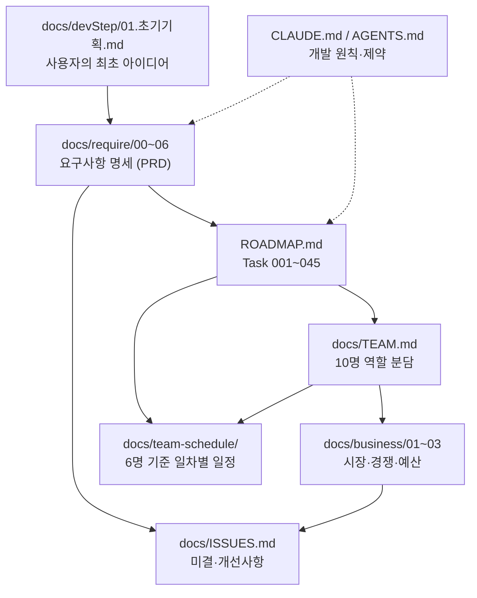

# football4 — 가상 축구 리그 시뮬레이션 & 배팅 플랫폼

> **"플레이하지 않고, 지켜보고 예측한다."**
> 컴퓨터가 24/7 자동으로 진행하는 3티어(24/20/16팀) 가상 축구 리그 세계를 구축한다.
> 사용자는 팀을 조작하지 않고 **관전**하며(1차 릴리스), 이후 **배팅**한다(2차 릴리스).

기술 스택: Next.js 16 (App Router) / React 19 / TypeScript / TailwindCSS v4 / Supabase
현재 상태: **구현 착수 — 25일차 진행 완료 (2026-08-24 기준)**. 8일차에 도메인 타입 47종이 **동결(H-01)** 됐고, 지금은 그 위에서 6팀이 병렬로 계약·엔진·상수·물리 스키마를 쌓는 단계입니다. **화면은 라우트 골격 + 전역 레이아웃 + 로케일 라우팅까지 완성됐고(Task 005 종료), DB에는 39테이블 + 인덱스 20개 + RLS 39/39가 실제로 적용됐습니다** — 화면 본문은 전부 자리표시자이며 5팀이 34일차 이후 채웁니다. 15일차에 **머지 게이트(`npm run gate`)** 가 가동돼 `tsc → lint → test:coverage`가 병합 전 강제되고, **20일차에 이 게이트가 GitHub Actions CI(`.github/workflows/ci.yml`)에도 연결**됐습니다. **24일차에 `next typegen`이 앞단에 추가돼 4단이 됐습니다** — 로컬에만 남아 있던 Next 생성 타입 때문에 로컬은 통과하고 CI만 실패하던 위양성을 없앤 것입니다(I-138).

```bash
npm run dev            # 개발 서버 (http://localhost:3000) — webpack 고정
npm run lint           # ESLint
npm run test           # Vitest 1회 실행
npm run test:watch     # Vitest watch 모드          ← 13일차 신규
npm run test:coverage  # 커버리지 리포트            ← 13일차 신규
npm run gate           # 4단 머지 게이트            ← 15일차 신규 / 24일차 확장
                       # next typegen → tsc --noEmit → lint → test:coverage, fail-fast
                       # WSL에서 next build가 EPERM으로 죽으므로(I-62) 빌드는 미포함
npx tsc --noEmit       # 타입체크 (별도 스크립트 없음)
```

> ⚠️ **WSL 마운트 경로(`/mnt/...`) 환경 주의 (I-62)** — Turbopack은 파일 쓰기 실패로 구동되지 않습니다. **`npm run dev`는 `next dev --webpack`으로 고정돼 있으니 그대로 쓰면 됩니다**(12일차 조치). `npx next dev`(플래그 없음)로 직접 띄우지 마세요 — EPERM으로 죽고 루트에 Windows 리터럴 경로 디렉터리(`E:\...`)를 만듭니다(I-87). 14일차에 기존 디렉터리는 삭제됐고 ESLint `globalIgnores`도 걸려 있지만, 플래그 없이 띄우면 다시 생깁니다.
>
> **`npm run build`는 번들러와 무관하게 실패**합니다(webpack 경로도 최종 `copyfile` 단계에서 EPERM). **빌드 성공을 검증 수단으로 쓰지 말고** `npx tsc --noEmit` / `npm run lint` / `npm run test`로 판정하세요. 근본 해소책은 리포지토리를 WSL 네이티브 파일시스템으로 옮기는 것이며, 아직 결정되지 않았습니다.

---

## 진행 현황 (25일차 · 2026-08-24)

25일차에는 4팀(2·3·4·6)이 배정돼 진행했습니다. 2팀은 **Berger 원형 로테이션 더블 라운드로빈**을 냈고(24/20/16팀 → 552/380/240경기·46/38/30라운드, **리터럴 24/20/16 0건**으로 NFR-SC-003 준수), 팀장 지시로 홈/원정 균형 단언을 보강해 3개 티어 모두 팀당 홈=원정=N−1을 고정했습니다. 3팀은 **재정 위기 판정**을 내면서 스폰서 부도가 영구 상태인 것과 달리 **재정 위기는 매 프리시즌 재판정·즉시 회복**으로 갈랐고(FR-EC-012 "프리시즌에 진입하면"), 실제 강제 매각은 스쿼드를 아는 Task 030에 위임했습니다.

**오늘의 핵심은 "검증이 검증되지 않고 있었다"는 것이 두 곳에서 동시에 드러난 것입니다.** 6팀은 034a의 "컴포넌트 Supabase 직접 import 0건"을 **위반 코드를 실제로 주입해 보는 방식**으로 검증했고, 그 결과 **가드레일이 죽어 있는 것을 발견**했습니다 — ESLint flat config는 같은 파일에 매칭되는 여러 블록이 **같은 규칙 키를 설정하면 병합하지 않고 뒤 블록으로 전체 교체**하는데, 22일차에 추가된 Task 044 블록이 **H-06 컴포넌트 가드레일**과 **NFR-DT-001 sim 도메인 가드레일**을 통째로 덮어써 22일차부터 둘 다 무력화돼 있었습니다(sim 건은 팀장 지시 전수확인에서 추가 발견). **규칙 추가 1회가 가드레일 2개를 동시에 죽인 구조적 사고**이며, 위반 5종 실주입으로 전건 발동을 확인해 해소했습니다(I-140). 같은 성격으로 4팀 컬러 토큰은 **색맹 상호 구분(ΔE)만 검증하고 배경 대비 축이 통째로 빠져 있었습니다** — 팀장 실측 결과 라이트 `--warning`이 **1.34:1**로 비텍스트 3:1 기준도 못 넘었고, **5개 중 4개 토큰이 sRGB 색역 밖**이라 브라우저 클램프로 실제 렌더 색이 달라져 **원 ΔE 검증 자체가 무효**였습니다. 색역 안으로 채도를 낮추고 `--warning`을 배지 채움 전용으로 확정한 뒤 짝이 되는 `--warning-foreground`를 신설해 해소했습니다. 두 건 모두 **재현 가능한 회귀 테스트가 없었던 것이 진짜 원인**이라, 컬러는 `globals.css`를 파싱하는 102케이스 테스트로 고정했고 ESLint 가드레일 쪽은 **I-142로 1팀에 배정**했습니다(6팀이 `ESLint#lintText`로 실현성 프로토타입까지 검증해 넘김).

**팀장 검증에서 결함 1건은 팀장 귀책입니다** — 4팀을 두 번 소환해 검증 테스트가 두 파일로 중복 생성됐습니다(23일차 중복 기동과 같은 계열). 커버 축이 상호 보완적이라 어느 쪽도 버리지 않고 한 벌로 통합했습니다(4축 전부 보존, 102케이스). 6팀의 **API p95는 측정 불가로 46일차 이월** — 선행 조건 `/api/health`가 46일차 인계물이라 `src/app/api/**`가 아직 없으며, **허위 수치 대신 사유를 보고한 올바른 처리**입니다. 그 밖에 오래 미배정이던 **I-119(→2팀)·I-111(→3팀·6팀)·I-134(→6팀)·I-139(해소)** 를 전부 결론냈습니다. 최종 게이트 4단 전부 통과(937 tests, 커버리지 96.3%).

## 진행 현황 (24일차 · 2026-08-21)

24일차에는 4팀(2·3·4·6)이 배정돼 진행했고 **Task 024(능력치 보정 체인)가 종료**됐습니다. 2팀은 23일차 자기 테스트가 weather/manager에 **테스트 전용 리터럴 테이블을 주입해 실제 공통코드 로더 경로를 타지 않았다**는 것을 스스로 진단하고 실 로더 경로 통합 검증을 추가했으며, `ability/README.md`로 9개 계수의 반환 타입과 **H-14(경기 결과·이벤트 타입)를 3팀에 인계**했습니다. 3팀은 스폰서 부도 판정을 내면서 `EXPIRED`/이미 `VOIDED`인 계약을 **대상에서 제외**했습니다(만료 계약까지 덮어쓰면 이력이 왜곡되므로) — 같은 파일의 급여 이중 지급이 예외를 던지는 것과 달리 **중복 부도 조회는 정상 흐름이라 `null` 반환**으로 갈랐습니다. 4팀은 브레이크포인트 6종을 `@theme inline`에 넣고 **I-135를 해소**했으며(리터럴 66→70), 시맨틱 컬러는 와이어프레임 문서가 "28일차 전 미정"이라 명시한 근거로 25일차에 이월했습니다. 6팀은 배정된 034a 작업이 **22~23일차에 이미 완료돼 있음을 조사로 확인하고 코드 변경 0건으로 보고**했습니다 — 팀장이 전 항목을 직접 재현해 타당함을 확인했습니다(I-139, 일정 문서 중복 배정).

**팀장 검증에서 차단급 결함 1건(I-138)**: 23일차 인계에 따라 CI를 실측했더니 **"CI 복구" 판정이 오판이었고 CI는 4일 연속 레드**였습니다. 원인은 `PageProps`/`LayoutProps`가 Next.js **생성물**(`.next/types` + `next-env.d.ts`, 둘 다 gitignore 대상)이라는 것으로, **로컬은 이전 `next dev` 산출물이 남아 tsc가 우연히 통과했지만 CI는 체크아웃 직후라 타입 오류 10건으로 6초 만에 실패**하고 있었습니다. 즉 **로컬 게이트 통과가 CI 통과를 보장하지 못하는 위양성**이었습니다. 진단 과정에서 **로그 다운로드는 403이지만 check-run annotations는 공개 조회가 가능**하다는 것을 찾아 실패 10건의 파일·행·메시지를 전부 확보했고(이후 CI 실패 진단의 기본 수단), 1팀을 추가 소환해 `scripts/gate.sh` 앞단에 `npx next typegen`을 넣어 해소했습니다. `.next`·`next-env.d.ts`를 완전히 제거한 CI 동일 상태에서 **1팀과 팀장이 각각 독립 재현**해 4단 게이트 exit 0을 확인했고, **push 후 러너에서 24일차 커밋 CI가 실제로 success임까지 확인**했습니다(5일 만의 실질 복구 — 23일차와 달리 로컬이 아니라 러너 결과로 판정했습니다). **⚠️ 브랜치 보호가 없어 4일치 레드가 그대로 master에 누적됐습니다(I-131, 사용자 판단 대기).**

## 진행 현황 (23일차 · 2026-08-20)

23일차에도 5팀(1·2·3·4·6)이 병렬로 진행했고 **Task 044(CI 게이트·배포 파이프라인)가 종료**됐습니다. 오늘의 핵심은 **3일간 미확인이던 CI 첫 실행 결과가 확인됐고, 그 결과 CI가 3일 내내 레드였다는 사실이 드러난 것**입니다 — 1팀이 `gh` CLI 없이도 **repo가 public이라 `curl`로 Actions 실행 상태를 조회할 수 있음**을 찾아내 블로커를 풀었고, 확인해 보니 3회 연속 실패였습니다. 원인은 6팀의 22일차 산출물(`client.ts`/`index.ts`)이 테스트 없이 들어와 **커버리지 perFile 임계를 위반**한 것이었습니다. 즉 **게이트는 정상 동작했지만 아무도 그 결과를 보지 않고 있었습니다.** 6팀이 테스트를 붙여 해소했고, 그 과정에서 `client.ts`의 **이중 URL 인코딩 실버그**(공백이 `%2520`으로 나가 팀명 등 공백·한글이 든 PostgREST 필터가 **항상 불일치**)까지 잡았습니다 — 커버리지를 숫자 채우기로 처리했다면 놓쳤을 건입니다. 1팀은 `docs/deploy-runbook.md`를 냈는데, 실측이 두 전제를 뒤집었습니다: **스테이징(Supabase 브랜칭)이 미구성**이고(I-133), **로컬 마이그레이션 2파일 vs 원격 19건 적용**이라 **git으로 스키마 재현이 불가**합니다(I-132, 자격증명 필요). 4팀은 shadcn을 도입하며 init 기본값 2건이 프로젝트 규약과 충돌하는 것을 직접 교정했고(`.dark` 클래스 → `prefers-color-scheme`, WSL EPERM 우회), 3팀은 스폰서 계약과 **enums ko/en 실값 66리터럴**을, 2팀은 ability 계수 **커버리지 100%**를 달성했습니다. **최종 `npm run gate` 전체 통과 — CI 레드가 복구됐습니다.**

**팀장 검증에서 결함 3건**: ⓐ **팀 인스턴스 중복 기동(팀장 귀책)** — 3·4·6팀이 소환 직후 종료 통보를 보냈으나 실제로는 살아 있었고, 팀장이 `git status`(당시 clean)만 보고 재소환해 경합이 발생했습니다. 작업 시작 직후엔 산출물이 없어 clean이 정상이므로 **clean은 "종료됨"의 근거가 못 됩니다**. 4팀 재소환분이 경합을 감지해 즉시 멈추고 보고했고, 3팀은 우연히 작업이 갈려 유실이 없었습니다. ⓑ **`lucide-react` import 0건** — 수락 기준 "의존성 최소(NFR-MT-008)"를 **"마감 시점 `src/` 내 import 0건인 런타임 의존성은 남기지 않는다"**로 구체화해 제거했습니다. ⓒ **034a 라벨 오류** — 오늘 6팀 일정 행이 `match_event` 필터를 "034a"로 표기했으나 034a는 Supabase 어댑터(22일차 종료)이고, 이 항목은 라벨 없는 별도 항목이었습니다(**034-E**로 라벨 부여, I-130). 덕분에 이 항목의 수락 기준 ①이 아직 미충족(`is_event_elapsed()`가 의도된 스텁, 30일차 확정)임이 확인돼 조기 체크를 막았습니다. 신규 이슈 8건(**I-130~I-137**), **I-127 종결**. **⚠️ 브랜치 보호가 없어 CI 실패가 머지를 막지 못합니다(I-131, 사용자 판단 대기).**

## 진행 현황 (22일차 · 2026-08-19)

22일차에도 5팀(1·2·3·4·6)이 병렬로 진행했고 **Task 011(i18n)과 034a가 함께 종료**됐습니다 — 4팀이 로케일 스위처(`src/components/` 첫 파일)·쿠키 영속화·Provider 실배선을 내면서 **D-18 경고 111건을 0건으로 해소**해 19일차부터 조건부였던 1팀 lint 수락 기준까지 함께 닫았고, 6팀은 `DataSource` **전 55메서드 구현 + `factory.ts` 등록**으로 034a를 끝냈습니다(`@supabase-js` 미설치는 PostgREST fetch 브리지로 우회 — 설치 후 1줄 교체). 2팀은 카드·퇴장 정지를 **리그/컵 축으로 완전 분리**했고, 3팀은 급여 이중 차감을 **원장 스캔으로 구조 차단**했으며(플래그를 만들면 원장과 이중 소스가 되므로), 1팀은 gitleaks 시크릿 스캔 워크플로우와 **프로덕션의 `@/lib/mock` import를 막는 ESLint 룰**(21일차 결함 A 재발 방지)을 냈습니다.

**팀장 검증에서 결함 3건 — 모두 하나의 배선에서 연쇄로 드러났습니다.** ⓐ 11일차에 확정하고 12일차에 승인한 **`await bootstrapApp()` 루트 레이아웃 배선이 9일간 실행되지 않았습니다**(호출처 grep 0건) — 공통코드 폴백 등록과 어댑터 등록이 둘 다 죽어 있었습니다. 이를 붙이자 ⓑ **I-75가 실결함으로 확정**됐습니다: `bootstrap.ts`의 변수 경유 동적 import를 webpack이 해석하지 못해 1차 `/ko`가 500(`Cannot find module './mock'`)이었고, 11일차에 "정적 분석으로 두 갈래를 모두 포함할 가능성이 높다"고 본 낙관이 틀렸습니다(등재해 둔 대안인 리터럴 분기로 해소). 그 과정에서 4팀이 ⓒ **부트스트랩 완료 플래그가 `await` 이전에 세팅돼 실패를 은폐하는 구조**를 발견했습니다 — 첫 요청만 500이고 **두 번째부터는 전 라우트가 200으로 조용히 통과하지만 등록은 끝내 실행되지 않습니다**. ⓑ보다 위험하다고 판정해(향후 어떤 부트스트랩 실패든 한 번만 깨지고 정상처럼 보임) in-flight Promise 캐시로 전환하고 회귀 9건을 고정했습니다(**I-127**). 세 건 모두 팀장이 격리 포트로 직접 재현·재검증했습니다(수정 후 1차 `/ko`·`/en` 200, webpack 경고 0건). 신규 이슈 3건 — **I-128**(Playwright Chromium 미설치로 Task 011의 클릭 전환 실측이 미수행, 28일차 이후 UI 검증마다 반복될 사안), **I-129**(`loading`/`not-found`가 Next 16에서 `params` 접근 불가로 DEFAULT_LOCALE 고정). **⚠️ CI 첫 실행 결과는 `gh` CLI 부재로 3일째 미확인이며, 오늘 `secret-scan.yml`이 추가돼 확인 대상이 2개가 됐습니다.**

**같은 계열 결함이 네 번째입니다**(I-67 · I-72 · I-117 · 오늘 ⓐ) — "등록 함수를 만들었는데 아무도 호출하지 않는다"를 잡아낼 수단이 lint·tsc·test 어디에도 없어, 게이트화 여부를 23일차에 검토합니다.

## 진행 현황 (21일차 · 2026-08-18)

전체 일정은 **94영업일(~2026-11-27)**, 1차 MVP는 74일차(2026-10-30)입니다. **8일차에 SP-1 타입 동결(H-01)이 완료**됐고, 이후 `src/types/**` 변경은 이슈 배치(C-7) 반영만 가능합니다 — 13일차에 그 절차가 처음 발동해 공통코드 범위 3필드가 E-41→E-42로 이동했습니다(I-93).

21일차에도 5팀(1·2·3·4·6)이 병렬로 진행했습니다 — 2팀이 **라인업 자동 선정**(부상·정지 선발 0건 테스트 고정), 3팀이 **몸값 공식**(하한 100pt를 배율 로직과 분리된 마지막 줄로 구조 보장), 4팀이 **번역 경계 문서**(`src/i18n/README.md` — 애매 사례 3종 + 자동/사람 검출 구분표), 6팀이 **034a 2/3**(4메서드), 1팀이 **스냅샷 갱신 차단 + 번역 키 검사 CI 편입**을 냈습니다. 1팀은 번역 키 검사를 **중복 구현하지 않았습니다** — `keys.ts`의 재귀 타입 덕에 `tsc`가 이미 잡는다는 것을 TS2741/TS2353 실측으로 입증하고 기존 게이트 강화(`UPDATE_SNAPSHOT: none` 명시)로 갈음했습니다. **팀장 검증에서 결함 1건**: 6팀의 프로덕션 `SupabaseDataSource`가 `toPublicProfile`을 쓰려고 `@/lib/mock/fixtures/screens`를 import했는데 그 파일이 Mock 월드 생성기 전체를 정적 import해 **프로덕션 어댑터 그래프에 Mock 스택이 딸려 들어왔습니다** — Task 034의 존재 이유와 충돌해 `src/lib/data/player-profile.ts`로 추출했고(재export 없음), **의존 방향이 `data → mock`에서 `mock → data`로 뒤집힌 것**을 grep 0건으로 실증했습니다. 6팀은 스스로 이 차이를 감지해 판단을 물어왔고 절차상 정확했습니다. 신규 이슈 7건 — 그중 **I-121**은 "소비 측이 공통코드 키 이름을 시드보다 먼저 확정"하는 패턴이 이틀 연속 2개 팀에서 반복돼 I-118을 구조적 문제로 승격한 것이고, **I-123**은 `PlayerState`에 출전 이력 필드가 없어 이력 기반 로테이션이 불가함을 기록한 것입니다(Task 024 로테이션은 **부분 충족**으로 판정). **⚠️ CI 첫 실행 결과는 `gh` CLI 부재로 2일째 미확인입니다.**

20일차에는 5팀(1·2·3·4·6)이 병렬로 진행했고 **Task 044의 CI 게이트가 가동**됐습니다 — 1팀이 `.github/workflows/ci.yml`을 올려 push·PR(master)에서 **`npm run gate` 단일 호출**로 3단 게이트를 돌리게 했습니다(로컬과 CI가 갈라지지 않도록 스텝을 개별 나열하지 않았습니다). 2팀은 날씨·감독 계수를 내며 **`tactics.ts` 분리를 확정**했는데, 19일차 포지션 판단을 승계하지 않고 "`fallback.ts`에 안전 기본값 자체가 없어 로더를 반드시 거쳐야 한다"는 **별도 축으로 재판단**한 것입니다. 3팀은 포인트 원장을 **잔고를 직접 바꾸는 함수를 아예 만들지 않는 API 표면**으로 설계해 "원장 없는 잔고 변동 0건"을 구조적으로 강제했고, 4팀은 날짜·숫자 포맷터를 단일 소스로 세웠으며(`src/**`에서 `Intl.*` 직접 호출 0건 실증), 6팀은 `@supabase/*` 미설치 제약을 **클라이언트 주입 인터페이스(duck-typing)** 로 우회해 034a 1/3을 냈습니다. **팀장 검증에서 결함 1건**: 2팀 수락 기준이 "숫자 리터럴 0건 **(CI 검증)**"인데 `check:literals`가 게이트·CI 어디에도 없어 **19일차에 막 해소한 I-117과 같은 계열**이었습니다 — 다만 후보 55건이 전부 기존 파일이고 스크립트 자신이 휴리스틱이라 명시하므로 blocking이 아니라 **비차단 advisory 스텝**으로 연결했습니다(I-115 갱신). 신규 이슈 2건(**I-118** 시드 키 이름 정렬, **I-119** xG 배율 Task 행 누락 — `ROADMAP.md`에 "xG" 문자열 0건). **⚠️ CI는 아직 러너에서 실행된 적이 없어 첫 실행 결과 확인이 21일차 몫입니다.**

19일차에는 5팀(1·2·3·4·6)이 병렬로 진행해 **결함 0건**으로 마감했고, **Task 007(Mock 팩토리)과 Task 010(코드 규약·정적 가드레일)이 함께 종료**됐습니다 — 1팀이 `bootstrap.test.ts`를 "배럴 존재 여부 런타임 검사" 방식으로 재작성해 **I-113의 순서 고정 자체를 없앤 뒤**, 3팀이 `mock/index.ts` 배럴 + `registerDataSource` 배선(**H-07**)을 올려 4·5·6팀의 20일차 Mock 소비가 열렸습니다. 2팀은 포지션 계수를 인접 그래프 BFS로 구현하며 `position.ts` **분리를 확정**했고, 4팀은 열거형 표시명 카탈로그 골격(66키, enum 전 멤버를 tsc가 강제)을 냈으며, 3팀은 Mock 기준 시각 3종의 최대 3일 편차를 단일 앵커로 통일했습니다(**I-114**). **팀장 판정 1건**: 1팀 수락 기준 "`npm run lint` 경고 0"은 잔존 111건이 전부 4·5팀 소유 `src/app/**`의 D-18 항목이고 Task 011(22일차)에 종속돼 **조건부 충족으로 판정하고 22일차 재판정**으로 넘겼습니다(**I-116**). 또 마감 검증에서 **실결함 1건(I-117)** 이 드러났습니다 — 15일차에 만든 `npm run gate`가 일차 마감 판정에 연결되지 않아(계속 `npm run test`로만 판정했고 여기엔 `--coverage`가 없습니다) **16~18일차 동안 perFile 커버리지 임계 위반 6건이 누적·미검출**됐습니다. 18일차 커밋을 별도 worktree에 체크아웃해 이월 건임을 재현 확인한 뒤 1·3·6팀이 분담 해소했고(**신규 테스트 54건**, 570→624), **마감 검증을 `npm run gate`로 고정**했습니다.

18일차에는 5팀(1·2·3·4·6)이 병렬로 진행했고 **Task 032(DB 마이그레이션)가 종료**됐습니다 — 6팀이 이월돼 있던 성능 advisor **211건(`auth_rls_initplan` 41 + `multiple_permissive_policies` 170)을 전량 0으로** 떨어뜨렸고(원인은 SELECT 권한이 두 정책에 중첩된 구조), 3팀이 `MockDataSource`로 `DataSource` **56개 메서드를 전량 구현**해 **I-106을 완전 해소**했으며, 4팀이 서버·클라이언트 겸용 번역 함수 `t()`와 로케일 Provider를, 2팀이 컨디션·피로·캐미 **실공식 3종**을, 1팀이 **D-18 하드코딩 문자열 검출 룰**을 냈습니다. **팀장 검증에서 결함 1건**(6팀이 수락 기준의 "보안" 경고를 스코프 밖으로 남김)을 반려해 보안 advisor를 5→1건으로 마감했고, **팀 보고 2건은 직접 재현·이력 조회로 오탐 기각**했습니다.

17일차에도 5팀(1·2·3·4·6)이 병렬로 진행해 **결함 0건**으로 마감했습니다 — 1팀이 sim·컴포넌트 import 가드를 채웠고, 2팀이 능력치 계수 9종 골격과 클램프를, 3팀이 4상태 픽스처 11화면분을, 4팀이 번역 키 타입 안전 접근을, 6팀이 DB 타입 39테이블 + 38엔티티 매퍼를 냈습니다. 팀 제보 1건은 팀장이 **DB 원본을 직접 조회해 실결함으로 확정**했습니다(**I-110** — `team_season_stat`의 동반 null 불변식을 강제하는 CHECK 제약이 실제로 없습니다).

16일차에는 5팀(1·2·3·4·6)이 병렬로 진행해 **결함 0건**으로 마감했습니다 — 2팀 성능 벤치가 수락 기준(p95 ≤ 50ms)을 250배 여유로 통과했고, 6팀이 `unindexed_foreign_keys` 65건을 전량 해소했습니다. 팀 제보 1건은 원본 대조 결과 **사실과 달라 기각**했습니다(I-108 — 리스크 번호의 단일 소스는 `docs/require/06-prioritization-and-risks.md`입니다).

14일차에는 사용자 판정 3건이 확정됐습니다 — **I-83**(엔진은 공통코드를 `SimConstantSnapshot`에서 **파라미터로 주입**받고 `loadConstants()` 직접 호출은 엔진 밖 오케스트레이션 계층 소관), **I-88**(국적 비중을 공통코드 그룹으로 신규 추가 → **36그룹 → 37그룹**, D-17 원문 준수), **I-87**(스트레이 빌드 캐시 디렉터리 삭제).

| Task | 담당 | 상태 |
|---|---|---|
| **001** 확정 결정(D-15~D-26) 설계 전제화 | 1팀 | ✅ 완료 (2일차) |
| **006** 시드 PRNG·결정론 유틸 | 2팀 | ✅ 완료 (6일차) — 118케이스 + 100만 회 바이트 동일성 벤치 |
| **002** 도메인 타입 47종 | 1팀 | ✅ **동결** (8일차, H-01) — E-01~E-47 전량 |
| **004** `DataSource` 인터페이스 | 1팀 | ✅ 완료 (11일차) — 9군 시그니처·팩토리·4상태 래퍼·폴링 계약(H-02) |
| **003** 공통코드 카탈로그 | 3팀 | ✅ **완료** (12일차) — 로더·폴백·발효정책·스냅샷 해시. **H-05 인계**. 14일차 I-88로 36→**37그룹**(`NATIONALITY_WEIGHT`) |
| **009** DB 스키마 설계 | 6팀 | ✅ **완료** (12일차) — 47엔티티·관계·인덱스·RLS 초안·타입 대응표(불일치 0). **H-08 인계** |
| **005** 라우트 골격 | 4팀 | ✅ **완료** (13일차) — 20라우트 × `{loading,error,not-found}` 60파일. ⚠️ Playwright 콘솔 스모크만 15일차 이월 |
| **008** 테스트 하네스 | 1팀 | ✅ **완료** (15일차) — **3단 머지 게이트 `npm run gate`** + perFile 커버리지(I-94 해소). aggregate lines 98.05%/branches 90.7% |
| **023** 매치 틱 엔진 | 2팀 | 🔄 순회·이벤트 23종·스탯 폴드·교체·승부차기·GK 폴백 + 시드 스냅샷 100경기 diff 0 + **성능 벤치 p95 0.203ms / p99 0.430ms**(16일차, 한도 50/120ms) — **수락 기준 충족** |
| **007** Mock 월드 팩토리 | 3팀 | ✅ **완료** (19일차) — 월드 팩토리·진행 상태·4상태 픽스처·`MockDataSource` 전 메서드 + **배럴 `registerDataSource` 배선(H-07)**. I-106·I-113·I-114 해소, 4·5·6팀 20일차부터 소비 개시 |
| **032** DB 마이그레이션 | 6팀 | ✅ **완료** (18일차) — 39테이블 + RLS 39/39 + 인덱스·제약 + 매퍼 38엔티티. **advisors 성능 211건 → 0, 보안 5건 → 1건**(잔존 1건은 예외 승인 I-112). `unused_index` 73건은 Task 042 이관 |
| **012** 디자인 시스템 | 4팀 | 🔄 **shadcn 도입**(23일차) — `components.json` + `cn()` + 프리미티브 8종(button·badge·card·table·tabs·separator·skeleton·tooltip). init 기본값 2건을 규약에 맞게 교정(`.dark` → `prefers-color-scheme`, WSL EPERM 우회). 잔여: 토큰 확장·시맨틱 컬러·대비 검증(24~27일차) |
| **011** i18n 기반 | 4팀 | ✅ **완료** (22일차) — 로케일 라우팅 + 카탈로그 8네임스페이스 + 키 타입 파생 + 서버·클라 겸용 `t()` / `TranslationProvider` + **열거형 카탈로그 골격 66키**(19일차) + **날짜·숫자 포맷터 단일 소스**(20일차) + **번역 경계 문서 `src/i18n/README.md`**(21일차, 애매 사례 3종 + 자동/사람 검출 구분표) — **22일차 종료**: 로케일 스위처(`src/components/` 첫 파일)·쿠키 영속화·Provider 실배선 + **D-18 경고 111건 → 0건**(1팀 lint 수락 기준도 함께 해소). Playwright Chromium 미설치로 클릭 전환 실측은 미수행(I-128) |
| **010** 코드 규약·정적 가드레일 | 1팀 | ✅ **완료** (19일차) — sim 결정론·import 가드 + D-18 룰 + 리터럴 검사 스크립트 + **PR 체크리스트·ISSUES 갱신 규약**. lint 경고 0은 D-18 잔존 111건(Task 011 종속)으로 **조건부 충족, 22일차 재판정**(I-116). H-06은 5팀 인계 |
| **024** 능력치 보정 체인 | 2팀 | 🔄 **핵심 9개 함수 커버리지 100% 달성**(23일차, NFR-QA-002) — 계수 9종 + 실공식(컨디션·피로·캐미·포지션 BFS·날씨·감독 6×6) + **라인업 자동 선정**(21일차, 부상·정지 선발 0건 고정). 로테이션은 `PlayerState` 출전이력 필드 부재로 **부분 충족**(I-123). 계수 값은 36일차 시드 이후. + **카드 누적·퇴장 정지 리그/컵 분리 및 I-03 해소**(22일차). 계수 값은 36일차 시드 이후 |
| **029** 포인트 경제 | 3팀 | 🔄 **포인트 원장**(20일차, 잔고 직접 변경 함수 부재로 수락 기준 구조적 강제) + **몸값 공식**(21일차, 하한 100pt를 배율과 분리된 마지막 줄로 보장). + **급여·성과 분배·스폰서 수입**(22일차, 이중 차감을 원장 스캔으로 구조 차단). + **스폰서 계약**(23일차, 팀당 3슬롯을 예외로 강제) + **enums ko/en 실값 66리터럴**. 잔여: 부도 판정·재정 위기(26일차까지) |
| **034a** Supabase 어댑터 | 6팀 | ✅ **완료** (22일차) — **1/3 순위·일정**(20일차) + **2/3 경기상세·선수·클럽·통계**(21일차) = 6메서드. `@supabase/*` 미설치를 클라이언트 주입(duck-typing)으로 해소. 21일차 결함 A 조치로 **프로덕션 어댑터의 Mock 의존 제거**(`player-profile.ts` 추출). **3/3(22일차)로 전 55메서드 구현 + `implements DataSource` 전환 + `factory.ts` 등록 완료.** `@supabase-js` 설치 시 1줄 교체로 실클라이언트 전환 |
| **044** CI 게이트 | 1팀 | ✅ **완료** (23일차) — 3단 게이트 CI(20일차) + 스냅샷 갱신 차단·번역 키 검사(21일차) + gitleaks 시크릿 스캔(22일차) + **`docs/deploy-runbook.md`**(23일차: 환경 분리·마이그레이션 순서·Edge Fn 배포/롤백·요금제). **수락 기준 실측 충족** — `curl`로 CI 결과 확인 수단을 뚫어(public repo) 3회 연속 실패를 확인, 게이트가 실제 회귀(커버리지 0%)를 잡아냄을 입증. ⚠️ 브랜치 보호 부재로 **머지 차단은 미충족**(I-131) |

**현재 코드**

```
src/types/        11파일 — E-01~E-47 전량 정의 후 8일차 동결(H-01)
                  34속성(기술10·정신10·신체8·GK6), enum 34종·177리터럴 확정
src/lib/sim/rng/  5파일 — prng(xoshiro128**) / derive(시드 계층) / precision(6자리 정수 비교)
                          sort(tiebreak 키 타입 강제) / hash(외부 의존 0 SHA-256)
src/lib/sim/match/ tick.ts — 90(+30)틱 순회, 추가시간(전반 0~5 / 후반 1~8)  ← 9일차
                   events.ts — 이벤트 23종 생성·시간순 정렬, 밸런싱 리터럴 0건 ← 10일차
                   stats.ts — Tier A 16필드 이벤트 폴드                    ← 11일차
                   substitution.ts — 교체 5명·3창, 부상 즉시 교체          ← 12일차
                   penalty.ts — 승부차기 5+서든데스, PK골 통산 미포함(D-19) ← 13일차
                   gk-fallback.ts — GK 퇴장 시 필드플레이어 배치(D-22)      ← 14일차 신규
                                    배율은 리터럴이 아니라 스냅샷 주입(I-83)
                   snapshot-pipeline.ts — 100경기 틱→이벤트→PK→스탯 단일소스 ← 15일차 신규
                   __snapshots__/ — 다이제스트 스냅샷(경기당 SHA-256 hex 2개)
                                    원본 배열은 수만 줄이라 리뷰 불가 → 축약
src/lib/naming/    generate.ts — 국적 기반 결정론 이름 생성(D-17)          ← 13일차
                   namePools.ts(20개국·표기순서) / blacklist.ts(실명 회피)
                   emblem.ts — 절차적 엠블럼 SVG(외부 의존 0, D-16)        ← 14일차 신규
                               도형5·배색6·문양5·색상을 crestSeed로 결정
src/__suites__/    검증 스위트 골격 6종 — 단위/스냅샷/분포/회계/구조/성능   ← 13일차 신규
                   (D-03은 전역 게이트라 sim 하위가 아닌 프로젝트 레벨)
src/lib/data/      DataSource.ts — 화면별 조회 메서드 9군                 ← 9일차
                   result.ts — 4상태 판별 유니온 / factory.ts — 어댑터 선택  ← 10일차
                   polling.ts / fetch-result.ts / bootstrap.ts            ← 11일차
                   *.test.ts 4종 — 0% 방치분 해소(polling만 제외, I-99)   ← 15일차
                   database.types.ts — 생성 DB 타입 39테이블 3,184줄       ← 17일차 신규
                   supabase/mapper.ts — DB Row→도메인 단방향 매퍼 38엔티티  ← 17일차 신규
                                        (컴포넌트는 DB 타입 직접 참조 안 함)
                   mock/MockDataSource.ts — DataSource 56메서드 전량 구현  ← 18일차 신규
                                        getStandings는 schedule.ts 역산값
                                        (I-106 해소). 배럴 등록은 19일차
src/lib/mock/      world.ts — 시드 1개로 3리그 60팀·1,577명·감독60·스폰서41 ← 15일차 신규
                              결정론 생성(Math.random·Date.now 0건)
                   world.test.ts — 스쿼드 불변식·등번호 무중복·OVR 리그차
                   progress.ts — 라이브/타임라인/순위표/스탯/뉴스/브래킷    ← 16일차
                   fixtures/ — schedule.ts(더블 라운드로빈 풀 일정·순위표    ← 17일차 신규
                               역산, I-106) / states.ts(4상태 빌더) /
                               screens.ts(11화면 × 4상태 픽스처)
src/lib/sim/ability/ modifiers.ts — 계수 9종 + 클램프 [0.35,1.35] 단일 진입점 ← 17일차
                                   컨디션·피로·캐미 실공식 3종            ← 18일차 신규
                                   잔여 5종은 자리표시자(19~20일차)
src/lib/config/    catalog.ts — 공통코드 그룹 **37종**(14일차 I-88로 +1)   ← 9일차
                   loader.ts — 그룹코드·반환타입 컴파일타임 강제 로더       ← 10일차
                   fallback.ts(37그룹 안전 기본값) / policy.ts(발효 3종)   ← 11일차
                   snapshot.ts — 상수 스냅샷 SHA-256·중복 제거            ← 12일차
src/app/[lang]/    layout.tsx — 루트(html lang 동적) + 전역 레이아웃 골격   ← 12일차
                   17개 라우트 page.tsx (정규 14 + 2차 예약 3)            ← 10~11일차
                   20라우트 × {loading,error,not-found} 60파일           ← 13일차 신규
                   (error.tsx는 Next 16.2 신규 unstable_retry 사용)
supabase/          migrations/*.sql — 핵심 32테이블(13일차) +             ← 14일차
                   공통코드 4(E-41~44)·운영 3(E-45~47) = **39테이블 적용**
                   fixture/season.snapshot_id → sim_constant_snapshot FK 연결
                   + 인덱스 20개(§6.2.1 12 + §6.2.2 이월 7 + 기존 1)      ← 15일차 신규
                   + RLS 39/39 — A그룹34(공개SELECT+service_role쓰기)
                     B그룹4(append-only 트리거) C그룹1(match_event 차단·뷰)
docs/handoff/      H-10-enum-display-names.md — 열거형 ko/en 표시명 70건  ← 13일차
docs/db/           schema-design.md — 47엔티티 매핑·관계·인덱스·RLS 초안
                                      + §8 타입 필드 대응표(불일치 0건)    ← 12일차
                                      + §10 14일차 마이그레이션 실행 기록  ← 14일차
src/proxy.ts       무프리픽스 경로 → 기본 로케일 ko 307 리다이렉트         ← 15일차 신규
                   (Next 16에서 middleware.ts는 proxy.ts로 개명, I-57)
src/i18n/           locales.ts — SUPPORTED_LOCALES 단일 소스(Edge/Node 안전) ← 15일차
                    messages/{ko,en}/ — 8네임스페이스 × 2로케일 16파일      ← 16일차
                    keys.ts — 카탈로그에서 TranslationKey 유니온 파생        ← 17일차
                              (codegen 아님 — stale 불가, keys.type-test.ts)
                    t.ts — t(locale,key,params) 순수 함수(React 미의존)    ← 18일차 신규
                    provider.tsx — TranslationProvider/useTranslation
                                   (서버는 t() 직접, 클라만 Context)
scripts/check-literals.mjs — 공통코드 값과 겹치는 숫자 리터럴 검사         ← 18일차 신규
                   (정보성 — 게이트 미연결, I-115)
src/app/global-not-found.tsx — 레이아웃 우회 404(I-89 채택)              ← 15일차 신규
scripts/gate.sh    3단 머지 게이트 — tsc → lint → test:coverage fail-fast ← 15일차 신규
vitest.config.ts   @/* 별칭 + typecheck 모드 + 커버리지 임계 + **perFile** ← 15일차
                   include: sim/data/config/naming/mock, lines 80%/branches 70%

npm run test → 570 tests 통과(46파일) · Type Errors 0                ← 19일차 기준
lint → 0 error / 134 warning (그중 112건이 신규 D-18 룰 — 의도된 warn)
```

**18일차 주요 결정**

- **성능 advisor 211건의 원인은 정책 개수가 아니라 권한 중첩이었습니다** — 34개 테이블의 `_service_role_write`가 `FOR ALL`이라 `_public_select`의 SELECT와 겹쳤고, 이게 `multiple_permissive_policies` 170건의 실체였습니다. 정책을 통합하는 대신 **write를 INSERT/UPDATE/DELETE 3개로 쪼개 SELECT를 public_select 하나에만 남기는** 방향으로 풀었습니다 — 서비스롤 쓰기 분리라는 원래 설계 의도를 유지하면서 중첩만 없앱니다.
- **`match_event_visible`의 SECURITY DEFINER는 유지합니다**(I-112) — advisor가 ERROR로 잡지만, `match_event`에는 `service_role` 전용 정책 하나뿐이라 invoker로 바꾸면 **스포일러 차단이 아니라 전면 차단**이 됩니다(완료 경기 이벤트까지 0건). `security_barrier=true` 하드닝만 얹고 예외 승인했습니다. 헬퍼 함수 2종은 실제로 DEFINER가 불필요해 invoker로 전환했습니다.
- **번역 함수는 서버·클라이언트로 두 벌 만들지 않습니다** — `t(locale, key, params?)`를 React 미의존 순수 함수로 두고, 서버 컴포넌트는 `params.lang`으로 직접 호출(공식 `getDictionary` 패턴), 클라이언트는 Context가 **같은 `t()`를 바인딩**해 제공합니다. RSC가 Context를 쓸 수 없다는 제약 때문에 사실상 단일 선택지였고, 결과적으로 구현이 갈리지 않습니다.
- **Mock 배럴을 일부러 만들지 않았습니다**(I-113) — `src/lib/data/mock/index.ts`를 추가하는 순간 `bootstrapDataSource()`의 동적 import가 성공으로 바뀌어 1팀 `bootstrap.test.ts` 5건이 깨집니다. **1팀이 그 테스트를 "등록 성공 경로" 검증으로 갱신한 뒤에** 배럴을 올리는 순서를 고정했습니다.
- **캐미 계수는 상한만 주어져 곡선을 선형으로 확정했습니다** — 과제에 "상한 +6%"만 있어 1%p/시즌 선형(6시즌차 상한 도달)으로 채택하고 근거를 코드 주석에 남겼습니다. 밸런싱 재조정 시 이 지점이 후보입니다.

**17일차 주요 결정**

- **번역 키 타입은 codegen이 아니라 재귀 조건부 타입으로 파생합니다** — 카탈로그 → 리터럴 유니온 파일을 생성하는 스크립트는 카탈로그가 바뀔 때마다 재실행해야 하는데, 이 프로젝트엔 그 실행을 강제할 pre-commit 훅이 없습니다(Husky/lint-staged 미설치). 재실행을 잊으면 생성 타입이 stale해져 **"없는 키인데 타입은 통과"하는 정반대 결과**가 납니다. `messages.ko` 타입에서 직접 파생하면 카탈로그와 같은 컴파일에서 갱신되므로 이 실패 모드 자체가 없습니다.
- **계수 함수는 시그니처와 클램프만 먼저 고정합니다** — Task 024의 9개 계수 중 개별 8종은 담당 일차가 18·19·20일차로 흩어져 있습니다. 오늘 공식까지 채우면 그날 담당의 판단(특히 날씨·포지션 로직을 `tactics.ts`/`position.ts`로 분리할지)을 앞질러 버리므로, **클램프 진입점 하나만 단일화하고 나머지는 중립값 자리표시자로 비워** 뒀습니다.
- **매퍼가 가정하던 DB 불변식이 실제로는 강제되고 있지 않았습니다**(I-110) — 6팀이 "`team_season_stat`의 동반 null 불변식에 CHECK가 있는지 미확인"이라고 이슈 후보를 올렸고, 팀장이 `pg_constraint`를 직접 조회하니 **CHECK는 금액 범위 8건과 열거 1건뿐**이었습니다. 부분 null 행이 들어오면 타입은 통과하되 런타임에 `undefined` 필드를 가진 도메인 객체가 만들어집니다. 18일차에 `num_nonnulls(...) IN (0,4)` 제약으로 닫습니다.
- **순위표 라운드 가정(I-106)이 신규 경로에서 해소됐습니다** — 16일차 `progress.ts`는 "전 팀 동일 10라운드 소화" 표본이었는데, 17일차 `schedule.ts`가 더블 라운드로빈 풀 일정을 생성하고 `FINISHED` 경기만 집계해 순위표를 역산합니다. 다만 `progress.ts`는 "진행 중 스냅샷 전용"이라는 별개 목적이라 그대로 뒀고, **18일차 MockDataSource의 `getStandings`를 `schedule.ts` 파생값으로 배선**해야 완전 해소됩니다.

**15일차 주요 결정**

- **3단 머지 게이트가 실제로 커버리지를 강제합니다** — 최초 구현은 3단계가 `vitest run`(커버리지 없음)이라 임계가 한 번도 평가되지 않았고, 커버리지 0%인 변경도 게이트를 통과했습니다. 팀장 검증에서 발견해 `test:coverage`로 교체하고 임계 미달 시 exit 1을 재현 확인했습니다. **커버리지 범위도 `src/lib/sim`에서 `data`·`config`·`naming`·`mock`까지 확장**했는데, 확장하니 미달하는 건 남의 코드가 아니라 게이트를 만든 팀 자신의 `src/lib/data/**`(4파일 0%)였습니다 — 테스트를 새로 작성해 채웠습니다(I-94 해소, perFile 채택).
- **로케일 검증은 프록시가 아니라 라우트 단에서 합니다** — `proxy.ts`의 matcher는 설계상 일부 경로(`/admin`, 확장자 포함 경로 등)를 의도적으로 매치하지 않으므로, "프록시가 모든 요청을 정규화한다"는 전제가 성립하지 않습니다. 실제로 `/admin`과 `/nonexistent.txt`가 `<html lang="admin">`·`<html lang="nonexistent.txt">`로 **홈 화면을 200 응답**하는 결함이 두 차례 나왔습니다. `[lang]/layout.tsx`의 `LocaleGate`로 2중 방어를 걸어 무효 lang 렌더를 0건으로 만들었습니다(I-89 해소, 잔여 I-101).
- **DB 인덱스는 21개가 Task 032 범위입니다** — 설계서 §6.2.1의 공식 14개만 보면 §6.2.2 이월분 7개가 누락되는데, 그중 4개는 성능 인덱스가 아니라 **무결성 UNIQUE 제약**입니다(팀 내 등번호 유일, 공통코드 전역/오버라이드 분리 등). 특히 등번호 유일 제약은 같은 날 만들어진 Mock 팩토리가 코드 레벨에서 이미 전제하던 불변식이라, DB 방어가 없는 상태로 넘어갈 뻔했습니다.
- **100경기 스냅샷은 다이제스트로 저장합니다** — 원본 이벤트 배열은 수만 줄이라 회귀 diff를 사람이 읽을 수 없습니다. 기존 `hash.ts`의 SHA-256으로 경기당 hex 2개(이벤트·스탯)로 축약했습니다(NFR-QA-003, 2회 연속 실행 diff 0).
- **`world` 최초 1행 생성은 6팀 034a 시드로 배정**(I-97) — `world_singleton_uq`로 단일 레코드가 DB 제약으로 이미 강제되므로 스키마 소유팀의 부트스트랩에 속합니다. 단 034a는 3팀 `generateMockWorld` 출력을 INSERT로 매핑하는 **얇은 어댑터**로 구현하고 생성 로직을 재구현하지 않습니다(결정론 로직 이중화 방지).

**12일차 주요 결정**

- **타입 레벨 테스트는 `typecheck` 모드로만 실행** — `*.type-test.ts`를 vitest의 런타임 `include`에 넣으면 esbuild가 `expectTypeOf` 단언을 소거해 **항상 통과하는 무의미한 테스트**가 됩니다. 팀장 2차 검증이 반례로 실증해 당일 재작업했습니다(I-46·I-84).
- **엔진의 상수 조회 경로 — 스냅샷 주입이 유력**(사용자 확정 대기). `loadConstants()`를 `src/lib/sim/**` 안에서 직접 호출하면 어드민 변경 시점에 따라 값이 달라져 **FR-AD-004 재현이 무너집니다**. 17일차(Task 024) 착수 전 확정이 필요합니다(I-83).
- **교체 창 사후 재구성은 `(teamId, minute, addedTime)` 3튜플** — `detail`에 신규 키 없이 영속 로그만으로 결정론적 재구성이 성립합니다(I-42 ④ 종결).

**10일차 주요 결정**

- **`app/[lang]/layout.tsx`가 루트 레이아웃** — 최상단 `src/app/layout.tsx`를 없앴습니다. 레이아웃은 자기보다 상위 세그먼트의 `params`에 접근할 수 없어, 분리해 두면 `<html lang>`을 **구조적으로** 로케일에 맞출 수 없습니다(Next.js 16 `internationalization.md` Static Rendering 절의 정석 구조).
- **어댑터는 self-registration 레지스트리** — `factory.ts`가 미존재 구현체를 정적 import하면 `tsc`가 깨지므로, 3팀(mock)·6팀(supabase)이 `registerDataSource(kind, provider)`로 스스로 등록합니다.
- **엔진에 밸런싱 리터럴을 만들지 않음** — `events.ts`의 확률·가중치는 전부 호출자 주입. 다만 이 값의 소유 계층(공통코드 그룹 vs Task 024 계수 체인)이 미확정이라 **17일차 전 확정**이 필요합니다(I-66).
- **`fixture.snapshot_id` 관계는 R-06이 아니라 R-04** — 9일차 스키마 문서의 오표기를 6팀이 자체 발견·정정했습니다(I-63).

**9일차 주요 결정**

- **AS-10 무효화 확정** — "스탯은 이벤트 로그로부터 파생 가능"이 성립하지 않습니다. `PlayerStatCoreValues` 56필드 중 약 30개(패스·태클·듀얼 등)가 `MatchEventType` 23종에 대응 이벤트가 없습니다. `MatchEventType`은 확장하지 않고 **직접 카운터** 방식을 채택했으며, `LIVE` 중에는 event-backed 필드만 노출합니다(I-34 2차 판정).
- **I-57** Next.js 16에서 `middleware.ts`가 deprecated → **`proxy.ts`로 개명**. `params`/`searchParams`는 **Promise**입니다.
- **I-60** 같은 파울에 `FOUL`/`PENALTY_AWARDED`를 동시 생성하지 않습니다(I-43 준용). 집계는 양쪽 합산 폴드.
- `app/[lang]/` **조기 배치 승인** — Task 005가 Task 011보다 먼저 끝나는 일정 구조라, 평면으로 만들면 재작업이 확정적입니다.

일차별 상세는 [`docs/dailyWorkLog/`](./docs/dailyWorkLog/)를, 미결 이슈는 [`docs/ISSUES.md`](./docs/ISSUES.md)를 보십시오.

---

## 이 문서의 목적

이 저장소는 **코드보다 문서가 먼저 쌓인 프로젝트**입니다. 구현을 시작하기 전에 기획 → 요구사항 → 로드맵 → 팀 편성 → 일정 순서로 문서를 확정했고, 그 결과 30여 개의 마크다운 문서가 존재합니다.

이 README는 **어떤 문서가 왜 만들어졌고 무엇을 담당하는지**를 정리한 지도입니다. 새로 합류했다면 여기서 시작하세요.

---

## 문서 계보 — 무엇이 무엇을 낳았는가

각 문서는 앞 문서의 산출물을 입력으로 받아 만들어졌습니다. 화살표는 "근거로 삼았다"는 뜻입니다.



**흐름 요약**: 거친 아이디어 한 장(`01.초기기획.md`)에서 출발해 → 측정 가능한 요구사항 253건으로 정제하고(`docs/require/`) → 실행 단위 Task 45개로 분해한 뒤(`ROADMAP.md`) → 사람에게 배분하고(`docs/TEAM.md`) → 실제 인원에 맞춰 날짜를 붙였습니다(`docs/team-schedule/`).

---

## 문서 목록

### 루트 — 프로젝트 규약과 전체 계획

| 문서 | 역할 | 만든 이유 |
|---|---|---|
| **`README.md`** | 문서 지도 (이 파일) | 문서가 30개를 넘어가면서 "어디부터 봐야 하는지"가 불명확해졌기 때문 |
| **`CLAUDE.md`** | AI 에이전트용 프로젝트 가이드 — 실제 디렉터리 구조, 도입된 것과 **아직 도입 안 된 것**, Mock First 개발 원칙, 테스트 계정 | 에이전트가 존재하지도 않는 라이브러리(shadcn/ui, Supabase 클라이언트 등)를 있다고 가정하고 코드를 쓰는 것을 막기 위해 |
| **`AGENTS.md`** | Next.js 16 경고 — 코드 작성 전 `node_modules/next/dist/docs/`를 먼저 읽으라는 규칙 | Next.js 16이 학습 데이터와 다를 수 있어, 기억에 의존한 코드 작성을 차단하기 위해 |
| **`ROADMAP.md`** | **개발 로드맵 본체** — Phase 1~4, Task 001~045. Task마다 담당·의존·구현 체크리스트·수락 기준·테스트 | 요구사항 253건은 그대로는 실행할 수 없어, 독립적으로 완료 가능한 Task 단위로 분해하기 위해 |

### `docs/devStep/` — 개발 단계 기록 (원본 보존)

| 문서 | 역할 | 만든 이유 |
|---|---|---|
| `00.agent팀터미널실행 및 기본 설치 파일들.md` | WSL·tmux 등 개발 환경 설치/실행 절차 | 여러 에이전트를 터미널에서 병렬로 띄우는 환경을 재현 가능하게 만들기 위해 |
| `01.초기기획.md` | **사용자의 최초 아이디어 원문** — 리그 구성, 능력치 1~30, 승강제, 컨디션, 플레이오프 등 | 모든 요구사항의 뿌리. 나중에 "원래 뭘 원했더라"를 확인할 수 있게 **가공하지 않고 보존**. 이후 정정된 수치(팀 수 등)는 상단 주석으로만 표시 |
| `02.타입스키마설계원칙.md` | **타입·스키마 설계 원칙 T1~T22** — 단일 월드 전제(D-15), 시드 표현(T2-a), 알고리즘 구현 타입의 소유 경계(T2-c) 등 | Task 001 산출물(1일차). 타입을 쓰기 전에 "무엇을 `src/types/`에 두고 무엇을 두지 않는가"를 먼저 못 박기 위해 |
| `03.결정Task매핑표와코드리뷰체크리스트.md` | **D-15~D-26 ↔ Task 매핑표**와 코드 리뷰 체크리스트 **C-1~C-27** | Task 001 산출물(2일차). 결정이 어느 Task의 전제인지 추적하고, 리뷰에서 기계적으로 확인할 항목으로 환산하기 위해 |

> 이 폴더는 `NN.제목.md` 형식으로 **누적**합니다. 기존 문서를 고치지 않고 새 단계를 추가합니다.

### `docs/dailyWorkLog/` — 일차별 작업 로그

일차가 끝날 때마다 **작업 → 개별 보고 → 상호 공유·교차 점검 → 조율 해소 → 마감 검증** 사이클의 결과를 남깁니다. `NDay.md` 형식으로 누적합니다.

| 문서 | 그날의 핵심 |
|---|---|
| `1Day.md` | Task 001 착수 / 006 `prng.ts` / 5팀 와이어프레임 착수 |
| `2Day.md` | **Task 001 완료** — 결정↔Task 매핑표·체크리스트 확정. xG 누락 재기각. 006 시드 계층 파생 |
| `3Day.md` | **최초 코드 생성일** — `src/types/` 11파일. 교차 점검에서 **동결 전 필수 2건(I-31·I-32)** 과 `TIEBREAK` 페이즈 공백 발견 |
| `4Day.md` | **Task 006 구현 완료**(`sort.ts`·`hash.ts`), E-01~E-20 + 34속성. 교차 점검에서 **E-번호 드리프트 5건**(하루만 늦었으면 배팅 도메인과 충돌) 과 **경기 단위 팀 스탯 엔티티 공백(W-38)** 발견 |

**왜 남기는가**: 팀이 6개로 나뉘어 병렬로 움직이므로, 한 팀의 발견이 다른 팀에 도달하지 않으면 8일차 동결처럼 되돌릴 수 없는 지점에서 터집니다. 교차 점검 결과와 팀장 결정을 그날 기록해 재론을 막습니다.

### `docs/wireframe/` — 화면 와이어프레임 (5팀)

5팀은 1~27일차가 선행 의존(디자인 토큰) 대기 구간이라, 그 기간에 화면 설계를 선행합니다. 015~021 Task의 설계 시간을 미리 줄이는 목적입니다.

| 문서 | 대상 화면 |
|---|---|
| `00-공통규약.md` | 표기법·4상태 규약·R-1~R-14 공통 규칙 |
| `01-홈-라이브센터.md` · `02-리그-순위표.md` · `03-일정-결과.md` · `04-경기상세-라이브중계.md` | Task 015·016·017 |
| `05-선수상세.md` · `06-클럽상세.md` | Task 018 |

와이어프레임에서 발견된 논점은 `W-*` 번호로 문서 말미에 기록하고, 팀 간 영향이 있는 것만 `docs/ISSUES.md`의 `I-*`로 승격합니다(예: W-34 → I-34 결과 역산 컷오프).

### `docs/require/` — 요구사항 명세 (PRD)

초기 기획서의 모호한 문장("적절히 보정된다")을 **검증 가능한 요구사항**으로 바꾸기 위해 작성한 7개 문서입니다. 모든 항목에 ID가 붙어 있어 ROADMAP의 Task가 이 ID를 근거로 참조합니다.

| 문서 | 역할 | 만든 이유 |
|---|---|---|
| `00-requirements-summary.md` | **요약 및 문서 인덱스** — 한 줄 요약, 전체 통계, 결정 기록 | 6개 문서를 매번 다 읽지 않고도 전체를 파악하는 진입점 |
| `01-project-overview.md` | 비즈니스 목적, 핵심 명제, 범위 경계 | "무엇을 만들지"보다 **무엇을 안 만들지**를 못 박기 위해 |
| `02-actors-and-usecases.md` | 액터 A-1~A-3(게스트/배터/운영자)와 유스케이스 | 권한 경계(RLS)와 화면 접근 범위를 나중에 설계하려면 액터가 먼저 확정돼야 해서 |
| `03-functional-requirements.md` | **기능 요구사항 163건** — `FR-LG`(리그) `FR-MT`(경기 엔진) `FR-PL`(선수) `FR-BT`(배팅) 등 그룹별. MoSCoW 우선순위 표기 | 최대 문서(1,600줄). 시뮬레이션 규칙을 구현자가 해석할 여지 없이 적기 위해 |
| `04-non-functional-requirements.md` | **비기능 요구사항 90건** — 성능/결정론/테스트/설정 외부화 등. **모든 항목이 측정 가능한 수치** | "빠르게", "적절히" 같은 표현은 검수가 불가능하므로 정성 표현을 금지하고 전부 수치화 |
| `05-data-requirements.md` | **엔티티 47종(E-01~E-47) 논리 설계**와 데이터 제약(DC) | 물리 스키마(DDL)를 짜기 전에 엔티티 관계를 확정해, Mock 데이터와 실제 DB가 **같은 타입**을 쓰게 하려고 |
| `06-prioritization-and-risks.md` | MoSCoW 집계, 릴리스 범위, 리스크, **결정 기록(D-15~D-26)** | 결정이 여러 곳에 흩어지면 충돌하므로, 확정 결정의 **단일 소스**로 지정 |

### `docs/` — 운영 문서

| 문서 | 역할 | 만든 이유 |
|---|---|---|
| **`ISSUES.md`** | **미해결 질문(Q-\*) · 개선사항(I-\*) · 가정(AS-\*) · 검증 항목(V-\*)** | 확정 사양과 미확정 사항이 섞이면 위험하므로 분리. 확정된 것은 `docs/require/`, **아직 결정 안 된 것은 여기**. 착수 전 미결 4건(Q-03·10·11·12)은 전부 2차 이후 사항이나, **구현 시작 후 교차 점검에서 발견된 항목이 I-29~I-35로 누적**되고 있습니다(그중 I-31·I-32는 8일차 타입 동결 전 필수) |
| **`TEAM.md`** | **팀원 10명의 역할·책임·산출물 경로·담당 요구사항 ID·매핑 에이전트**, Phase별 분담 매트릭스 | 각 팀원을 서브에이전트로 실행하기 위해, 누가 어떤 파일을 소유하는지 사전에 갈라 충돌을 막으려고 |

### `docs/business/` — 사업성 검토 (팀원 1~3 산출물)

개발과 **병행 트랙**으로 진행됐습니다. 순수 사업 문서가 아니라, 결과가 개발 파라미터로 되돌아오도록 설계됐습니다.

| 문서 | 역할 | 만든 이유 |
|---|---|---|
| `01-market-research.md` | 시장 규모(TAM/SAM/SOM), 타겟 세그먼트, 페르소나 | 페르소나 검증 결과가 **UX 우선순위**(Task 015·039)와 다국어 대상 시장 결정으로 연결 |
| `02-competitor-analysis.md` | 직접/간접 경쟁 분석, 차별화 전략 | 배팅 마켓 범위(FR-BT)와 3차 기능 우선순위를 정하는 근거 |
| `03-budget-plan.md` | 초기 투자, 운영비, 손익분기점, 인프라 비용 모델 | **Supabase 요금제·크론 실행 주기·몬테카를로 N값**이 곧 비용이라, Task 033·035의 파라미터를 비용에서 역산하기 위해 |

### `docs/team-schedule/` — 실행 일정 (6명 기준)

ROADMAP은 10명 전제로 작성됐지만 실제 가용 인원은 6명이라, **역할을 병합해 일차(1일차, 2일차 …) 단위로 재배치**한 문서 묶음입니다. 팀별로 파일이 나뉘며, 각 팀이 자기 파일만 보고도 그날 할 일을 알 수 있게 구성했습니다.

핵심 설계 원칙은 **팀 간 간섭 최소화** — 팀마다 소유 경로를 갈라 같은 날 같은 모듈을 동시에 건드리지 않게 하고, 팀 간 의존은 일차 경계의 **인계(handoff)** 로만 발생시킵니다. 공유 계약(타입·어댑터 IF·공통코드·i18n 키·디자인 토큰)을 전부 1~27일차에 몰아 확정해서, **28일차 이후로는 팀 간 동시 편집이 필요한 파일이 없습니다.**

| 문서 | 역할 |
|---|---|
| `README.md` | **전체 개요** — 팀 구성, 크리티컬 패스, Phase 마일스톤(M-1~M-6), 인계 지점, 동기화 포인트, 리스크, 10명 대비 비교 |
| `01-코어품질팀.md` | 타입·계약·테스트·CI·리뷰 게이트 (원 팀원 4 일부 + 10) |
| `02-시뮬레이션엔진팀.md` | 경기 엔진·대진표·시즌 정산 (원 팀원 5) |
| `03-데이터밸런싱배당팀.md` | 공통코드·Mock·경제·배당 산출 (원 팀원 6 + 7 일부) |
| `04-UI기반i18n팀.md` | 라우트 골격·디자인 시스템·i18n (원 팀원 8 일부 + 4 일부) |
| `05-화면배팅UX팀.md` | 화면 조립·운영 콘솔·배팅 UX (원 팀원 8 일부 + 7 일부) |
| `06-DB인프라팀.md` | 스키마·RLS·크론·어댑터 실구현 (원 팀원 9 + 3) |

산출 요약: 총 잔여 공수 **211.5인일** / 크리티컬 패스 **74영업일** / 버퍼 18% 포함 **94영업일**(~2026-11-27) / 1차 MVP는 74일차(2026-10-30) / 동기화 포인트 **6개**(전원 참여는 2개뿐).

### `.claude/agents/` — 서브에이전트 정의

문서가 아니라 **실행 주체의 정의**입니다. `docs/TEAM.md`의 각 팀원 역할이 여기 정의된 에이전트에 매핑됩니다.

| 경로 | 역할 |
|---|---|
| `dev/nextjs-app-developer.md` | App Router 구조·라우팅·레이아웃 설계 (팀원 4 아키텍트) |
| `dev/ui-markup-specialist.md` | 컴포넌트 마크업·Tailwind 스타일링 (팀원 8 UI) |
| `dev/code-reviewer.md` | 코드 리뷰 (팀원 10 QA) |
| `dev/development-planner.md` | **ROADMAP.md 생성·갱신** — 이 저장소의 `ROADMAP.md`를 만든 주체 |
| `dev/starter-cleaner.md` | create-next-app 보일러플레이트 정리 |
| `docs/prd-generator.md` · `docs/prd-validator.md` | PRD 생성 / 기술적 타당성 검증 |
| `requirements-analysis-expert.md` | **요구사항 분석** — `docs/require/` 7종을 만든 주체 |
| `nextjs-supabase-expert.md` | 스키마·RLS·Server Action (팀원 9 DB) |
| `notion-api-database-expert.md` | Notion API 연동 (현재 프로젝트 범위 밖) |
| `plan-specialist/schedule-planner.md` | **일정 수립** — 팀원 수와 ROADMAP을 받아 `docs/team-schedule/`를 만드는 주체 |

---

## 읽는 순서

**처음 합류했다면** — 아래 4개면 전체 그림이 잡힙니다.

1. `docs/require/00-requirements-summary.md` — 무엇을 만드는가
2. `ROADMAP.md` 개요 절 — 어떻게 쪼갰는가
3. `docs/TEAM.md` — 누가 무엇을 맡는가
4. `CLAUDE.md` — 어떤 규칙으로 코드를 쓰는가

**구현을 시작한다면** — 자기 팀의 `docs/team-schedule/<팀명>.md`에서 오늘 일차를 확인하고, 해당 Task 번호로 `ROADMAP.md`를 펴서 체크리스트와 수락 기준을 봅니다. 요구사항 ID(FR-\*, NFR-\*, E-\*)가 나오면 `docs/require/`에서 원문을 확인합니다.

---

## 문서 갱신 규칙

| 상황 | 갱신할 문서 |
|---|---|
| 새 결정이 내려짐 | `docs/require/06-prioritization-and-risks.md` 결정 기록 (**단일 소스**) + `docs/ISSUES.md`에서 해당 미결 항목 제거 |
| 결정되지 않은 논점·개선 아이디어 발생 | `docs/ISSUES.md` |
| Task 완료 / 새 Task 추가 | `ROADMAP.md` (체크박스 `[x]`) — `development-planner` 에이전트. **스코프가 바뀌었으면 이어서 `schedule-planner`로 일정 재산출** |
| 인원 변경 / 일정 지연 | `schedule-planner` 에이전트 — `docs/team-schedule/` 재산출 **+ `ROADMAP.md` 동기화를 한 번에 수행** |
| 설치·실행 절차 변경 | `docs/devStep/00.*.md` |
| 새 개발 단계 시작 | `docs/devStep/NN.제목.md` **추가** (기존 문서 수정하지 않음) |
| **일차 작업 종료** | 교차 점검·이슈 판정 후 `docs/dailyWorkLog/NDay.md` **추가**. 완료된 Task 체크박스는 `ROADMAP.md`에 반영 |
| 화면 설계 논점 발생 | `docs/wireframe/`의 해당 문서에 `W-*`로 기록 → 팀 간 영향이 있으면 `docs/ISSUES.md`의 `I-*`로 승격 |

**원칙**: 확정 사양은 `docs/require/`, 미확정은 `docs/ISSUES.md`, 실행 계획은 `ROADMAP.md`, 날짜는 `docs/team-schedule/`. 같은 정보를 두 곳에 쓰지 않습니다.

### ROADMAP ↔ team-schedule 동기화

두 문서는 **항상 같은 계획을 말해야 합니다.** 정보가 흐르는 방향이 정해져 있습니다.

| 정보 | 단일 소스 | 반영 방향 |
|---|---|---|
| **스코프** — Task 존재·제목·구현 사항·수락 기준 | `ROADMAP.md` | ROADMAP → team-schedule (일정 재산출) |
| **일정·배정** — 누가, 언제, 며칠 | `docs/team-schedule/` | team-schedule → ROADMAP (`**담당**`·`**일정**` 줄 갱신) |

`schedule-planner` 에이전트가 이 동기화를 **한 작업 안에서 양쪽 다** 수행합니다. 일정만 고치고 ROADMAP을 방치하면, 로드맵을 보고 일하는 사람과 일정을 보고 일하는 사람이 서로 다른 계획을 실행하게 됩니다.

동기화 시 ROADMAP에서 건드리는 영역은 **담당·일정·팀 구성 절·마일스톤 요약뿐**이며, 구현 사항 체크박스·수락 기준·테스트·요구사항 ID는 수정하지 않습니다 (편집 전후 개수를 기계적으로 대조해 검증).
