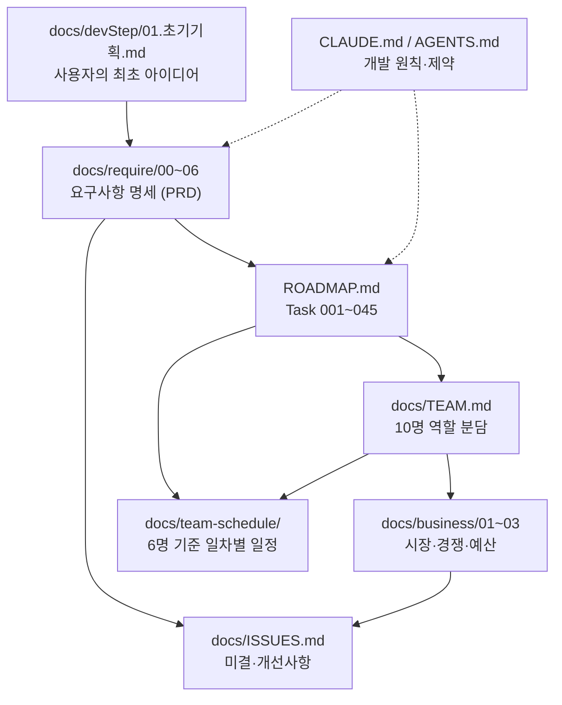

# football4 — 가상 축구 리그 시뮬레이션 & 배팅 플랫폼

> **"플레이하지 않고, 지켜보고 예측한다."**
> 컴퓨터가 24/7 자동으로 진행하는 3티어(24/20/16팀) 가상 축구 리그 세계를 구축한다.
> 사용자는 팀을 조작하지 않고 **관전**하며(1차 릴리스), 이후 **배팅**한다(2차 릴리스).

기술 스택: Next.js 16 (App Router) / React 19 / TypeScript / TailwindCSS v4 / Supabase
현재 상태: **구현 착수 — 5일차 진행 완료 (2026-07-27 기준)**. Phase 1 기반 계약 구축 중이며, 화면 코드(`src/app/`)는 아직 create-next-app 기본 파일뿐입니다(라우트 골격은 9~13일차).

```bash
npm run dev     # 개발 서버 (http://localhost:3000)
npm run build   # 프로덕션 빌드
npm run lint    # ESLint
npx tsc --noEmit  # 타입체크 (별도 스크립트 없음)
```

---

## 진행 현황 (5일차 · 2026-07-27)

전체 일정은 **94영업일(~2026-11-27)**, 1차 MVP는 74일차(2026-10-30)입니다. 현재는 8일차 **타입 동결(SP-1)** 을 향해 가는 Phase 1 초입입니다.

| Task | 담당 | 진척 | 상태 |
|---|---|---|---|
| **001** 확정 결정(D-15~D-26) 설계 전제화 | 1팀 | 5/5 | ✅ **완료** (2일차) |
| **006** 시드 PRNG·결정론 유틸 | 2팀 | 5/5 | ✅ 구현 완료(4일차) + **테스트 완료**(5일차, 107케이스) — 벤치는 6일차 |
| **002** 도메인 타입 47종 | 1팀 | 2/7 | 🔄 진행 중 — **E-01~E-40 정의 완료**(E-33~E-40은 2차 대비 선정의) |
| 003·004·005·007~045 | — | — | ⏸ 미착수 |

**현재 코드**

```
src/types/     11파일 — world/person/brand/enums/match/stat/economy/betting/config/ops/index
                       E-01~E-40 정의 완료, 34속성(기술10·정신10·신체8·GK6) 전건
src/lib/sim/rng/  5파일 + 테스트 5파일
                  prng.ts(xoshiro128**) / derive.ts(시드 계층) / precision.ts(6자리 정수 비교)
                  sort.ts(tiebreak 키 타입 강제) / hash.ts(외부 의존 0 SHA-256)
                  → npm run test (vitest) 107케이스 통과
```

**8일차 동결 전 반드시 처리해야 할 것** (`docs/ISSUES.md`)

- ~~**I-31** `World` 시간 환산 앵커 필드 결손~~ → ✅ 5일차 반영(앵커 4필드 추가). 6팀 물리 스키마 반영은 12일차
- ~~**I-32** `Seed` 32비트 → 53비트 완화~~ → ✅ 5일차 T2-a 개정. `brand.ts` 브랜드 승격은 7일차
- **I-39** **D-28 53비트 완화가 `src/lib/sim/rng/**` 구현에 미반영** — `derive.ts`가 53비트 시드에서 `RangeError`, `prng.ts`도 상위 비트 절단. **H-04 인계 전 필수** (2팀 6일차, 5일차 교차 점검 발견)
- **I-33** 시즌 페이즈 6번째 = `TIEBREAK` **팀장 승인 완료** — ROADMAP의 "페이즈 6종"은 근거 없는 기재였고, 실제 공백은 승강 동률 경기가 킥오프할 페이즈였음 (1팀 6일차)
- **I-37** `MatchEvent`에 ASSIST→GOAL 연결 참조 필드 부재 — 타임라인이 "어느 골로 이어졌는지"를 표시할 근거가 없음 (1팀 6일차, 4일차 발견)

일차별 상세는 [`docs/dailyWorkLog/`](./docs/dailyWorkLog/)를 보십시오.

---

## 이 문서의 목적

이 저장소는 **코드보다 문서가 먼저 쌓인 프로젝트**입니다. 구현을 시작하기 전에 기획 → 요구사항 → 로드맵 → 팀 편성 → 일정 순서로 문서를 확정했고, 그 결과 30여 개의 마크다운 문서가 존재합니다.

이 README는 **어떤 문서가 왜 만들어졌고 무엇을 담당하는지**를 정리한 지도입니다. 새로 합류했다면 여기서 시작하세요.

---

## 문서 계보 — 무엇이 무엇을 낳았는가

각 문서는 앞 문서의 산출물을 입력으로 받아 만들어졌습니다. 화살표는 "근거로 삼았다"는 뜻입니다.



**흐름 요약**: 거친 아이디어 한 장(`01.초기기획.md`)에서 출발해 → 측정 가능한 요구사항 253건으로 정제하고(`docs/require/`) → 실행 단위 Task 45개로 분해한 뒤(`ROADMAP.md`) → 사람에게 배분하고(`docs/TEAM.md`) → 실제 인원에 맞춰 날짜를 붙였습니다(`docs/team-schedule/`).

---

## 문서 목록

### 루트 — 프로젝트 규약과 전체 계획

| 문서 | 역할 | 만든 이유 |
|---|---|---|
| **`README.md`** | 문서 지도 (이 파일) | 문서가 30개를 넘어가면서 "어디부터 봐야 하는지"가 불명확해졌기 때문 |
| **`CLAUDE.md`** | AI 에이전트용 프로젝트 가이드 — 실제 디렉터리 구조, 도입된 것과 **아직 도입 안 된 것**, Mock First 개발 원칙, 테스트 계정 | 에이전트가 존재하지도 않는 라이브러리(shadcn/ui, Supabase 클라이언트 등)를 있다고 가정하고 코드를 쓰는 것을 막기 위해 |
| **`AGENTS.md`** | Next.js 16 경고 — 코드 작성 전 `node_modules/next/dist/docs/`를 먼저 읽으라는 규칙 | Next.js 16이 학습 데이터와 다를 수 있어, 기억에 의존한 코드 작성을 차단하기 위해 |
| **`ROADMAP.md`** | **개발 로드맵 본체** — Phase 1~4, Task 001~045. Task마다 담당·의존·구현 체크리스트·수락 기준·테스트 | 요구사항 253건은 그대로는 실행할 수 없어, 독립적으로 완료 가능한 Task 단위로 분해하기 위해 |

### `docs/devStep/` — 개발 단계 기록 (원본 보존)

| 문서 | 역할 | 만든 이유 |
|---|---|---|
| `00.agent팀터미널실행 및 기본 설치 파일들.md` | WSL·tmux 등 개발 환경 설치/실행 절차 | 여러 에이전트를 터미널에서 병렬로 띄우는 환경을 재현 가능하게 만들기 위해 |
| `01.초기기획.md` | **사용자의 최초 아이디어 원문** — 리그 구성, 능력치 1~30, 승강제, 컨디션, 플레이오프 등 | 모든 요구사항의 뿌리. 나중에 "원래 뭘 원했더라"를 확인할 수 있게 **가공하지 않고 보존**. 이후 정정된 수치(팀 수 등)는 상단 주석으로만 표시 |
| `02.타입스키마설계원칙.md` | **타입·스키마 설계 원칙 T1~T22** — 단일 월드 전제(D-15), 시드 표현(T2-a), 알고리즘 구현 타입의 소유 경계(T2-c) 등 | Task 001 산출물(1일차). 타입을 쓰기 전에 "무엇을 `src/types/`에 두고 무엇을 두지 않는가"를 먼저 못 박기 위해 |
| `03.결정Task매핑표와코드리뷰체크리스트.md` | **D-15~D-26 ↔ Task 매핑표**와 코드 리뷰 체크리스트 **C-1~C-27** | Task 001 산출물(2일차). 결정이 어느 Task의 전제인지 추적하고, 리뷰에서 기계적으로 확인할 항목으로 환산하기 위해 |

> 이 폴더는 `NN.제목.md` 형식으로 **누적**합니다. 기존 문서를 고치지 않고 새 단계를 추가합니다.

### `docs/dailyWorkLog/` — 일차별 작업 로그

일차가 끝날 때마다 **작업 → 개별 보고 → 상호 공유·교차 점검 → 조율 해소 → 마감 검증** 사이클의 결과를 남깁니다. `NDay.md` 형식으로 누적합니다.

| 문서 | 그날의 핵심 |
|---|---|
| `1Day.md` | Task 001 착수 / 006 `prng.ts` / 5팀 와이어프레임 착수 |
| `2Day.md` | **Task 001 완료** — 결정↔Task 매핑표·체크리스트 확정. xG 누락 재기각. 006 시드 계층 파생 |
| `3Day.md` | **최초 코드 생성일** — `src/types/` 11파일. 교차 점검에서 **동결 전 필수 2건(I-31·I-32)** 과 `TIEBREAK` 페이즈 공백 발견 |
| `4Day.md` | **Task 006 구현 완료**(`sort.ts`·`hash.ts`), E-01~E-20 + 34속성. 교차 점검에서 **E-번호 드리프트 5건**(하루만 늦었으면 배팅 도메인과 충돌) 과 **경기 단위 팀 스탯 엔티티 공백(W-38)** 발견 |

**왜 남기는가**: 팀이 6개로 나뉘어 병렬로 움직이므로, 한 팀의 발견이 다른 팀에 도달하지 않으면 8일차 동결처럼 되돌릴 수 없는 지점에서 터집니다. 교차 점검 결과와 팀장 결정을 그날 기록해 재론을 막습니다.

### `docs/wireframe/` — 화면 와이어프레임 (5팀)

5팀은 1~27일차가 선행 의존(디자인 토큰) 대기 구간이라, 그 기간에 화면 설계를 선행합니다. 015~021 Task의 설계 시간을 미리 줄이는 목적입니다.

| 문서 | 대상 화면 |
|---|---|
| `00-공통규약.md` | 표기법·4상태 규약·R-1~R-14 공통 규칙 |
| `01-홈-라이브센터.md` · `02-리그-순위표.md` · `03-일정-결과.md` · `04-경기상세-라이브중계.md` | Task 015·016·017 |
| `05-선수상세.md` · `06-클럽상세.md` | Task 018 |

와이어프레임에서 발견된 논점은 `W-*` 번호로 문서 말미에 기록하고, 팀 간 영향이 있는 것만 `docs/ISSUES.md`의 `I-*`로 승격합니다(예: W-34 → I-34 결과 역산 컷오프).

### `docs/require/` — 요구사항 명세 (PRD)

초기 기획서의 모호한 문장("적절히 보정된다")을 **검증 가능한 요구사항**으로 바꾸기 위해 작성한 7개 문서입니다. 모든 항목에 ID가 붙어 있어 ROADMAP의 Task가 이 ID를 근거로 참조합니다.

| 문서 | 역할 | 만든 이유 |
|---|---|---|
| `00-requirements-summary.md` | **요약 및 문서 인덱스** — 한 줄 요약, 전체 통계, 결정 기록 | 6개 문서를 매번 다 읽지 않고도 전체를 파악하는 진입점 |
| `01-project-overview.md` | 비즈니스 목적, 핵심 명제, 범위 경계 | "무엇을 만들지"보다 **무엇을 안 만들지**를 못 박기 위해 |
| `02-actors-and-usecases.md` | 액터 A-1~A-3(게스트/배터/운영자)와 유스케이스 | 권한 경계(RLS)와 화면 접근 범위를 나중에 설계하려면 액터가 먼저 확정돼야 해서 |
| `03-functional-requirements.md` | **기능 요구사항 163건** — `FR-LG`(리그) `FR-MT`(경기 엔진) `FR-PL`(선수) `FR-BT`(배팅) 등 그룹별. MoSCoW 우선순위 표기 | 최대 문서(1,600줄). 시뮬레이션 규칙을 구현자가 해석할 여지 없이 적기 위해 |
| `04-non-functional-requirements.md` | **비기능 요구사항 90건** — 성능/결정론/테스트/설정 외부화 등. **모든 항목이 측정 가능한 수치** | "빠르게", "적절히" 같은 표현은 검수가 불가능하므로 정성 표현을 금지하고 전부 수치화 |
| `05-data-requirements.md` | **엔티티 47종(E-01~E-47) 논리 설계**와 데이터 제약(DC) | 물리 스키마(DDL)를 짜기 전에 엔티티 관계를 확정해, Mock 데이터와 실제 DB가 **같은 타입**을 쓰게 하려고 |
| `06-prioritization-and-risks.md` | MoSCoW 집계, 릴리스 범위, 리스크, **결정 기록(D-15~D-26)** | 결정이 여러 곳에 흩어지면 충돌하므로, 확정 결정의 **단일 소스**로 지정 |

### `docs/` — 운영 문서

| 문서 | 역할 | 만든 이유 |
|---|---|---|
| **`ISSUES.md`** | **미해결 질문(Q-\*) · 개선사항(I-\*) · 가정(AS-\*) · 검증 항목(V-\*)** | 확정 사양과 미확정 사항이 섞이면 위험하므로 분리. 확정된 것은 `docs/require/`, **아직 결정 안 된 것은 여기**. 착수 전 미결 4건(Q-03·10·11·12)은 전부 2차 이후 사항이나, **구현 시작 후 교차 점검에서 발견된 항목이 I-29~I-35로 누적**되고 있습니다(그중 I-31·I-32는 8일차 타입 동결 전 필수) |
| **`TEAM.md`** | **팀원 10명의 역할·책임·산출물 경로·담당 요구사항 ID·매핑 에이전트**, Phase별 분담 매트릭스 | 각 팀원을 서브에이전트로 실행하기 위해, 누가 어떤 파일을 소유하는지 사전에 갈라 충돌을 막으려고 |

### `docs/business/` — 사업성 검토 (팀원 1~3 산출물)

개발과 **병행 트랙**으로 진행됐습니다. 순수 사업 문서가 아니라, 결과가 개발 파라미터로 되돌아오도록 설계됐습니다.

| 문서 | 역할 | 만든 이유 |
|---|---|---|
| `01-market-research.md` | 시장 규모(TAM/SAM/SOM), 타겟 세그먼트, 페르소나 | 페르소나 검증 결과가 **UX 우선순위**(Task 015·039)와 다국어 대상 시장 결정으로 연결 |
| `02-competitor-analysis.md` | 직접/간접 경쟁 분석, 차별화 전략 | 배팅 마켓 범위(FR-BT)와 3차 기능 우선순위를 정하는 근거 |
| `03-budget-plan.md` | 초기 투자, 운영비, 손익분기점, 인프라 비용 모델 | **Supabase 요금제·크론 실행 주기·몬테카를로 N값**이 곧 비용이라, Task 033·035의 파라미터를 비용에서 역산하기 위해 |

### `docs/team-schedule/` — 실행 일정 (6명 기준)

ROADMAP은 10명 전제로 작성됐지만 실제 가용 인원은 6명이라, **역할을 병합해 일차(1일차, 2일차 …) 단위로 재배치**한 문서 묶음입니다. 팀별로 파일이 나뉘며, 각 팀이 자기 파일만 보고도 그날 할 일을 알 수 있게 구성했습니다.

핵심 설계 원칙은 **팀 간 간섭 최소화** — 팀마다 소유 경로를 갈라 같은 날 같은 모듈을 동시에 건드리지 않게 하고, 팀 간 의존은 일차 경계의 **인계(handoff)** 로만 발생시킵니다. 공유 계약(타입·어댑터 IF·공통코드·i18n 키·디자인 토큰)을 전부 1~27일차에 몰아 확정해서, **28일차 이후로는 팀 간 동시 편집이 필요한 파일이 없습니다.**

| 문서 | 역할 |
|---|---|
| `README.md` | **전체 개요** — 팀 구성, 크리티컬 패스, Phase 마일스톤(M-1~M-6), 인계 지점, 동기화 포인트, 리스크, 10명 대비 비교 |
| `01-코어품질팀.md` | 타입·계약·테스트·CI·리뷰 게이트 (원 팀원 4 일부 + 10) |
| `02-시뮬레이션엔진팀.md` | 경기 엔진·대진표·시즌 정산 (원 팀원 5) |
| `03-데이터밸런싱배당팀.md` | 공통코드·Mock·경제·배당 산출 (원 팀원 6 + 7 일부) |
| `04-UI기반i18n팀.md` | 라우트 골격·디자인 시스템·i18n (원 팀원 8 일부 + 4 일부) |
| `05-화면배팅UX팀.md` | 화면 조립·운영 콘솔·배팅 UX (원 팀원 8 일부 + 7 일부) |
| `06-DB인프라팀.md` | 스키마·RLS·크론·어댑터 실구현 (원 팀원 9 + 3) |

산출 요약: 총 잔여 공수 **211.5인일** / 크리티컬 패스 **74영업일** / 버퍼 18% 포함 **94영업일**(~2026-11-27) / 1차 MVP는 74일차(2026-10-30) / 동기화 포인트 **6개**(전원 참여는 2개뿐).

### `.claude/agents/` — 서브에이전트 정의

문서가 아니라 **실행 주체의 정의**입니다. `docs/TEAM.md`의 각 팀원 역할이 여기 정의된 에이전트에 매핑됩니다.

| 경로 | 역할 |
|---|---|
| `dev/nextjs-app-developer.md` | App Router 구조·라우팅·레이아웃 설계 (팀원 4 아키텍트) |
| `dev/ui-markup-specialist.md` | 컴포넌트 마크업·Tailwind 스타일링 (팀원 8 UI) |
| `dev/code-reviewer.md` | 코드 리뷰 (팀원 10 QA) |
| `dev/development-planner.md` | **ROADMAP.md 생성·갱신** — 이 저장소의 `ROADMAP.md`를 만든 주체 |
| `dev/starter-cleaner.md` | create-next-app 보일러플레이트 정리 |
| `docs/prd-generator.md` · `docs/prd-validator.md` | PRD 생성 / 기술적 타당성 검증 |
| `requirements-analysis-expert.md` | **요구사항 분석** — `docs/require/` 7종을 만든 주체 |
| `nextjs-supabase-expert.md` | 스키마·RLS·Server Action (팀원 9 DB) |
| `notion-api-database-expert.md` | Notion API 연동 (현재 프로젝트 범위 밖) |
| `plan-specialist/schedule-planner.md` | **일정 수립** — 팀원 수와 ROADMAP을 받아 `docs/team-schedule/`를 만드는 주체 |

---

## 읽는 순서

**처음 합류했다면** — 아래 4개면 전체 그림이 잡힙니다.

1. `docs/require/00-requirements-summary.md` — 무엇을 만드는가
2. `ROADMAP.md` 개요 절 — 어떻게 쪼갰는가
3. `docs/TEAM.md` — 누가 무엇을 맡는가
4. `CLAUDE.md` — 어떤 규칙으로 코드를 쓰는가

**구현을 시작한다면** — 자기 팀의 `docs/team-schedule/<팀명>.md`에서 오늘 일차를 확인하고, 해당 Task 번호로 `ROADMAP.md`를 펴서 체크리스트와 수락 기준을 봅니다. 요구사항 ID(FR-\*, NFR-\*, E-\*)가 나오면 `docs/require/`에서 원문을 확인합니다.

---

## 문서 갱신 규칙

| 상황 | 갱신할 문서 |
|---|---|
| 새 결정이 내려짐 | `docs/require/06-prioritization-and-risks.md` 결정 기록 (**단일 소스**) + `docs/ISSUES.md`에서 해당 미결 항목 제거 |
| 결정되지 않은 논점·개선 아이디어 발생 | `docs/ISSUES.md` |
| Task 완료 / 새 Task 추가 | `ROADMAP.md` (체크박스 `[x]`) — `development-planner` 에이전트. **스코프가 바뀌었으면 이어서 `schedule-planner`로 일정 재산출** |
| 인원 변경 / 일정 지연 | `schedule-planner` 에이전트 — `docs/team-schedule/` 재산출 **+ `ROADMAP.md` 동기화를 한 번에 수행** |
| 설치·실행 절차 변경 | `docs/devStep/00.*.md` |
| 새 개발 단계 시작 | `docs/devStep/NN.제목.md` **추가** (기존 문서 수정하지 않음) |
| **일차 작업 종료** | 교차 점검·이슈 판정 후 `docs/dailyWorkLog/NDay.md` **추가**. 완료된 Task 체크박스는 `ROADMAP.md`에 반영 |
| 화면 설계 논점 발생 | `docs/wireframe/`의 해당 문서에 `W-*`로 기록 → 팀 간 영향이 있으면 `docs/ISSUES.md`의 `I-*`로 승격 |

**원칙**: 확정 사양은 `docs/require/`, 미확정은 `docs/ISSUES.md`, 실행 계획은 `ROADMAP.md`, 날짜는 `docs/team-schedule/`. 같은 정보를 두 곳에 쓰지 않습니다.

### ROADMAP ↔ team-schedule 동기화

두 문서는 **항상 같은 계획을 말해야 합니다.** 정보가 흐르는 방향이 정해져 있습니다.

| 정보 | 단일 소스 | 반영 방향 |
|---|---|---|
| **스코프** — Task 존재·제목·구현 사항·수락 기준 | `ROADMAP.md` | ROADMAP → team-schedule (일정 재산출) |
| **일정·배정** — 누가, 언제, 며칠 | `docs/team-schedule/` | team-schedule → ROADMAP (`**담당**`·`**일정**` 줄 갱신) |

`schedule-planner` 에이전트가 이 동기화를 **한 작업 안에서 양쪽 다** 수행합니다. 일정만 고치고 ROADMAP을 방치하면, 로드맵을 보고 일하는 사람과 일정을 보고 일하는 사람이 서로 다른 계획을 실행하게 됩니다.

동기화 시 ROADMAP에서 건드리는 영역은 **담당·일정·팀 구성 절·마일스톤 요약뿐**이며, 구현 사항 체크박스·수락 기준·테스트·요구사항 ID는 수정하지 않습니다 (편집 전후 개수를 기계적으로 대조해 검증).
