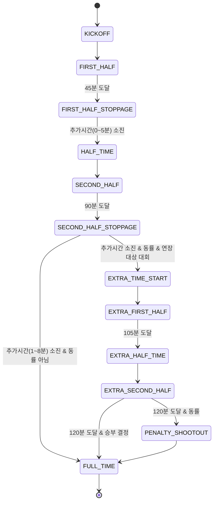

# 04. 023 틱 엔진 설계 메모 (2팀, 7일차 대기구간 산출물)

> 작성: 2팀 시뮬레이션엔진팀 / 대상 일차: **7일차 (2026-07-29)**
> 근거: `docs/team-schedule/02-시뮬레이션엔진팀.md` §4 "7~8일차 대기구간" ②
> "023은 도메인 타입(H-01, 8일차 동결) 필요" → **9일차 착수 전 구조만 미리 스케치**하는 문서입니다.

## 0. 이 문서의 성격 (반드시 먼저 읽을 것)

- **확정 문서가 아닙니다.** 023(9~16일차)·024(17~24일차) 실제 착수 시 이 스케치와 다르게 구현될 수 있습니다.
- **실제 확률 수치를 담지 않습니다.** 024(능력치 보정 계수, 17일차 착수)와 026(타이브레이커 등)이 확정되기 전이므로, 아래 확률 트리의 수치는 전부 `TBD`입니다. 8일차 이전에 밸런싱 값을 앞당겨 정하지 않습니다.
- 근거 타입은 `src/types/**`를 **읽기만** 했습니다 — 이 문서 작성으로 타입 파일은 전혀 수정하지 않았습니다.

---

## 1. 90(+30)틱 상태 전이도

team-schedule 9일차 산출물 목표: `src/lib/sim/match/tick.ts` — "90틱(+30 연장) 순회 엔진 골격, 추가시간(전반 0~5 / 후반 1~8) 표현", 수락 기준 "120틱까지 순회".

### 1.1 상위 상태 흐름



- **틱 단위 = 분(minute) 1틱.** `MatchEvent.minute`(0~90 또는 0~120)이 틱 인덱스와 1:1 대응한다는 전제로 스케치했다. 같은 분에 여러 이벤트가 발생하면 `MatchEvent.sequence`(경기 내 순번, `match.ts` E-16)로 순서를 구분한다 — 별도의 "sub-tick" 필드는 필요 없다고 판단(근거는 §4 SP-1 문서 참고).
- 정규 120틱(90 + 연장 30) 순회는 team-schedule 수락 기준과 일치. **연장전 여부는 대회 규정에 의존**(리그는 연장 없음, 컵/플레이오프는 연장 있음 — D-19 "연장전 득점 포함" 전제와 정합).
- 추가시간 폭(전반 0~5, 후반 1~8)은 `MatchEvent`의 `HALF_TIME`/`FULL_TIME` 이벤트가 `addedTime` 필드(E-16)에 실제 부여된 분을 기록하는 것으로 표현 가능 — 타입에 이미 있는 필드로 충분(신규 필드 불필요, §4 SP-1 문서에서 확인).

### 1.2 틱 내부 처리 순서 (스켈레톤)

한 틱(분)마다 엔진이 순회하는 단계 — 실제 알고리즘은 9~16일차 확정, 여기서는 자리만 표시한다.

| 순서 | 단계 | 비고 |
|---|---|---|
| 1 | 틱 시드 파생 | `deriveEventSeed(matchSeed, tick, eventIndex)` (`derive.ts`, 이미 구현됨) |
| 2 | 이 틱에 "이벤트가 발생하는가" 판정 | `precision.ts`의 `rollSucceeds`/`succeeds` 경유 (TBD 확률) |
| 3 | 발생 시 이벤트 카테고리 선택 | §2 확률 트리 참조 |
| 4 | 카테고리 내 세부 이벤트 선택 | 예: 슛 카테고리 → SHOT_ON / SHOT_OFF / SHOT_BLOCKED / GOAL |
| 5 | 파생 효과 처리 | 카드 누적(024), 부상(023-12), 교체 판단(023-12) 등 — 후속 Task 소관 |
| 6 | `MatchEvent` 레코드 생성 | `sequence`/`minute`/`addedTime`/`type`/`xg`/`detail` 채움 |

---

## 2. 이벤트 23종 발생 확률 트리 스케치

값 근거: `src/types/enums.ts`의 `MatchEventType`(FR-MT-002, 23종, 6일차 확정) — 그대로 인용, 재선언하지 않음.

### 2.1 카테고리 분류 (구조 스케치)

```
틱 판정 (발생/무발생)
└─ 발생 시 카테고리 선택 (TBD 가중치, normalizeWeights()로 정규화 예정)
   ├─ 경기 진행 마커 (틱 판정과 무관하게 정해진 시점에 결정론적으로 발생)
   │   ├─ KICKOFF          (0분, 1회)
   │   ├─ HALF_TIME         (45+추가시간, 1회)
   │   ├─ FULL_TIME         (90/120+추가시간, 1회)
   │   ├─ EXTRA_TIME_START  (동률 조건부, 최대 1회)
   │   └─ PENALTY_SHOOTOUT  (동률 조건부. **확정(팀장, 7일차 교차점검)**: 킥마다 별도
   │                          `MatchEvent`로 반복 발생 — 같은 `type=PENALTY_SHOOTOUT`,
   │                          서로 다른 `sequence`/`detail`(키커·성공여부·순번). "유일
   │                          이벤트 리터럴 값 = 유일 인스턴스"가 아님에 주의. 5팀
   │                          `09-이벤트중계문구.md` 10일차분이 이 전제로 작성됨)
   │
   ├─ 공격 전개 계열
   │   ├─ CORNER
   │   ├─ OFFSIDE
   │   └─ 슛 시퀀스 진입 → 슛 세부 분기(아래)
   │       ├─ SHOT_BLOCKED
   │       ├─ SHOT_OFF
   │       ├─ SHOT_ON → SAVE (골키퍍 판정) 또는 GOAL
   │       ├─ GOAL           (SHOT_ON 성공 판정 후)
   │       ├─ OWN_GOAL
   │       ├─ PENALTY_AWARDED → PENALTY_SCORED | PENALTY_MISSED
   │       └─ ASSIST          (GOAL과 relatedEventSequence로 연결, match.ts I-37 규약)
   │
   ├─ 수비/파울 계열
   │   ├─ FOUL → (조건부) YELLOW_CARD | SECOND_YELLOW | RED_CARD
   │   └─ SAVE (슛 계열에서도 참조되는 공용 이벤트)
   │
   ├─ 상태 변화 계열
   │   ├─ INJURY → (즉시 교체 판단, Task 012 소관)
   │   └─ SUBSTITUTION (최대 5명·3창, Task 012 소관)
   │
   └─ (위 KICKOFF~PENALTY_SHOOTOUT 5종은 마커로 이미 集計)

합계: 마커 5종 + 공격 8종(SHOT_BLOCKED/SHOT_OFF/SHOT_ON/GOAL/OWN_GOAL/PENALTY_AWARDED/
PENALTY_SCORED/PENALTY_MISSED/ASSIST/CORNER/OFFSIDE = 실제 11종) + 카드 3종(YELLOW/
SECOND_YELLOW/RED) + FOUL 1종 + SAVE 1종 + INJURY 1종 + SUBSTITUTION 1종 = 23종 확인.
```

> 위 합계 표기는 개수 검산용이며, 최종 카테고리 트리 구조는 023 착수 시 재검토 대상이다.

### 2.2 확률 판정 원칙 (확정 사항 — 이 부분만 규약)

- **모든 확률 판정은 `precision.ts`를 경유한다.** `rollSucceeds(state, probability)` 또는 `succeeds(roll, probability)`만 쓰고, 부동소수 `<`/`===` 직접 비교는 금지(NFR-DT-005, 기존 규약 그대로 인용).
- **여러 후보 중 하나를 뽑을 때는 `normalizeWeights()` + `pickWeightedIndex()`를 쓴다** — 부동소수 누적합 오차로 마지막 후보가 누락되는 사고를 구조적으로 차단(이미 구현된 `precision.ts` 함수, 신규 구현 불필요).
- **난수는 `deriveEventSeed(matchSeed, tick, eventIndex)`로 얻은 시드를 `stateForSeed()`로 PRNG 상태화한 뒤 소비한다** — 같은 틱에서 여러 판정(예: FOUL 발생 여부 → 카드 여부 → 카드 등급)을 할 때 `eventIndex`를 증가시켜 서로 다른 독립 스트림을 쓴다.

### 2.3 xG(기대 득점) 처리 지점

- `match.ts` E-16 주석(3일차 변경요청 F, 6일차 반영): xG는 **슛 이벤트가 발생하는 순간의 득점 확률 `p`**를 그대로 `MatchEvent.xg`에 기록한다(좌표 기반 곡선은 3차 확장 여지, ROADMAP xG 최소안).
- 즉 §2.1의 "슛 세부 분기" 판정에 쓰인 성공 확률 `p`(SHOT_ON→GOAL 여부 판정 입력)가 **신규로 계산하는 값이 아니라 판정에 이미 쓰던 값을 기록만 하는 것**임을 재확인 — team-schedule "xG 누락 보정" 절의 완화 요인과 일치.
- 슛이 아닌 이벤트(FOUL, CORNER 등)는 `xg: null`.

---

## 3. 참조

| 항목 | 위치 |
|---|---|
| Task 023 일차별 수락 기준 | `docs/team-schedule/02-시뮬레이션엔진팀.md` 9~16일차 표 |
| `MatchEventType` 23종 정의 | `src/types/enums.ts` |
| `MatchEvent` 필드(xg/sequence/minute/addedTime/relatedEventSequence 등) | `src/types/match.ts` |
| 확률 판정 진입점(`rollSucceeds`/`succeeds`/`normalizeWeights`/`pickWeightedIndex`) | `src/lib/sim/rng/precision.ts` |
| 시드 파생(`deriveEventSeed`/`stateForSeed`) | `src/lib/sim/rng/derive.ts` |
| xG 최소안·완화 요인 근거 | `docs/team-schedule/02-시뮬레이션엔진팀.md` §5 "xG 누락 보정" 절 |

## 4. 이 문서에서 다루지 않은 것 (의도적 제외)

- 실제 확률 수치·계수(024, 17일차 착수 이후).
- GK 대체(D-22, Task 014)의 구체 로직 — 관련 타입 갭은 `05.SP1사전검토_2팀_7일차.md`에서 별도로 다룬다.
- 스탯 누적 규칙(Task 011, `stats.ts`) — 이벤트 로그가 SSOT라는 원칙(AS-10)만 전제하고 세부는 다루지 않는다.
